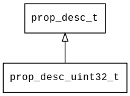

## prop\_desc\_uint32\_t
### 概述

 无符号32位整数类型属性描述。

----------------------------------
### 属性

| 属性名称 | 类型 | 说明 | 
| -------- | ----- | ------------ | 
| <a href="#prop_desc_uint32_t_defvalue">defvalue</a> | uint32\_t | 缺省值。 |
| <a href="#prop_desc_uint32_t_max">max</a> | uint32\_t | 最大值。 |
| <a href="#prop_desc_uint32_t_min">min</a> | uint32\_t | 最小值。 |
#### defvalue 属性
-----------------------
> 
 缺省值。

* 类型：uint32\_t

| 特性 | 是否支持 |
| -------- | ----- |
| 可直接读取 | 是 |
| 可直接修改 | 否 |
#### max 属性
-----------------------
> 
 最大值。

* 类型：uint32\_t

| 特性 | 是否支持 |
| -------- | ----- |
| 可直接读取 | 是 |
| 可直接修改 | 否 |
#### min 属性
-----------------------
> 
 最小值。

* 类型：uint32\_t

| 特性 | 是否支持 |
| -------- | ----- |
| 可直接读取 | 是 |
| 可直接修改 | 否 |
