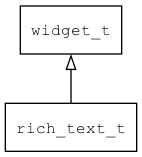

## rich\_text\_t
### 概述


图文混排控件，实现简单的图文混排。

rich\_text\_t是[widget\_t](widget_t.md)的子类控件，widget\_t的函数均适用于rich\_text\_t控件。

在xml中使用"rich\_text"标签创建图文混排控件。如：

```xml
<rich_text x="0" y="0" w="100%" h="60"
text="<image name=&quota;bricks&quota;/><font align_v=&quota;middle&quota;>hello awtk!</font>" />
```
>

> 更多用法请参考：
[rich_text.xml](https://github.com/zlgopen/awtk/blob/master/design/default/ui/rich_text.xml)

在c代码中使用函数rich\_text\_create创建图文混排控件。如：

```c
widget_t* rich_text = rich_text_create(win, 0, 0, 0, 0);
widget_set_text_utf8(rich_text,
"<image name=\"bricks\"/><font color=\"gold\" align_v=\"bottom\" "
"size=\"24\">hello awtk!</font><font color=\"green\" size=\"20\">ProTip! The "
"feed shows you events from people you follow and repositories you watch. "
"nhello world. </font><font color=\"red\" "
"size=\"20\">确定取消中文字符测试。确定。取消。中文字符测试。</font>");

widget_set_self_layout_params(rich_text, "center", "middle", "100%", "100%");
```

> 完整示例请参考：
[rich_text demo](https://github.com/zlgopen/awtk-c-demos/blob/master/demos/rich_text.c)

可用通过style来设置控件的显示风格，如背景颜色等等。而字体的大小和颜色则由文本内部的属性决定。

目前支持image和font两个tag：

* image 支持的属性有：
* name 图片的名称。
* w 图片的宽度。
* h 图片的高度。

* font 支持的属性有：
* color 颜色。
* size 大小。
* align_v 垂直方向对齐的方式(top|middle|bottom)。
* bold 粗体(暂不支持)
* italic 斜体(暂不支持)
* underline 下划线(暂不支持)
----------------------------------
### 函数
<p id="rich_text_t_methods">

| 函数名称 | 说明 | 
| -------- | ------------ | 
| <a href="#rich_text_t_rich_text_cast">rich\_text\_cast</a> | 转换为rich_text对象(供脚本语言使用)。 |
| <a href="#rich_text_t_rich_text_create">rich\_text\_create</a> | 创建rich_text对象 |
| <a href="#rich_text_t_rich_text_set_text">rich\_text\_set\_text</a> | 设置文本。 |
### 属性
<p id="rich_text_t_properties">

| 属性名称 | 类型 | 说明 | 
| -------- | ----- | ------------ | 
| <a href="#rich_text_t_line_gap">line\_gap</a> | uint32\_t | 行间距。 |
| <a href="#rich_text_t_margin">margin</a> | uint32\_t | 边距。 |
| <a href="#rich_text_t_need_reset">need\_reset</a> | bool\_t | 标识控件是否需要重新绘图。 |
| <a href="#rich_text_t_yoffset">yoffset</a> | int32\_t | y偏移。 |
#### rich\_text\_cast 函数
-----------------------

* 函数功能：

> <p id="rich_text_t_rich_text_cast">转换为rich_text对象(供脚本语言使用)。

* 函数原型：

```
widget_t* rich_text_cast (widget_t* widget);
```

* 参数说明：

| 参数 | 类型 | 说明 |
| -------- | ----- | --------- |
| 返回值 | widget\_t* | rich\_text对象。 |
| widget | widget\_t* | rich\_text对象。 |
#### rich\_text\_create 函数
-----------------------

* 函数功能：

> <p id="rich_text_t_rich_text_create">创建rich_text对象

* 函数原型：

```
widget_t* rich_text_create (widget_t* parent, xy_t x, xy_t y, wh_t w, wh_t h);
```

* 参数说明：

| 参数 | 类型 | 说明 |
| -------- | ----- | --------- |
| 返回值 | widget\_t* | 对象。 |
| parent | widget\_t* | 父控件 |
| x | xy\_t | x坐标 |
| y | xy\_t | y坐标 |
| w | wh\_t | 宽度 |
| h | wh\_t | 高度 |
#### rich\_text\_set\_text 函数
-----------------------

* 函数功能：

> <p id="rich_text_t_rich_text_set_text">设置文本。

* 函数原型：

```
ret_t rich_text_set_text (widget_t* widget, char* text);
```

* 参数说明：

| 参数 | 类型 | 说明 |
| -------- | ----- | --------- |
| 返回值 | ret\_t | 返回RET\_OK表示成功，否则表示失败。 |
| widget | widget\_t* | 控件对象。 |
| text | char* | 文本。 |
#### line\_gap 属性
-----------------------
> <p id="rich_text_t_line_gap">行间距。

* 类型：uint32\_t

| 特性 | 是否支持 |
| -------- | ----- |
| 可直接读取 | 是 |
| 可直接修改 | 否 |
| 可持久化   | 是 |
| 可脚本化   | 是 |
| 可在IDE中设置 | 是 |
| 可在XML中设置 | 是 |
| 可通过widget\_get\_prop读取 | 是 |
| 可通过widget\_set\_prop修改 | 是 |
#### margin 属性
-----------------------
> <p id="rich_text_t_margin">边距。

* 类型：uint32\_t

| 特性 | 是否支持 |
| -------- | ----- |
| 可直接读取 | 是 |
| 可直接修改 | 否 |
| 可持久化   | 是 |
| 可脚本化   | 是 |
| 可在IDE中设置 | 是 |
| 可在XML中设置 | 是 |
| 可通过widget\_get\_prop读取 | 是 |
| 可通过widget\_set\_prop修改 | 是 |
#### need\_reset 属性
-----------------------
> <p id="rich_text_t_need_reset">标识控件是否需要重新绘图。

* 类型：bool\_t

| 特性 | 是否支持 |
| -------- | ----- |
| 可直接读取 | 是 |
| 可直接修改 | 否 |
#### yoffset 属性
-----------------------
> <p id="rich_text_t_yoffset">y偏移。

* 类型：int32\_t

| 特性 | 是否支持 |
| -------- | ----- |
| 可直接读取 | 是 |
| 可直接修改 | 否 |
| 可在XML中设置 | 是 |
| 可通过widget\_get\_prop读取 | 是 |
| 可通过widget\_set\_prop修改 | 是 |
