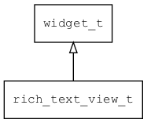

## rich\_text\_view\_t
### 概述


rich_text_view是一个专用容器，用来放rich text和 scroll bar，并在两者之间建立联系。

rich_text_view\_t是[widget\_t](widget_t.md)的子类控件，widget\_t的函数均适用于rich_text_view\_t控件。

在xml中使用"rich_text_view"标签创建rich_text_view。如：

```xml
<rich_text_view x="0" y="10" w="100%" h="300">
<rich_text line_gap="5" x="0" y="10" w="-12" h="100%" margin="10">
...
</rich_text>
<scroll_bar_d name="bar" x="right" y="0" w="12" h="100%" value="0"/>
</rich_text_view>
```

可用通过style来设置控件的显示风格，如背景颜色等。如：

```xml
<style name="default" border_color="#a0a0a0">
<normal     bg_color="#f0f0f0" />
</style>
```
----------------------------------
### 函数
<p id="rich_text_view_t_methods">

| 函数名称 | 说明 | 
| -------- | ------------ | 
| <a href="#rich_text_view_t_rich_text_view_cast">rich\_text\_view\_cast</a> | 转换为rich_text_view对象(供脚本语言使用)。 |
| <a href="#rich_text_view_t_rich_text_view_create">rich\_text\_view\_create</a> | 创建rich_text_view对象 |
#### rich\_text\_view\_cast 函数
-----------------------

* 函数功能：

> <p id="rich_text_view_t_rich_text_view_cast">转换为rich_text_view对象(供脚本语言使用)。

* 函数原型：

```
widget_t* rich_text_view_cast (widget_t* widget);
```

* 参数说明：

| 参数 | 类型 | 说明 |
| -------- | ----- | --------- |
| 返回值 | widget\_t* | rich\_text\_view对象。 |
| widget | widget\_t* | rich\_text\_view对象。 |
#### rich\_text\_view\_create 函数
-----------------------

* 函数功能：

> <p id="rich_text_view_t_rich_text_view_create">创建rich_text_view对象

* 函数原型：

```
widget_t* rich_text_view_create (widget_t* parent, xy_t x, xy_t y, wh_t w, wh_t h);
```

* 参数说明：

| 参数 | 类型 | 说明 |
| -------- | ----- | --------- |
| 返回值 | widget\_t* | 对象。 |
| parent | widget\_t* | 父控件 |
| x | xy\_t | x坐标 |
| y | xy\_t | y坐标 |
| w | wh\_t | 宽度 |
| h | wh\_t | 高度 |
