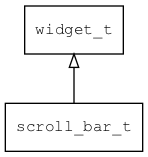

## scroll\_bar\_t
### 概述


滚动条控件。

> 目前只支持垂直滚动。

scroll\_bar\_t是[widget\_t](widget_t.md)的子类控件，widget\_t的函数均适用于scroll\_bar\_t控件。

在xml中使用"scroll\_bar"或"scroll\_bar\_d"或"scroll\_bar\_m"标签创建滚动条控件。如：

```xml
<list_view x="0"  y="30" w="100%" h="-80" item_height="60">
<scroll_view name="view" x="0"  y="0" w="100%" h="100%">
...
</scroll_view>
<scroll_bar_m name="bar" x="right" y="0" w="6" h="100%" value="0"/>
</list_view>
```

> 更多用法请参考：[list\_view\_m.xml](
https://github.com/zlgopen/awtk/blob/master/design/default/ui/list_view_m.xml)

在c代码中使用函数scroll\_bar\_create创建列表项控件。如：

```c
widget_t* scroll_bar = scroll_bar_create(list_view, 0, 0, 0, 0);
```

```xml
<style name="default">
<normal bg_color="#c0c0c0" fg_color="#808080"/>
<over bg_color="#c0c0c0" fg_color="#808080"/>
<pressed bg_color="#c0c0c0" fg_color="#808080"/>
</style>
```

> 更多用法请参考：[theme default](
https://github.com/zlgopen/awtk/blob/master/design/default/styles/default.xml#L350)
----------------------------------
### 函数
<p id="scroll_bar_t_methods">

| 函数名称 | 说明 | 
| -------- | ------------ | 
| <a href="#scroll_bar_t_scroll_bar_add_delta">scroll\_bar\_add\_delta</a> | 在当前的值上增加一个值，并触发EVT_VALUE_CHANGED事件。 |
| <a href="#scroll_bar_t_scroll_bar_cast">scroll\_bar\_cast</a> | 转换为scroll_bar对象(供脚本语言使用)。 |
| <a href="#scroll_bar_t_scroll_bar_create">scroll\_bar\_create</a> | 创建scroll_bar对象 |
| <a href="#scroll_bar_t_scroll_bar_create_desktop">scroll\_bar\_create\_desktop</a> | 创建desktop风格的scroll_bar对象 |
| <a href="#scroll_bar_t_scroll_bar_create_mobile">scroll\_bar\_create\_mobile</a> | 创建mobile风格的scroll_bar对象 |
| <a href="#scroll_bar_t_scroll_bar_is_mobile">scroll\_bar\_is\_mobile</a> | 判断是否是mobile风格的滚动条。 |
| <a href="#scroll_bar_t_scroll_bar_scroll_delta">scroll\_bar\_scroll\_delta</a> | 在当前的值上增加一个值，并滚动到新的值，并触发EVT_VALUE_CHANGED事件。 |
| <a href="#scroll_bar_t_scroll_bar_scroll_to">scroll\_bar\_scroll\_to</a> | 滚动到指定的值。 |
| <a href="#scroll_bar_t_scroll_bar_set_params">scroll\_bar\_set\_params</a> | 设置参数。 |
| <a href="#scroll_bar_t_scroll_bar_set_value">scroll\_bar\_set\_value</a> | 设置值，并触发EVT_VALUE_CHANGED事件。 |
| <a href="#scroll_bar_t_scroll_bar_set_value_only">scroll\_bar\_set\_value\_only</a> | 设置值，但不触发EVT_VALUE_CHANGED事件。 |
### 属性
<p id="scroll_bar_t_properties">

| 属性名称 | 类型 | 说明 | 
| -------- | ----- | ------------ | 
| <a href="#scroll_bar_t_animatable">animatable</a> | bool\_t | 滚动时是否启用动画。 |
| <a href="#scroll_bar_t_row">row</a> | int32\_t | 行的高度。 |
| <a href="#scroll_bar_t_value">value</a> | int32\_t | 当前的值。 |
| <a href="#scroll_bar_t_virtual_size">virtual\_size</a> | int32\_t | 虚拟宽度或高度。 |
#### scroll\_bar\_add\_delta 函数
-----------------------

* 函数功能：

> <p id="scroll_bar_t_scroll_bar_add_delta">在当前的值上增加一个值，并触发EVT_VALUE_CHANGED事件。

* 函数原型：

```
ret_t scroll_bar_add_delta (widget_t* widget, int32_t delta);
```

* 参数说明：

| 参数 | 类型 | 说明 |
| -------- | ----- | --------- |
| 返回值 | ret\_t | 返回RET\_OK表示成功，否则表示失败。 |
| widget | widget\_t* | scroll\_bar控件。 |
| delta | int32\_t | 值。 |
#### scroll\_bar\_cast 函数
-----------------------

* 函数功能：

> <p id="scroll_bar_t_scroll_bar_cast">转换为scroll_bar对象(供脚本语言使用)。

* 函数原型：

```
widget_t* scroll_bar_cast (widget_t* widget);
```

* 参数说明：

| 参数 | 类型 | 说明 |
| -------- | ----- | --------- |
| 返回值 | widget\_t* | scroll\_bar对象。 |
| widget | widget\_t* | scroll\_bar对象。 |
#### scroll\_bar\_create 函数
-----------------------

* 函数功能：

> <p id="scroll_bar_t_scroll_bar_create">创建scroll_bar对象

> 根据宏WITH_DESKTOP_STYLE决定创建desktop风格还是mobile风格的滚动条

* 函数原型：

```
widget_t* scroll_bar_create (widget_t* parent, xy_t x, xy_t y, wh_t w, wh_t h);
```

* 参数说明：

| 参数 | 类型 | 说明 |
| -------- | ----- | --------- |
| 返回值 | widget\_t* | 对象。 |
| parent | widget\_t* | 父控件 |
| x | xy\_t | x坐标 |
| y | xy\_t | y坐标 |
| w | wh\_t | 宽度 |
| h | wh\_t | 高度 |
#### scroll\_bar\_create\_desktop 函数
-----------------------

* 函数功能：

> <p id="scroll_bar_t_scroll_bar_create_desktop">创建desktop风格的scroll_bar对象

* 函数原型：

```
widget_t* scroll_bar_create_desktop (widget_t* parent, xy_t x, xy_t y, wh_t w, wh_t h);
```

* 参数说明：

| 参数 | 类型 | 说明 |
| -------- | ----- | --------- |
| 返回值 | widget\_t* | 对象。 |
| parent | widget\_t* | 父控件 |
| x | xy\_t | x坐标 |
| y | xy\_t | y坐标 |
| w | wh\_t | 宽度 |
| h | wh\_t | 高度 |
#### scroll\_bar\_create\_mobile 函数
-----------------------

* 函数功能：

> <p id="scroll_bar_t_scroll_bar_create_mobile">创建mobile风格的scroll_bar对象

* 函数原型：

```
widget_t* scroll_bar_create_mobile (widget_t* parent, xy_t x, xy_t y, wh_t w, wh_t h);
```

* 参数说明：

| 参数 | 类型 | 说明 |
| -------- | ----- | --------- |
| 返回值 | widget\_t* | 对象。 |
| parent | widget\_t* | 父控件 |
| x | xy\_t | x坐标 |
| y | xy\_t | y坐标 |
| w | wh\_t | 宽度 |
| h | wh\_t | 高度 |
#### scroll\_bar\_is\_mobile 函数
-----------------------

* 函数功能：

> <p id="scroll_bar_t_scroll_bar_is_mobile">判断是否是mobile风格的滚动条。

* 函数原型：

```
bool_t scroll_bar_is_mobile (widget_t* widget);
```

* 参数说明：

| 参数 | 类型 | 说明 |
| -------- | ----- | --------- |
| 返回值 | bool\_t | 返回TRUE表示是mobile风格的，否则表示不是mobile风格的。 |
| widget | widget\_t* | scroll\_bar控件。 |
#### scroll\_bar\_scroll\_delta 函数
-----------------------

* 函数功能：

> <p id="scroll_bar_t_scroll_bar_scroll_delta">在当前的值上增加一个值，并滚动到新的值，并触发EVT_VALUE_CHANGED事件。

* 函数原型：

```
ret_t scroll_bar_scroll_delta (widget_t* widget, int32_t delta);
```

* 参数说明：

| 参数 | 类型 | 说明 |
| -------- | ----- | --------- |
| 返回值 | ret\_t | 返回RET\_OK表示成功，否则表示失败。 |
| widget | widget\_t* | scroll\_bar控件。 |
| delta | int32\_t | 值。 |
#### scroll\_bar\_scroll\_to 函数
-----------------------

* 函数功能：

> <p id="scroll_bar_t_scroll_bar_scroll_to">滚动到指定的值。

* 函数原型：

```
ret_t scroll_bar_scroll_to (widget_t* widget, int32_t value, int32_t duration);
```

* 参数说明：

| 参数 | 类型 | 说明 |
| -------- | ----- | --------- |
| 返回值 | ret\_t | 返回RET\_OK表示成功，否则表示失败。 |
| widget | widget\_t* | scroll\_bar控件。 |
| value | int32\_t | 值。 |
| duration | int32\_t | 动画持续时间。 |
#### scroll\_bar\_set\_params 函数
-----------------------

* 函数功能：

> <p id="scroll_bar_t_scroll_bar_set_params">设置参数。

* 函数原型：

```
ret_t scroll_bar_set_params (widget_t* widget, int32_t virtual_size, int32_t row);
```

* 参数说明：

| 参数 | 类型 | 说明 |
| -------- | ----- | --------- |
| 返回值 | ret\_t | 返回RET\_OK表示成功，否则表示失败。 |
| widget | widget\_t* | scroll\_bar控件。 |
| virtual\_size | int32\_t | 虚拟高度。 |
| row | int32\_t | 每一行的高度。 |
#### scroll\_bar\_set\_value 函数
-----------------------

* 函数功能：

> <p id="scroll_bar_t_scroll_bar_set_value">设置值，并触发EVT_VALUE_CHANGED事件。

* 函数原型：

```
ret_t scroll_bar_set_value (widget_t* widget, int32_t value);
```

* 参数说明：

| 参数 | 类型 | 说明 |
| -------- | ----- | --------- |
| 返回值 | ret\_t | 返回RET\_OK表示成功，否则表示失败。 |
| widget | widget\_t* | scroll\_bar控件。 |
| value | int32\_t | 值。 |
#### scroll\_bar\_set\_value\_only 函数
-----------------------

* 函数功能：

> <p id="scroll_bar_t_scroll_bar_set_value_only">设置值，但不触发EVT_VALUE_CHANGED事件。

* 函数原型：

```
ret_t scroll_bar_set_value_only (widget_t* widget, int32_t value);
```

* 参数说明：

| 参数 | 类型 | 说明 |
| -------- | ----- | --------- |
| 返回值 | ret\_t | 返回RET\_OK表示成功，否则表示失败。 |
| widget | widget\_t* | scroll\_bar控件。 |
| value | int32\_t | 值。 |
#### animatable 属性
-----------------------
> <p id="scroll_bar_t_animatable">滚动时是否启用动画。

* 类型：bool\_t

| 特性 | 是否支持 |
| -------- | ----- |
| 可直接读取 | 是 |
| 可直接修改 | 否 |
| 可持久化   | 是 |
| 可脚本化   | 是 |
| 可在IDE中设置 | 是 |
| 可在XML中设置 | 是 |
| 可通过widget\_get\_prop读取 | 是 |
| 可通过widget\_set\_prop修改 | 是 |
#### row 属性
-----------------------
> <p id="scroll_bar_t_row">行的高度。

* 类型：int32\_t

| 特性 | 是否支持 |
| -------- | ----- |
| 可直接读取 | 是 |
| 可直接修改 | 否 |
| 可持久化   | 是 |
| 可脚本化   | 是 |
| 可在IDE中设置 | 是 |
| 可在XML中设置 | 是 |
| 可通过widget\_get\_prop读取 | 是 |
| 可通过widget\_set\_prop修改 | 是 |
#### value 属性
-----------------------
> <p id="scroll_bar_t_value">当前的值。

* 类型：int32\_t

| 特性 | 是否支持 |
| -------- | ----- |
| 可直接读取 | 是 |
| 可直接修改 | 否 |
| 可持久化   | 是 |
| 可脚本化   | 是 |
| 可在IDE中设置 | 是 |
| 可在XML中设置 | 是 |
| 可通过widget\_get\_prop读取 | 是 |
| 可通过widget\_set\_prop修改 | 是 |
#### virtual\_size 属性
-----------------------
> <p id="scroll_bar_t_virtual_size">虚拟宽度或高度。

* 类型：int32\_t

| 特性 | 是否支持 |
| -------- | ----- |
| 可直接读取 | 是 |
| 可直接修改 | 否 |
| 可持久化   | 是 |
| 可脚本化   | 是 |
| 可在IDE中设置 | 是 |
| 可在XML中设置 | 是 |
| 可通过widget\_get\_prop读取 | 是 |
| 可通过widget\_set\_prop修改 | 是 |
