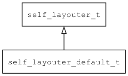

## self\_layouter\_default\_t
### 概述


缺省的控件自身布局算法实现。

> 用法请参考：[缺省控件自身布局算法](
https://github.com/zlgopen/awtk/blob/master/docs/self_layouter_default.md)
----------------------------------
### 函数
<p id="self_layouter_default_t_methods">

| 函数名称 | 说明 | 
| -------- | ------------ | 
| <a href="#self_layouter_default_t_self_layouter_default_create">self\_layouter\_default\_create</a> | 创建控件自身布局对象。 |
#### self\_layouter\_default\_create 函数
-----------------------

* 函数功能：

> <p id="self_layouter_default_t_self_layouter_default_create">创建控件自身布局对象。

* 函数原型：

```
self_layouter_t* self_layouter_default_create ();
```

* 参数说明：

| 参数 | 类型 | 说明 |
| -------- | ----- | --------- |
| 返回值 | self\_layouter\_t* | 返回创建控件自身布局对象。 |
