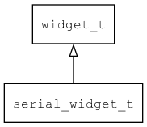

## serial\_widget\_t
### 概述


用于串口通信的控件
在xml中使用"serial"标签创建控件。如：

```xml
<!-- ui -->
<serial device="COM1" baudrate="115200"/>
```

可用通过style来设置控件的显示风格，如字体的大小和颜色等等。如：
> 本控件默认不可见，无需指定style。

```xml
<!-- style -->
<serial>
<style name="default" font_size="32">
<normal text_color="black" />
</style>
</serial>
```
----------------------------------
### 函数
<p id="serial_widget_t_methods">

| 函数名称 | 说明 | 
| -------- | ------------ | 
| <a href="#serial_widget_t_serial_widget_cast">serial\_widget\_cast</a> | 转换为serial_widget对象(供脚本语言使用)。 |
| <a href="#serial_widget_t_serial_widget_create">serial\_widget\_create</a> | 创建serial_widget对象 |
| <a href="#serial_widget_t_serial_widget_get_widget_vtable">serial\_widget\_get\_widget\_vtable</a> | 获取 serial_widget 虚表。 |
| <a href="#serial_widget_t_serial_widget_set_baudrate">serial\_widget\_set\_baudrate</a> | 设置 波特率。 |
| <a href="#serial_widget_t_serial_widget_set_bytesize">serial\_widget\_set\_bytesize</a> | 设置 字节位数。 |
| <a href="#serial_widget_t_serial_widget_set_check_interval">serial\_widget\_set\_check\_interval</a> | 设置 轮询时间。 |
| <a href="#serial_widget_t_serial_widget_set_device">serial\_widget\_set\_device</a> | 设置 设备。 |
| <a href="#serial_widget_t_serial_widget_set_flowcontrol">serial\_widget\_set\_flowcontrol</a> | 设置 流控。 |
| <a href="#serial_widget_t_serial_widget_set_parity">serial\_widget\_set\_parity</a> | 设置 奇偶校验。 |
| <a href="#serial_widget_t_serial_widget_set_stopbits">serial\_widget\_set\_stopbits</a> | 设置 停止位。 |
### 属性
<p id="serial_widget_t_properties">

| 属性名称 | 类型 | 说明 | 
| -------- | ----- | ------------ | 
| <a href="#serial_widget_t_baudrate">baudrate</a> | uint32\_t | 波特率。 |
| <a href="#serial_widget_t_bytesize">bytesize</a> | uint32\_t | 字节位数。 |
| <a href="#serial_widget_t_check_interval">check\_interval</a> | uint32\_t | 轮询时间（单位：ms）。 |
| <a href="#serial_widget_t_device">device</a> | char* | 设备(文件)名。 |
| <a href="#serial_widget_t_flowcontrol">flowcontrol</a> | uint32\_t | 流控。 |
| <a href="#serial_widget_t_iostream">iostream</a> | tk\_iostream\_t* | 输入/出流。 |
| <a href="#serial_widget_t_istream">istream</a> | tk\_istream\_t* | 输入流。 |
| <a href="#serial_widget_t_ostream">ostream</a> | tk\_ostream\_t* | 输出流。 |
| <a href="#serial_widget_t_parity">parity</a> | uint32\_t | 奇偶校验。 |
| <a href="#serial_widget_t_stopbits">stopbits</a> | uint32\_t | 停止位。 |
### 事件
<p id="serial_widget_t_events">

| 事件名称 | 类型  | 说明 | 
| -------- | ----- | ------- | 
| EVT\_DATA | event\_t | 数据到来事件。 |
#### serial\_widget\_cast 函数
-----------------------

* 函数功能：

> <p id="serial_widget_t_serial_widget_cast">转换为serial_widget对象(供脚本语言使用)。

* 函数原型：

```
widget_t* serial_widget_cast (widget_t* widget);
```

* 参数说明：

| 参数 | 类型 | 说明 |
| -------- | ----- | --------- |
| 返回值 | widget\_t* | serial\_widget对象。 |
| widget | widget\_t* | serial\_widget对象。 |
#### serial\_widget\_create 函数
-----------------------

* 函数功能：

> <p id="serial_widget_t_serial_widget_create">创建serial_widget对象

* 函数原型：

```
widget_t* serial_widget_create (widget_t* parent, xy_t x, xy_t y, wh_t w, wh_t h);
```

* 参数说明：

| 参数 | 类型 | 说明 |
| -------- | ----- | --------- |
| 返回值 | widget\_t* | serial\_widget对象。 |
| parent | widget\_t* | 父控件 |
| x | xy\_t | x坐标 |
| y | xy\_t | y坐标 |
| w | wh\_t | 宽度 |
| h | wh\_t | 高度 |
#### serial\_widget\_get\_widget\_vtable 函数
-----------------------

* 函数功能：

> <p id="serial_widget_t_serial_widget_get_widget_vtable">获取 serial_widget 虚表。

* 函数原型：

```
const widget_vtable_t* serial_widget_get_widget_vtable ();
```

* 参数说明：

| 参数 | 类型 | 说明 |
| -------- | ----- | --------- |
| 返回值 | const widget\_vtable\_t* | 成功返回 serial\_widget 虚表。 |
#### serial\_widget\_set\_baudrate 函数
-----------------------

* 函数功能：

> <p id="serial_widget_t_serial_widget_set_baudrate">设置 波特率。

* 函数原型：

```
ret_t serial_widget_set_baudrate (widget_t* widget, uint32_t baudrate);
```

* 参数说明：

| 参数 | 类型 | 说明 |
| -------- | ----- | --------- |
| 返回值 | ret\_t | 返回RET\_OK表示成功，否则表示失败。 |
| widget | widget\_t* | widget对象。 |
| baudrate | uint32\_t | 波特率。 |
#### serial\_widget\_set\_bytesize 函数
-----------------------

* 函数功能：

> <p id="serial_widget_t_serial_widget_set_bytesize">设置 字节位数。

* 函数原型：

```
ret_t serial_widget_set_bytesize (widget_t* widget, uint32_t bytesize);
```

* 参数说明：

| 参数 | 类型 | 说明 |
| -------- | ----- | --------- |
| 返回值 | ret\_t | 返回RET\_OK表示成功，否则表示失败。 |
| widget | widget\_t* | widget对象。 |
| bytesize | uint32\_t | 字节位数。 |
#### serial\_widget\_set\_check\_interval 函数
-----------------------

* 函数功能：

> <p id="serial_widget_t_serial_widget_set_check_interval">设置 轮询时间。

* 函数原型：

```
ret_t serial_widget_set_check_interval (widget_t* widget, uint32_t check_interval);
```

* 参数说明：

| 参数 | 类型 | 说明 |
| -------- | ----- | --------- |
| 返回值 | ret\_t | 返回RET\_OK表示成功，否则表示失败。 |
| widget | widget\_t* | widget对象。 |
| check\_interval | uint32\_t | 轮询时间（单位：ms）。 |
#### serial\_widget\_set\_device 函数
-----------------------

* 函数功能：

> <p id="serial_widget_t_serial_widget_set_device">设置 设备。

* 函数原型：

```
ret_t serial_widget_set_device (widget_t* widget, const char* device);
```

* 参数说明：

| 参数 | 类型 | 说明 |
| -------- | ----- | --------- |
| 返回值 | ret\_t | 返回RET\_OK表示成功，否则表示失败。 |
| widget | widget\_t* | widget对象。 |
| device | const char* | 设备。 |
#### serial\_widget\_set\_flowcontrol 函数
-----------------------

* 函数功能：

> <p id="serial_widget_t_serial_widget_set_flowcontrol">设置 流控。

* 函数原型：

```
ret_t serial_widget_set_flowcontrol (widget_t* widget, uint32_t flowcontrol);
```

* 参数说明：

| 参数 | 类型 | 说明 |
| -------- | ----- | --------- |
| 返回值 | ret\_t | 返回RET\_OK表示成功，否则表示失败。 |
| widget | widget\_t* | widget对象。 |
| flowcontrol | uint32\_t | 流控。 |
#### serial\_widget\_set\_parity 函数
-----------------------

* 函数功能：

> <p id="serial_widget_t_serial_widget_set_parity">设置 奇偶校验。

* 函数原型：

```
ret_t serial_widget_set_parity (widget_t* widget, uint32_t parity);
```

* 参数说明：

| 参数 | 类型 | 说明 |
| -------- | ----- | --------- |
| 返回值 | ret\_t | 返回RET\_OK表示成功，否则表示失败。 |
| widget | widget\_t* | widget对象。 |
| parity | uint32\_t | 奇偶校验。 |
#### serial\_widget\_set\_stopbits 函数
-----------------------

* 函数功能：

> <p id="serial_widget_t_serial_widget_set_stopbits">设置 停止位。

* 函数原型：

```
ret_t serial_widget_set_stopbits (widget_t* widget, uint32_t stopbits);
```

* 参数说明：

| 参数 | 类型 | 说明 |
| -------- | ----- | --------- |
| 返回值 | ret\_t | 返回RET\_OK表示成功，否则表示失败。 |
| widget | widget\_t* | widget对象。 |
| stopbits | uint32\_t | 停止位。 |
#### baudrate 属性
-----------------------
> <p id="serial_widget_t_baudrate">波特率。

* 类型：uint32\_t

| 特性 | 是否支持 |
| -------- | ----- |
| 可直接读取 | 是 |
| 可直接修改 | 否 |
| 可持久化   | 是 |
| 可脚本化   | 是 |
| 可在IDE中设置 | 是 |
| 可在XML中设置 | 是 |
| 可通过widget\_get\_prop读取 | 是 |
| 可通过widget\_set\_prop修改 | 是 |
#### bytesize 属性
-----------------------
> <p id="serial_widget_t_bytesize">字节位数。

* 类型：uint32\_t

| 特性 | 是否支持 |
| -------- | ----- |
| 可直接读取 | 是 |
| 可直接修改 | 否 |
| 可持久化   | 是 |
| 可脚本化   | 是 |
| 可在IDE中设置 | 是 |
| 可在XML中设置 | 是 |
| 可通过widget\_get\_prop读取 | 是 |
| 可通过widget\_set\_prop修改 | 是 |
#### check\_interval 属性
-----------------------
> <p id="serial_widget_t_check_interval">轮询时间（单位：ms）。
> 仅在不支持用select等待串口数据的嵌入式设备上有效。

* 类型：uint32\_t

| 特性 | 是否支持 |
| -------- | ----- |
| 可直接读取 | 是 |
| 可直接修改 | 否 |
| 可持久化   | 是 |
| 可脚本化   | 是 |
| 可在IDE中设置 | 是 |
| 可在XML中设置 | 是 |
| 可通过widget\_get\_prop读取 | 是 |
| 可通过widget\_set\_prop修改 | 是 |
#### device 属性
-----------------------
> <p id="serial_widget_t_device">设备(文件)名。

* 类型：char*

| 特性 | 是否支持 |
| -------- | ----- |
| 可直接读取 | 是 |
| 可直接修改 | 否 |
| 可持久化   | 是 |
| 可脚本化   | 是 |
| 可在IDE中设置 | 是 |
| 可在XML中设置 | 是 |
| 可通过widget\_get\_prop读取 | 是 |
| 可通过widget\_set\_prop修改 | 是 |
#### flowcontrol 属性
-----------------------
> <p id="serial_widget_t_flowcontrol">流控。

* 类型：uint32\_t

| 特性 | 是否支持 |
| -------- | ----- |
| 可直接读取 | 是 |
| 可直接修改 | 否 |
| 可持久化   | 是 |
| 可脚本化   | 是 |
| 可在IDE中设置 | 是 |
| 可在XML中设置 | 是 |
| 可通过widget\_get\_prop读取 | 是 |
| 可通过widget\_set\_prop修改 | 是 |
#### iostream 属性
-----------------------
> <p id="serial_widget_t_iostream">输入/出流。

* 类型：tk\_iostream\_t*

| 特性 | 是否支持 |
| -------- | ----- |
| 可直接读取 | 是 |
| 可直接修改 | 否 |
| 可持久化   | 是 |
| 可在IDE中设置 | 是 |
| 可在XML中设置 | 是 |
| 可通过widget\_get\_prop读取 | 是 |
| 可通过widget\_set\_prop修改 | 是 |
#### istream 属性
-----------------------
> <p id="serial_widget_t_istream">输入流。

* 类型：tk\_istream\_t*

| 特性 | 是否支持 |
| -------- | ----- |
| 可直接读取 | 是 |
| 可直接修改 | 否 |
| 可持久化   | 是 |
| 可在IDE中设置 | 是 |
| 可在XML中设置 | 是 |
| 可通过widget\_get\_prop读取 | 是 |
| 可通过widget\_set\_prop修改 | 是 |
#### ostream 属性
-----------------------
> <p id="serial_widget_t_ostream">输出流。

* 类型：tk\_ostream\_t*

| 特性 | 是否支持 |
| -------- | ----- |
| 可直接读取 | 是 |
| 可直接修改 | 否 |
| 可持久化   | 是 |
| 可在IDE中设置 | 是 |
| 可在XML中设置 | 是 |
| 可通过widget\_get\_prop读取 | 是 |
| 可通过widget\_set\_prop修改 | 是 |
#### parity 属性
-----------------------
> <p id="serial_widget_t_parity">奇偶校验。

* 类型：uint32\_t

| 特性 | 是否支持 |
| -------- | ----- |
| 可直接读取 | 是 |
| 可直接修改 | 否 |
| 可持久化   | 是 |
| 可脚本化   | 是 |
| 可在IDE中设置 | 是 |
| 可在XML中设置 | 是 |
| 可通过widget\_get\_prop读取 | 是 |
| 可通过widget\_set\_prop修改 | 是 |
#### stopbits 属性
-----------------------
> <p id="serial_widget_t_stopbits">停止位。

* 类型：uint32\_t

| 特性 | 是否支持 |
| -------- | ----- |
| 可直接读取 | 是 |
| 可直接修改 | 否 |
| 可持久化   | 是 |
| 可脚本化   | 是 |
| 可在IDE中设置 | 是 |
| 可在XML中设置 | 是 |
| 可通过widget\_get\_prop读取 | 是 |
| 可通过widget\_set\_prop修改 | 是 |
