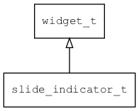

## slide\_indicator\_t
### 概述


slide_view的指示器控件。

> 支持直线、弧线排布，默认有4种绘制样式，若设置了icon/active_icon，则优先使用icon/active_icon

slide\_indicator\_t是[widget\_t](widget_t.md)的子类控件，widget\_t的函数均适用于slide\_indicator\_t控件。

在xml中使用"slide\_indicator"或"slide\_indicator\_arc"标签创建指示器控件。如：

```xml
<slide_view name="view" x="0"  y="0" w="100%" h="100%">
...
</slide_view>
<slide_indicator name="indicator" x="right" y="0" w="6" h="100%"/>
```

> 更多用法请参考：[slide\_view.xml](
https://github.com/zlgopen/awtk/blob/master/design/default/ui/slide_view.xml)

在c代码中使用函数slide\_indicator\_create创建指示器控件。如：

```c
widget_t* slide_indicator = slide_indicator_create(parent, 0, 0, 0, 0);
```

```xml
<style name="default">
<normal fg_color="#FFFFFF80" selected_fg_color="#FFFFFF"/>
</style>
```

> 更多用法请参考：[theme default](
https://github.com/zlgopen/awtk/blob/master/design/default/styles/default.xml#L350)
----------------------------------
### 函数
<p id="slide_indicator_t_methods">

| 函数名称 | 说明 | 
| -------- | ------------ | 
| <a href="#slide_indicator_t_slide_indicator_cast">slide\_indicator\_cast</a> | 转换为slide_indicator对象(供脚本语言使用)。 |
| <a href="#slide_indicator_t_slide_indicator_create">slide\_indicator\_create</a> | 创建slide_indicator对象 |
| <a href="#slide_indicator_t_slide_indicator_create_arc">slide\_indicator\_create\_arc</a> | 创建slide_indicator对象（圆弧显示） |
| <a href="#slide_indicator_t_slide_indicator_create_linear">slide\_indicator\_create\_linear</a> | 创建slide_indicator对象（线性显示） |
| <a href="#slide_indicator_t_slide_indicator_set_anchor">slide\_indicator\_set\_anchor</a> | 设置旋转锚点。 |
| <a href="#slide_indicator_t_slide_indicator_set_auto_hide">slide\_indicator\_set\_auto\_hide</a> | 设置指示器是否自动隐藏。 |
| <a href="#slide_indicator_t_slide_indicator_set_default_paint">slide\_indicator\_set\_default\_paint</a> | 设置指示器的默认绘制类型。 |
| <a href="#slide_indicator_t_slide_indicator_set_indicated_target">slide\_indicator\_set\_indicated\_target</a> | 设置指示器指示的目标。 |
| <a href="#slide_indicator_t_slide_indicator_set_margin">slide\_indicator\_set\_margin</a> | 设置指示器的边距(默认为10像素)。 |
| <a href="#slide_indicator_t_slide_indicator_set_max">slide\_indicator\_set\_max</a> | 设置指示器的数量。 |
| <a href="#slide_indicator_t_slide_indicator_set_size">slide\_indicator\_set\_size</a> | 设置指示器的大小(默认为8)。 |
| <a href="#slide_indicator_t_slide_indicator_set_spacing">slide\_indicator\_set\_spacing</a> | 设置指示器的间距(指示器有弧度时为角度值，否则为直线间距)。 |
| <a href="#slide_indicator_t_slide_indicator_set_value">slide\_indicator\_set\_value</a> | 设置当前页的序号。 |
### 属性
<p id="slide_indicator_t_properties">

| 属性名称 | 类型 | 说明 | 
| -------- | ----- | ------------ | 
| <a href="#slide_indicator_t_anchor_x">anchor\_x</a> | float\_t | 锚点x坐标。 |
| <a href="#slide_indicator_t_anchor_y">anchor\_y</a> | float\_t | 锚点y坐标。 |
| <a href="#slide_indicator_t_auto_hide">auto\_hide</a> | uint16\_t | 自动隐藏。0表示禁止，非0表示无操作后延迟多久隐藏。 |
| <a href="#slide_indicator_t_default_paint">default\_paint</a> | indicator\_default\_paint\_t | 指示器的类型。 |
| <a href="#slide_indicator_t_indicated_target">indicated\_target</a> | char* | 指示器指示的目标。 |
| <a href="#slide_indicator_t_margin">margin</a> | int32\_t | 指示器与边缘的边距。 |
| <a href="#slide_indicator_t_max">max</a> | uint32\_t | 最大值(缺省为100)。 |
| <a href="#slide_indicator_t_size">size</a> | uint32\_t | 指示器的大小。 |
| <a href="#slide_indicator_t_spacing">spacing</a> | float\_t | 指示器的中心之间的间距（圆弧显示时，间距的单位为弧度，否则为像素）。 |
| <a href="#slide_indicator_t_value">value</a> | uint32\_t | 值(缺省为0)。 |
#### slide\_indicator\_cast 函数
-----------------------

* 函数功能：

> <p id="slide_indicator_t_slide_indicator_cast">转换为slide_indicator对象(供脚本语言使用)。

* 函数原型：

```
widget_t* slide_indicator_cast (widget_t* widget);
```

* 参数说明：

| 参数 | 类型 | 说明 |
| -------- | ----- | --------- |
| 返回值 | widget\_t* | slide\_indicator对象。 |
| widget | widget\_t* | slide\_indicator对象。 |
#### slide\_indicator\_create 函数
-----------------------

* 函数功能：

> <p id="slide_indicator_t_slide_indicator_create">创建slide_indicator对象

* 函数原型：

```
widget_t* slide_indicator_create (widget_t* parent, xy_t x, xy_t y, wh_t w, wh_t h);
```

* 参数说明：

| 参数 | 类型 | 说明 |
| -------- | ----- | --------- |
| 返回值 | widget\_t* | 对象。 |
| parent | widget\_t* | 父控件 |
| x | xy\_t | x坐标 |
| y | xy\_t | y坐标 |
| w | wh\_t | 宽度 |
| h | wh\_t | 高度 |
#### slide\_indicator\_create\_arc 函数
-----------------------

* 函数功能：

> <p id="slide_indicator_t_slide_indicator_create_arc">创建slide_indicator对象（圆弧显示）

* 函数原型：

```
widget_t* slide_indicator_create_arc (widget_t* parent, xy_t x, xy_t y, wh_t w, wh_t h);
```

* 参数说明：

| 参数 | 类型 | 说明 |
| -------- | ----- | --------- |
| 返回值 | widget\_t* | 对象。 |
| parent | widget\_t* | 父控件 |
| x | xy\_t | x坐标 |
| y | xy\_t | y坐标 |
| w | wh\_t | 宽度 |
| h | wh\_t | 高度 |
#### slide\_indicator\_create\_linear 函数
-----------------------

* 函数功能：

> <p id="slide_indicator_t_slide_indicator_create_linear">创建slide_indicator对象（线性显示）

* 函数原型：

```
widget_t* slide_indicator_create_linear (widget_t* parent, xy_t x, xy_t y, wh_t w, wh_t h);
```

* 参数说明：

| 参数 | 类型 | 说明 |
| -------- | ----- | --------- |
| 返回值 | widget\_t* | 对象。 |
| parent | widget\_t* | 父控件 |
| x | xy\_t | x坐标 |
| y | xy\_t | y坐标 |
| w | wh\_t | 宽度 |
| h | wh\_t | 高度 |
#### slide\_indicator\_set\_anchor 函数
-----------------------

* 函数功能：

> <p id="slide_indicator_t_slide_indicator_set_anchor">设置旋转锚点。

* 函数原型：

```
ret_t slide_indicator_set_anchor (widget_t* widget, const char* anchor_x, const char* anchor_y);
```

* 参数说明：

| 参数 | 类型 | 说明 |
| -------- | ----- | --------- |
| 返回值 | ret\_t | 返回RET\_OK表示成功，否则表示失败。 |
| widget | widget\_t* | slide\_indicator对象。 |
| anchor\_x | const char* | 锚点坐标x。(后面加上px为像素点，不加px为相对百分比坐标) |
| anchor\_y | const char* | 锚点坐标y。(后面加上px为像素点，不加px为相对百分比坐标) |
#### slide\_indicator\_set\_auto\_hide 函数
-----------------------

* 函数功能：

> <p id="slide_indicator_t_slide_indicator_set_auto_hide">设置指示器是否自动隐藏。

* 函数原型：

```
ret_t slide_indicator_set_auto_hide (widget_t* widget, uint16_t auto_hide);
```

* 参数说明：

| 参数 | 类型 | 说明 |
| -------- | ----- | --------- |
| 返回值 | ret\_t | 返回RET\_OK表示成功，否则表示失败。 |
| widget | widget\_t* | slide\_indicator对象。 |
| auto\_hide | uint16\_t | 0表示禁止，非0表示无操作后延迟多久隐藏。 |
#### slide\_indicator\_set\_default\_paint 函数
-----------------------

* 函数功能：

> <p id="slide_indicator_t_slide_indicator_set_default_paint">设置指示器的默认绘制类型。

* 函数原型：

```
ret_t slide_indicator_set_default_paint (widget_t* widget, indicator_default_paint_t default_paint);
```

* 参数说明：

| 参数 | 类型 | 说明 |
| -------- | ----- | --------- |
| 返回值 | ret\_t | 返回RET\_OK表示成功，否则表示失败。 |
| widget | widget\_t* | slide\_indicator对象。 |
| default\_paint | indicator\_default\_paint\_t | 默认绘制类型。 |
#### slide\_indicator\_set\_indicated\_target 函数
-----------------------

* 函数功能：

> <p id="slide_indicator_t_slide_indicator_set_indicated_target">设置指示器指示的目标。

* 函数原型：

```
ret_t slide_indicator_set_indicated_target (widget_t* widget, const char* indicated_target);
```

* 参数说明：

| 参数 | 类型 | 说明 |
| -------- | ----- | --------- |
| 返回值 | ret\_t | 返回RET\_OK表示成功，否则表示失败。 |
| widget | widget\_t* | slide\_indicator对象。 |
| indicated\_target | const char* | 指示器指示的目标 |
#### slide\_indicator\_set\_margin 函数
-----------------------

* 函数功能：

> <p id="slide_indicator_t_slide_indicator_set_margin">设置指示器的边距(默认为10像素)。

* 函数原型：

```
ret_t slide_indicator_set_margin (widget_t* widget, int32_t margin);
```

* 参数说明：

| 参数 | 类型 | 说明 |
| -------- | ----- | --------- |
| 返回值 | ret\_t | 返回RET\_OK表示成功，否则表示失败。 |
| widget | widget\_t* | slide\_indicator对象。 |
| margin | int32\_t | 指示器的边距。 |
#### slide\_indicator\_set\_max 函数
-----------------------

* 函数功能：

> <p id="slide_indicator_t_slide_indicator_set_max">设置指示器的数量。

* 函数原型：

```
ret_t slide_indicator_set_max (widget_t* widget, uint32_t max);
```

* 参数说明：

| 参数 | 类型 | 说明 |
| -------- | ----- | --------- |
| 返回值 | ret\_t | 返回RET\_OK表示成功，否则表示失败。 |
| widget | widget\_t* | slide\_indicator对象。 |
| max | uint32\_t | 数量。 |
#### slide\_indicator\_set\_size 函数
-----------------------

* 函数功能：

> <p id="slide_indicator_t_slide_indicator_set_size">设置指示器的大小(默认为8)。

* 函数原型：

```
ret_t slide_indicator_set_size (widget_t* widget, uint32_t size);
```

* 参数说明：

| 参数 | 类型 | 说明 |
| -------- | ----- | --------- |
| 返回值 | ret\_t | 返回RET\_OK表示成功，否则表示失败。 |
| widget | widget\_t* | slide\_indicator对象。 |
| size | uint32\_t | 指示器的大小。 |
#### slide\_indicator\_set\_spacing 函数
-----------------------

* 函数功能：

> <p id="slide_indicator_t_slide_indicator_set_spacing">设置指示器的间距(指示器有弧度时为角度值，否则为直线间距)。

* 函数原型：

```
ret_t slide_indicator_set_spacing (widget_t* widget, float_t spacing);
```

* 参数说明：

| 参数 | 类型 | 说明 |
| -------- | ----- | --------- |
| 返回值 | ret\_t | 返回RET\_OK表示成功，否则表示失败。 |
| widget | widget\_t* | slide\_indicator对象。 |
| spacing | float\_t | 指示器的间距。 |
#### slide\_indicator\_set\_value 函数
-----------------------

* 函数功能：

> <p id="slide_indicator_t_slide_indicator_set_value">设置当前页的序号。

* 函数原型：

```
ret_t slide_indicator_set_value (widget_t* widget, uint32_t value);
```

* 参数说明：

| 参数 | 类型 | 说明 |
| -------- | ----- | --------- |
| 返回值 | ret\_t | 返回RET\_OK表示成功，否则表示失败。 |
| widget | widget\_t* | slide\_indicator对象。 |
| value | uint32\_t | 当前项的序号。 |
#### anchor\_x 属性
-----------------------
> <p id="slide_indicator_t_anchor_x">锚点x坐标。

* 类型：float\_t

| 特性 | 是否支持 |
| -------- | ----- |
| 可直接读取 | 是 |
| 可直接修改 | 否 |
| 可持久化   | 是 |
| 可脚本化   | 是 |
| 可在IDE中设置 | 是 |
| 可在XML中设置 | 是 |
| 可通过widget\_get\_prop读取 | 是 |
| 可通过widget\_set\_prop修改 | 是 |
#### anchor\_y 属性
-----------------------
> <p id="slide_indicator_t_anchor_y">锚点y坐标。

* 类型：float\_t

| 特性 | 是否支持 |
| -------- | ----- |
| 可直接读取 | 是 |
| 可直接修改 | 否 |
| 可持久化   | 是 |
| 可脚本化   | 是 |
| 可在IDE中设置 | 是 |
| 可在XML中设置 | 是 |
| 可通过widget\_get\_prop读取 | 是 |
| 可通过widget\_set\_prop修改 | 是 |
#### auto\_hide 属性
-----------------------
> <p id="slide_indicator_t_auto_hide">自动隐藏。0表示禁止，非0表示无操作后延迟多久隐藏。

* 类型：uint16\_t

| 特性 | 是否支持 |
| -------- | ----- |
| 可直接读取 | 是 |
| 可直接修改 | 否 |
| 可持久化   | 是 |
| 可脚本化   | 是 |
| 可在IDE中设置 | 是 |
| 可在XML中设置 | 是 |
| 可通过widget\_get\_prop读取 | 是 |
| 可通过widget\_set\_prop修改 | 是 |
#### default\_paint 属性
-----------------------
> <p id="slide_indicator_t_default_paint">指示器的类型。

* 类型：indicator\_default\_paint\_t

| 特性 | 是否支持 |
| -------- | ----- |
| 可直接读取 | 是 |
| 可直接修改 | 否 |
| 可持久化   | 是 |
| 可脚本化   | 是 |
| 可在IDE中设置 | 是 |
| 可在XML中设置 | 是 |
| 可通过widget\_get\_prop读取 | 是 |
| 可通过widget\_set\_prop修改 | 是 |
#### indicated\_target 属性
-----------------------
> <p id="slide_indicator_t_indicated_target">指示器指示的目标。

* 类型：char*

| 特性 | 是否支持 |
| -------- | ----- |
| 可直接读取 | 是 |
| 可直接修改 | 否 |
| 可持久化   | 是 |
| 可脚本化   | 是 |
| 可在IDE中设置 | 是 |
| 可在XML中设置 | 是 |
| 可通过widget\_get\_prop读取 | 是 |
| 可通过widget\_set\_prop修改 | 是 |
#### margin 属性
-----------------------
> <p id="slide_indicator_t_margin">指示器与边缘的边距。

* 类型：int32\_t

| 特性 | 是否支持 |
| -------- | ----- |
| 可直接读取 | 是 |
| 可直接修改 | 否 |
| 可持久化   | 是 |
| 可脚本化   | 是 |
| 可在IDE中设置 | 是 |
| 可在XML中设置 | 是 |
| 可通过widget\_get\_prop读取 | 是 |
| 可通过widget\_set\_prop修改 | 是 |
#### max 属性
-----------------------
> <p id="slide_indicator_t_max">最大值(缺省为100)。

* 类型：uint32\_t

| 特性 | 是否支持 |
| -------- | ----- |
| 可直接读取 | 是 |
| 可直接修改 | 否 |
| 可持久化   | 是 |
| 可脚本化   | 是 |
| 可在IDE中设置 | 是 |
| 可在XML中设置 | 是 |
| 可通过widget\_get\_prop读取 | 是 |
| 可通过widget\_set\_prop修改 | 是 |
#### size 属性
-----------------------
> <p id="slide_indicator_t_size">指示器的大小。

* 类型：uint32\_t

| 特性 | 是否支持 |
| -------- | ----- |
| 可直接读取 | 是 |
| 可直接修改 | 否 |
| 可持久化   | 是 |
| 可脚本化   | 是 |
| 可在IDE中设置 | 是 |
| 可在XML中设置 | 是 |
| 可通过widget\_get\_prop读取 | 是 |
| 可通过widget\_set\_prop修改 | 是 |
#### spacing 属性
-----------------------
> <p id="slide_indicator_t_spacing">指示器的中心之间的间距（圆弧显示时，间距的单位为弧度，否则为像素）。

* 类型：float\_t

| 特性 | 是否支持 |
| -------- | ----- |
| 可直接读取 | 是 |
| 可直接修改 | 否 |
| 可持久化   | 是 |
| 可脚本化   | 是 |
| 可在IDE中设置 | 是 |
| 可在XML中设置 | 是 |
| 可通过widget\_get\_prop读取 | 是 |
| 可通过widget\_set\_prop修改 | 是 |
#### value 属性
-----------------------
> <p id="slide_indicator_t_value">值(缺省为0)。

* 类型：uint32\_t

| 特性 | 是否支持 |
| -------- | ----- |
| 可直接读取 | 是 |
| 可直接修改 | 否 |
| 可持久化   | 是 |
| 可脚本化   | 是 |
| 可在IDE中设置 | 是 |
| 可在XML中设置 | 是 |
| 可通过widget\_get\_prop读取 | 是 |
| 可通过widget\_set\_prop修改 | 是 |
