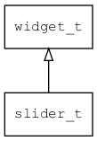

## slider\_t
### 概述


滑块控件。

slider\_t是[widget\_t](widget_t.md)的子类控件，widget\_t的函数均适用于slider\_t控件。

在xml中使用"slider"标签创建滑块控件。如：

```xml
<slider x="center" y="10" w="80%" h="20" value="10"/>
<slider style="img" x="center" y="50" w="80%" h="30" value="20" />
<slider style="img" x="center" y="90" w="80%" h="30" value="30" min="5" max="50" step="5"/>
```

> 更多用法请参考：
[basic](https://github.com/zlgopen/awtk/blob/master/design/default/ui/basic.xml)

在c代码中使用函数slider\_create创建滑块控件。如：

```c
widget_t* slider = slider_create(win, 10, 10, 200, 30);
widget_on(slider, EVT_VALUE_CHANGED, on_changed, NULL);
widget_on(slider, EVT_VALUE_CHANGING, on_changing, NULL);
```

> 完整示例请参考：
[slider demo](https://github.com/zlgopen/awtk-c-demos/blob/master/demos/slider.c)

可用通过style来设置控件的显示风格，如图片和颜色等等。如：

```xml
<style name="img" bg_image="slider_bg" fg_image="slider_fg">
<normal icon="slider_drag"/>
<pressed icon="slider_drag_p"/>
<over icon="slider_drag_o"/>
</style>
```

> 更多用法请参考：
[theme
default](https://github.com/zlgopen/awtk/blob/master/design/default/styles/default.xml#L179)
----------------------------------
### 函数
<p id="slider_t_methods">

| 函数名称 | 说明 | 
| -------- | ------------ | 
| <a href="#slider_t_slider_cast">slider\_cast</a> | 转换为slider对象(供脚本语言使用)。 |
| <a href="#slider_t_slider_create">slider\_create</a> | 创建slider对象 |
| <a href="#slider_t_slider_set_bar_size">slider\_set\_bar\_size</a> | 设置bar的宽度或高度。 |
| <a href="#slider_t_slider_set_max">slider\_set\_max</a> | 设置滑块的最大值。 |
| <a href="#slider_t_slider_set_min">slider\_set\_min</a> | 设置滑块的最小值。 |
| <a href="#slider_t_slider_set_step">slider\_set\_step</a> | 设置滑块的拖动的最小单位。 |
| <a href="#slider_t_slider_set_value">slider\_set\_value</a> | 设置滑块的值。 |
| <a href="#slider_t_slider_set_value_internal">slider\_set\_value\_internal</a> | 设置滑块的值(public for test)。 |
| <a href="#slider_t_slider_set_vertical">slider\_set\_vertical</a> | 设置滑块的方向。 |
### 属性
<p id="slider_t_properties">

| 属性名称 | 类型 | 说明 | 
| -------- | ----- | ------------ | 
| <a href="#slider_t_bar_size">bar\_size</a> | uint32\_t | 轴的宽度或高度（单位：像素），为0表示为控件的宽度或高度的一半，缺省为0。 |
| <a href="#slider_t_dragger_adapt_to_icon">dragger\_adapt\_to\_icon</a> | bool\_t | 滑块的宽度或高度是否与icon适应，缺省为true。 |
| <a href="#slider_t_dragger_size">dragger\_size</a> | uint32\_t | 滑块的宽度或高度（单位：像素），缺省为10。 |
| <a href="#slider_t_max">max</a> | double | 最大值。 |
| <a href="#slider_t_min">min</a> | double | 最小值。 |
| <a href="#slider_t_slide_with_bar">slide\_with\_bar</a> | bool\_t | 是否允许在轴上滑动来改变滑块位置，缺省为FALSE。 |
| <a href="#slider_t_step">step</a> | double | 拖动的最小单位。 |
| <a href="#slider_t_value">value</a> | double | 值。 |
| <a href="#slider_t_vertical">vertical</a> | bool\_t | 滑块的是否为垂直方向。 |
### 事件
<p id="slider_t_events">

| 事件名称 | 类型  | 说明 | 
| -------- | ----- | ------- | 
| EVT\_VALUE\_WILL\_CHANGE | event\_t | 值即将改变事件。 |
| EVT\_VALUE\_CHANGING | event\_t | 值正在改变事件(拖动中)。 |
| EVT\_VALUE\_CHANGED | event\_t | 值改变事件。 |
#### slider\_cast 函数
-----------------------

* 函数功能：

> <p id="slider_t_slider_cast">转换为slider对象(供脚本语言使用)。

* 函数原型：

```
widget_t* slider_cast (widget_t* widget);
```

* 参数说明：

| 参数 | 类型 | 说明 |
| -------- | ----- | --------- |
| 返回值 | widget\_t* | slider对象。 |
| widget | widget\_t* | slider对象。 |
#### slider\_create 函数
-----------------------

* 函数功能：

> <p id="slider_t_slider_create">创建slider对象

* 函数原型：

```
widget_t* slider_create (widget_t* parent, xy_t x, xy_t y, wh_t w, wh_t h);
```

* 参数说明：

| 参数 | 类型 | 说明 |
| -------- | ----- | --------- |
| 返回值 | widget\_t* | 对象。 |
| parent | widget\_t* | 父控件 |
| x | xy\_t | x坐标 |
| y | xy\_t | y坐标 |
| w | wh\_t | 宽度 |
| h | wh\_t | 高度 |
#### slider\_set\_bar\_size 函数
-----------------------

* 函数功能：

> <p id="slider_t_slider_set_bar_size">设置bar的宽度或高度。

* 函数原型：

```
ret_t slider_set_bar_size (widget_t* widget, uint32_t bar_size);
```

* 参数说明：

| 参数 | 类型 | 说明 |
| -------- | ----- | --------- |
| 返回值 | ret\_t | 返回RET\_OK表示成功，否则表示失败。 |
| widget | widget\_t* | 控件对象。 |
| bar\_size | uint32\_t | bar的宽度或高度。 |
#### slider\_set\_max 函数
-----------------------

* 函数功能：

> <p id="slider_t_slider_set_max">设置滑块的最大值。

* 函数原型：

```
ret_t slider_set_max (widget_t* widget, double max);
```

* 参数说明：

| 参数 | 类型 | 说明 |
| -------- | ----- | --------- |
| 返回值 | ret\_t | 返回RET\_OK表示成功，否则表示失败。 |
| widget | widget\_t* | 控件对象。 |
| max | double | 最大值 |
#### slider\_set\_min 函数
-----------------------

* 函数功能：

> <p id="slider_t_slider_set_min">设置滑块的最小值。

* 函数原型：

```
ret_t slider_set_min (widget_t* widget, double min);
```

* 参数说明：

| 参数 | 类型 | 说明 |
| -------- | ----- | --------- |
| 返回值 | ret\_t | 返回RET\_OK表示成功，否则表示失败。 |
| widget | widget\_t* | 控件对象。 |
| min | double | 最小值 |
#### slider\_set\_step 函数
-----------------------

* 函数功能：

> <p id="slider_t_slider_set_step">设置滑块的拖动的最小单位。

* 函数原型：

```
ret_t slider_set_step (widget_t* widget, double step);
```

* 参数说明：

| 参数 | 类型 | 说明 |
| -------- | ----- | --------- |
| 返回值 | ret\_t | 返回RET\_OK表示成功，否则表示失败。 |
| widget | widget\_t* | 控件对象。 |
| step | double | 拖动的最小单位。 |
#### slider\_set\_value 函数
-----------------------

* 函数功能：

> <p id="slider_t_slider_set_value">设置滑块的值。

* 函数原型：

```
ret_t slider_set_value (widget_t* widget, double value);
```

* 参数说明：

| 参数 | 类型 | 说明 |
| -------- | ----- | --------- |
| 返回值 | ret\_t | 返回RET\_OK表示成功，否则表示失败。 |
| widget | widget\_t* | 控件对象。 |
| value | double | 值 |
#### slider\_set\_value\_internal 函数
-----------------------

* 函数功能：

> <p id="slider_t_slider_set_value_internal">设置滑块的值(public for test)。

* 函数原型：

```
ret_t slider_set_value_internal (widget_t* widget, double value, event_type_t etype, bool_t force);
```

* 参数说明：

| 参数 | 类型 | 说明 |
| -------- | ----- | --------- |
| 返回值 | ret\_t | 返回RET\_OK表示成功，否则表示失败。 |
| widget | widget\_t* | 控件对象。 |
| value | double | 值。 |
| etype | event\_type\_t | 触发事件。 |
| force | bool\_t | 不管有没有变化都设置。 |
#### slider\_set\_vertical 函数
-----------------------

* 函数功能：

> <p id="slider_t_slider_set_vertical">设置滑块的方向。

* 函数原型：

```
ret_t slider_set_vertical (widget_t* widget, bool_t vertical);
```

* 参数说明：

| 参数 | 类型 | 说明 |
| -------- | ----- | --------- |
| 返回值 | ret\_t | 返回RET\_OK表示成功，否则表示失败。 |
| widget | widget\_t* | 控件对象。 |
| vertical | bool\_t | 是否为垂直方向。 |
#### bar\_size 属性
-----------------------
> <p id="slider_t_bar_size">轴的宽度或高度（单位：像素），为0表示为控件的宽度或高度的一半，缺省为0。

* 类型：uint32\_t

| 特性 | 是否支持 |
| -------- | ----- |
| 可直接读取 | 是 |
| 可直接修改 | 否 |
| 可持久化   | 是 |
| 可脚本化   | 是 |
| 可在IDE中设置 | 是 |
| 可在XML中设置 | 是 |
| 可通过widget\_get\_prop读取 | 是 |
| 可通过widget\_set\_prop修改 | 是 |
#### dragger\_adapt\_to\_icon 属性
-----------------------
> <p id="slider_t_dragger_adapt_to_icon">滑块的宽度或高度是否与icon适应，缺省为true。

* 类型：bool\_t

| 特性 | 是否支持 |
| -------- | ----- |
| 可直接读取 | 是 |
| 可直接修改 | 否 |
| 可持久化   | 是 |
| 可脚本化   | 是 |
| 可在IDE中设置 | 是 |
| 可在XML中设置 | 是 |
| 可通过widget\_get\_prop读取 | 是 |
| 可通过widget\_set\_prop修改 | 是 |
#### dragger\_size 属性
-----------------------
> <p id="slider_t_dragger_size">滑块的宽度或高度（单位：像素），缺省为10。

* 类型：uint32\_t

| 特性 | 是否支持 |
| -------- | ----- |
| 可直接读取 | 是 |
| 可直接修改 | 否 |
| 可持久化   | 是 |
| 可脚本化   | 是 |
| 可在IDE中设置 | 是 |
| 可在XML中设置 | 是 |
| 可通过widget\_get\_prop读取 | 是 |
| 可通过widget\_set\_prop修改 | 是 |
#### max 属性
-----------------------
> <p id="slider_t_max">最大值。

* 类型：double

| 特性 | 是否支持 |
| -------- | ----- |
| 可直接读取 | 是 |
| 可直接修改 | 否 |
| 可持久化   | 是 |
| 可脚本化   | 是 |
| 可在IDE中设置 | 是 |
| 可在XML中设置 | 是 |
| 可通过widget\_get\_prop读取 | 是 |
| 可通过widget\_set\_prop修改 | 是 |
#### min 属性
-----------------------
> <p id="slider_t_min">最小值。

* 类型：double

| 特性 | 是否支持 |
| -------- | ----- |
| 可直接读取 | 是 |
| 可直接修改 | 否 |
| 可持久化   | 是 |
| 可脚本化   | 是 |
| 可在IDE中设置 | 是 |
| 可在XML中设置 | 是 |
| 可通过widget\_get\_prop读取 | 是 |
| 可通过widget\_set\_prop修改 | 是 |
#### slide\_with\_bar 属性
-----------------------
> <p id="slider_t_slide_with_bar">是否允许在轴上滑动来改变滑块位置，缺省为FALSE。

* 类型：bool\_t

| 特性 | 是否支持 |
| -------- | ----- |
| 可直接读取 | 是 |
| 可直接修改 | 否 |
| 可持久化   | 是 |
| 可脚本化   | 是 |
| 可在IDE中设置 | 是 |
| 可在XML中设置 | 是 |
| 可通过widget\_get\_prop读取 | 是 |
| 可通过widget\_set\_prop修改 | 是 |
#### step 属性
-----------------------
> <p id="slider_t_step">拖动的最小单位。

* 类型：double

| 特性 | 是否支持 |
| -------- | ----- |
| 可直接读取 | 是 |
| 可直接修改 | 否 |
| 可持久化   | 是 |
| 可脚本化   | 是 |
| 可在IDE中设置 | 是 |
| 可在XML中设置 | 是 |
| 可通过widget\_get\_prop读取 | 是 |
| 可通过widget\_set\_prop修改 | 是 |
#### value 属性
-----------------------
> <p id="slider_t_value">值。

* 类型：double

| 特性 | 是否支持 |
| -------- | ----- |
| 可直接读取 | 是 |
| 可直接修改 | 否 |
| 可持久化   | 是 |
| 可脚本化   | 是 |
| 可在IDE中设置 | 是 |
| 可在XML中设置 | 是 |
| 可通过widget\_get\_prop读取 | 是 |
| 可通过widget\_set\_prop修改 | 是 |
#### vertical 属性
-----------------------
> <p id="slider_t_vertical">滑块的是否为垂直方向。

* 类型：bool\_t

| 特性 | 是否支持 |
| -------- | ----- |
| 可直接读取 | 是 |
| 可直接修改 | 否 |
| 可持久化   | 是 |
| 可脚本化   | 是 |
| 可在IDE中设置 | 是 |
| 可在XML中设置 | 是 |
| 可通过widget\_get\_prop读取 | 是 |
| 可通过widget\_set\_prop修改 | 是 |
