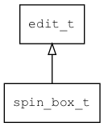

## spin\_box\_t
### 概述


spinbox控件。

一个特殊的数值编辑器，将edit\_t和button\_t进行组合，方便编辑数值。

点击向上的按钮将数值增加一个step，点击向下的按钮将数值减小一个step。
step的值可以通过step属性进行设置。

spin_box\_t是[edit\_t](edit_t.md)的子类控件，edit\_t的函数均适用于spin\_box\_t控件。

在xml中使用"spin_box"标签创建spinbox控件。如：

```xml
<spin_box w="70%" input_type="int" min="-100" max="100" step="5">
```

>
更多用法请参考：[spin_box.xml](https://github.com/zlgopen/awtk/blob/master/design/default/ui/spinbox.xml)

在c代码中使用函数spin_box\_create创建spinbox控件。如：

```c
widget_t* spin_box = spin_box_create(win, 10, 10, 128, 30);
edit_set_input_type(spin_box, type);
```

> 创建之后:
>
> 可以用edit相关函数去设置它的各种属性。

> 完整示例请参考：[spin_box
demo](https://github.com/zlgopen/awtk-c-demos/blob/master/demos/spin_box.c)

可用通过style来设置控件的显示风格，如背景和边框等。如：

```xml
<spin_box>
<style name="default" border_color="#a0a0a0"  text_color="black" text_align_h="left">
<normal     bg_color="#f0f0f0" />
<focused    bg_color="#f0f0f0" border_color="black"/>
<disable    bg_color="gray" text_color="#d0d0d0" />
<error      bg_color="#f0f0f0" text_color="red" />
<empty      bg_color="#f0f0f0" text_color="#a0a0a0" />
</style>
</spin_box>
```

> 更多用法请参考：[theme
default](https://github.com/zlgopen/awtk/blob/master/design/default/styles/default.xml#L128)
----------------------------------
### 函数
<p id="spin_box_t_methods">

| 函数名称 | 说明 | 
| -------- | ------------ | 
| <a href="#spin_box_t_spin_box_cast">spin\_box\_cast</a> | 转换为spin_box对象(供脚本语言使用)。 |
| <a href="#spin_box_t_spin_box_create">spin\_box\_create</a> | 创建spin_box对象 |
#### spin\_box\_cast 函数
-----------------------

* 函数功能：

> <p id="spin_box_t_spin_box_cast">转换为spin_box对象(供脚本语言使用)。

* 函数原型：

```
widget_t* spin_box_cast (widget_t* widget);
```

* 参数说明：

| 参数 | 类型 | 说明 |
| -------- | ----- | --------- |
| 返回值 | widget\_t* | spin\_box对象。 |
| widget | widget\_t* | spin\_box对象。 |
#### spin\_box\_create 函数
-----------------------

* 函数功能：

> <p id="spin_box_t_spin_box_create">创建spin_box对象

* 函数原型：

```
widget_t* spin_box_create (widget_t* parent, xy_t x, xy_t y, wh_t w, wh_t h);
```

* 参数说明：

| 参数 | 类型 | 说明 |
| -------- | ----- | --------- |
| 返回值 | widget\_t* | 对象。 |
| parent | widget\_t* | 父控件 |
| x | xy\_t | x坐标 |
| y | xy\_t | y坐标 |
| w | wh\_t | 宽度 |
| h | wh\_t | 高度 |
