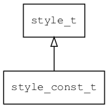

## style\_const\_t
### 概述


只读的style，从theme\_t中获取数据。

tools/theme_gen用于把XML的主题数据转换成常量数据。
----------------------------------
### 函数
<p id="style_const_t_methods">

| 函数名称 | 说明 | 
| -------- | ------------ | 
| <a href="#style_const_t_style_const_create">style\_const\_create</a> | 创建只读的style对象。 |
#### style\_const\_create 函数
-----------------------

* 函数功能：

> <p id="style_const_t_style_const_create">创建只读的style对象。

* 函数原型：

```
style_t* style_const_create ();
```

* 参数说明：

| 参数 | 类型 | 说明 |
| -------- | ----- | --------- |
| 返回值 | style\_t* | 返回style对象。 |
