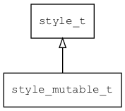

## style\_mutable\_t
### 概述


可变的style(可实时修改并生效，主要用于在designer中被编辑的控件，或者一些特殊控件)。

style\_mutable也对style\_const进行了包装，当用户没修改某个值时，便从style\_const中获取。
----------------------------------
### 函数
<p id="style_mutable_t_methods">

| 函数名称 | 说明 | 
| -------- | ------------ | 
| <a href="#style_mutable_t_style_mutable_cast">style\_mutable\_cast</a> | 转换为style_mutable对象。 |
| <a href="#style_mutable_t_style_mutable_copy">style\_mutable\_copy</a> | 将other对象的数据拷贝到s对象。 |
| <a href="#style_mutable_t_style_mutable_create">style\_mutable\_create</a> | 创建style\_mutable对象。 |
| <a href="#style_mutable_t_style_mutable_foreach">style\_mutable\_foreach</a> | 遍历。对每项调用回调函数on\_style\_item。 |
| <a href="#style_mutable_t_style_mutable_get_value">style\_mutable\_get\_value</a> | 获取指定名称的值。 |
| <a href="#style_mutable_t_style_mutable_register">style\_mutable\_register</a> | 将自己注册到style\_factory。 |
| <a href="#style_mutable_t_style_mutable_reset">style\_mutable\_reset</a> | 清空s对象。 |
| <a href="#style_mutable_t_style_mutable_set_color">style\_mutable\_set\_color</a> | 设置指定名称的颜色值。 |
| <a href="#style_mutable_t_style_mutable_set_int">style\_mutable\_set\_int</a> | 设置指定名称整数格式的值。 |
| <a href="#style_mutable_t_style_mutable_set_name">style\_mutable\_set\_name</a> | 设置style的名称。 |
| <a href="#style_mutable_t_style_mutable_set_str">style\_mutable\_set\_str</a> | 设置指定名称字符串的值。 |
| <a href="#style_mutable_t_style_mutable_set_value">style\_mutable\_set\_value</a> | 设置指定名称的值。 |
### 属性
<p id="style_mutable_t_properties">

| 属性名称 | 类型 | 说明 | 
| -------- | ----- | ------------ | 
| <a href="#style_mutable_t_name">name</a> | char* | 名称。 |
#### style\_mutable\_cast 函数
-----------------------

* 函数功能：

> <p id="style_mutable_t_style_mutable_cast">转换为style_mutable对象。

* 函数原型：

```
style_t* style_mutable_cast (style_t* s);
```

* 参数说明：

| 参数 | 类型 | 说明 |
| -------- | ----- | --------- |
| 返回值 | style\_t* | style对象。 |
| s | style\_t* | style对象。 |
#### style\_mutable\_copy 函数
-----------------------

* 函数功能：

> <p id="style_mutable_t_style_mutable_copy">将other对象的数据拷贝到s对象。

* 函数原型：

```
ret_t style_mutable_copy (style_t* s, style_t* other);
```

* 参数说明：

| 参数 | 类型 | 说明 |
| -------- | ----- | --------- |
| 返回值 | ret\_t | 返回RET\_OK表示成功，否则表示失败。 |
| s | style\_t* | style对象。 |
| other | style\_t* | style对象。 |
#### style\_mutable\_create 函数
-----------------------

* 函数功能：

> <p id="style_mutable_t_style_mutable_create">创建style\_mutable对象。

> 除了测试程序外不需要直接调用，widget会通过style\_factory\_create创建。

* 函数原型：

```
style_t* style_mutable_create (widget_t* widget, style_t* default_style);
```

* 参数说明：

| 参数 | 类型 | 说明 |
| -------- | ----- | --------- |
| 返回值 | style\_t* | style对象。 |
| widget | widget\_t* | 控件 |
| default\_style | style\_t* | 缺省的style。 |
#### style\_mutable\_foreach 函数
-----------------------

* 函数功能：

> <p id="style_mutable_t_style_mutable_foreach">遍历。对每项调用回调函数on\_style\_item。

* 函数原型：

```
ret_t style_mutable_foreach (style_t* s, tk_on_style_item_t on_style_item, void* ctx);
```

* 参数说明：

| 参数 | 类型 | 说明 |
| -------- | ----- | --------- |
| 返回值 | ret\_t | 返回RET\_OK表示成功，否则表示失败。 |
| s | style\_t* | style对象。 |
| on\_style\_item | tk\_on\_style\_item\_t | 回调函数。 |
| ctx | void* | 回调函数的上下文。 |
#### style\_mutable\_get\_value 函数
-----------------------

* 函数功能：

> <p id="style_mutable_t_style_mutable_get_value">获取指定名称的值。

* 函数原型：

```
ret_t style_mutable_get_value (style_t* s, const char* state, const char* name, const value_t* v);
```

* 参数说明：

| 参数 | 类型 | 说明 |
| -------- | ----- | --------- |
| 返回值 | ret\_t | 返回RET\_OK表示成功，否则表示失败。 |
| s | style\_t* | style对象。 |
| state | const char* | 控件状态。 |
| name | const char* | 属性名。 |
| v | const value\_t* | 值。 |
#### style\_mutable\_register 函数
-----------------------

* 函数功能：

> <p id="style_mutable_t_style_mutable_register">将自己注册到style\_factory。

* 函数原型：

```
ret_t style_mutable_register ();
```

* 参数说明：

| 参数 | 类型 | 说明 |
| -------- | ----- | --------- |
| 返回值 | ret\_t | 返回RET\_OK表示成功，否则表示失败。 |
#### style\_mutable\_reset 函数
-----------------------

* 函数功能：

> <p id="style_mutable_t_style_mutable_reset">清空s对象。

* 函数原型：

```
ret_t style_mutable_reset (style_t* s);
```

* 参数说明：

| 参数 | 类型 | 说明 |
| -------- | ----- | --------- |
| 返回值 | ret\_t | 返回RET\_OK表示成功，否则表示失败。 |
| s | style\_t* | style对象。 |
#### style\_mutable\_set\_color 函数
-----------------------

* 函数功能：

> <p id="style_mutable_t_style_mutable_set_color">设置指定名称的颜色值。

* 函数原型：

```
ret_t style_mutable_set_color (style_t* s, const char* state, const char* name, color_t val);
```

* 参数说明：

| 参数 | 类型 | 说明 |
| -------- | ----- | --------- |
| 返回值 | ret\_t | 返回RET\_OK表示成功，否则表示失败。 |
| s | style\_t* | style对象。 |
| state | const char* | 控件状态。 |
| name | const char* | 属性名。 |
| val | color\_t | 值。 |
#### style\_mutable\_set\_int 函数
-----------------------

* 函数功能：

> <p id="style_mutable_t_style_mutable_set_int">设置指定名称整数格式的值。

* 函数原型：

```
ret_t style_mutable_set_int (style_t* s, const char* state, const char* name, uint32_t val);
```

* 参数说明：

| 参数 | 类型 | 说明 |
| -------- | ----- | --------- |
| 返回值 | ret\_t | 返回RET\_OK表示成功，否则表示失败。 |
| s | style\_t* | style对象。 |
| state | const char* | 控件状态。 |
| name | const char* | 属性名。 |
| val | uint32\_t | 值。 |
#### style\_mutable\_set\_name 函数
-----------------------

* 函数功能：

> <p id="style_mutable_t_style_mutable_set_name">设置style的名称。

* 函数原型：

```
ret_t style_mutable_set_name (style_t* s, const char* name);
```

* 参数说明：

| 参数 | 类型 | 说明 |
| -------- | ----- | --------- |
| 返回值 | ret\_t | 返回RET\_OK表示成功，否则表示失败。 |
| s | style\_t* | style对象。 |
| name | const char* | 名称。 |
#### style\_mutable\_set\_str 函数
-----------------------

* 函数功能：

> <p id="style_mutable_t_style_mutable_set_str">设置指定名称字符串的值。

* 函数原型：

```
ret_t style_mutable_set_str (style_t* s, const char* state, const char* name, const char* val);
```

* 参数说明：

| 参数 | 类型 | 说明 |
| -------- | ----- | --------- |
| 返回值 | ret\_t | 返回RET\_OK表示成功，否则表示失败。 |
| s | style\_t* | style对象。 |
| state | const char* | 控件状态。 |
| name | const char* | 属性名。 |
| val | const char* | 值。 |
#### style\_mutable\_set\_value 函数
-----------------------

* 函数功能：

> <p id="style_mutable_t_style_mutable_set_value">设置指定名称的值。

* 函数原型：

```
ret_t style_mutable_set_value (style_t* s, const char* state, const char* name, const value_t* v);
```

* 参数说明：

| 参数 | 类型 | 说明 |
| -------- | ----- | --------- |
| 返回值 | ret\_t | 返回RET\_OK表示成功，否则表示失败。 |
| s | style\_t* | style对象。 |
| state | const char* | 控件状态。 |
| name | const char* | 属性名。 |
| v | const value\_t* | 值。 |
#### name 属性
-----------------------
> <p id="style_mutable_t_name">名称。

* 类型：char*

| 特性 | 是否支持 |
| -------- | ----- |
| 可直接读取 | 是 |
| 可直接修改 | 否 |
| 可脚本化   | 是 |
