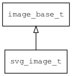

## svg\_image\_t
### 概述


 SVG图片控件。

 svg\_image\_t是[image\_base\_t](image_base_t.md)的子类控件，image\_base\_t的函数均适用于svg\_image\_t控件。

 在xml中使用"svg\_image"标签创建SVG图片控件。如：

 ```xml
 <svg_image image="girl"/>
 ```

 >更多用法请参考：[svg image](
 https://github.com/zlgopen/awtk/blob/master/demos/assets/raw/ui/svg_image.xml)

 在c代码中使用函数svg\_image\_create创建SVG图片控件。如：

 ```c
  widget_t* image = svg_image_create(win, 10, 10, 200, 200);
  image_set_image(image, "girl");
 ```

 > 创建之后: 需要用widget\_set\_image设置图片名称。

 > 完整示例请参考：[svg image demo](
 https://github.com/zlgopen/awtk-c-demos/blob/master/demos/svg_image.c)

 可用通过style来设置控件的显示风格，如背景和边框等。如：

 ```xml
 <style name="default">
   <normal border_color="green" fg_color="red" />
 </style>
 ```

 > 更多用法请参考：[theme default](
 https://github.com/zlgopen/awtk/blob/master/demos/assets/raw/styles/default.xml)


----------------------------------
### 函数
<p id="svg_image_t_methods">

| 函数名称 | 说明 | 
| -------- | ------------ | 
| <a href="#svg_image_t_svg_image_cast">svg\_image\_cast</a> | 转换为svg_image对象(供脚本语言使用)。 |
| <a href="#svg_image_t_svg_image_create">svg\_image\_create</a> | 创建svg_image对象 |
#### svg\_image\_cast 函数
-----------------------

* 函数功能：

> <p id="svg_image_t_svg_image_cast"> 转换为svg_image对象(供脚本语言使用)。


* 函数原型：

```
widget_t* svg_image_cast (widget_t* widget);
```

* 参数说明：

| 参数 | 类型 | 说明 |
| -------- | ----- | --------- |
| 返回值 | widget\_t* | svg\_image对象。 |
| widget | widget\_t* | svg\_image对象。 |
#### svg\_image\_create 函数
-----------------------

* 函数功能：

> <p id="svg_image_t_svg_image_create"> 创建svg_image对象


* 函数原型：

```
widget_t* svg_image_create (widget_t* parent, xy_t x, xy_t y, wh_t w, wh_t h);
```

* 参数说明：

| 参数 | 类型 | 说明 |
| -------- | ----- | --------- |
| 返回值 | widget\_t* | 对象。 |
| parent | widget\_t* | 父控件 |
| x | xy\_t | x坐标 |
| y | xy\_t | y坐标 |
| w | wh\_t | 宽度 |
| h | wh\_t | 高度 |
