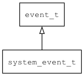

## system\_event\_t
### 概述


系统事件。
----------------------------------
### 函数
<p id="system_event_t_methods">

| 函数名称 | 说明 | 
| -------- | ------------ | 
| <a href="#system_event_t_system_event_cast">system\_event\_cast</a> | 把event对象转system_event_t对象。 |
| <a href="#system_event_t_system_event_init">system\_event\_init</a> | 初始化事件。 |
### 属性
<p id="system_event_t_properties">

| 属性名称 | 类型 | 说明 | 
| -------- | ----- | ------------ | 
| <a href="#system_event_t_sdl_event">sdl\_event</a> | void* | SDL_Event。 |
#### system\_event\_cast 函数
-----------------------

* 函数功能：

> <p id="system_event_t_system_event_cast">把event对象转system_event_t对象。

* 函数原型：

```
system_event_t* system_event_cast (event_t* event);
```

* 参数说明：

| 参数 | 类型 | 说明 |
| -------- | ----- | --------- |
| 返回值 | system\_event\_t* | event 对象。 |
| event | event\_t* | event对象。 |
#### system\_event\_init 函数
-----------------------

* 函数功能：

> <p id="system_event_t_system_event_init">初始化事件。

* 函数原型：

```
event_t* system_event_init (system_event_t* event, void* target, void* sdl_event);
```

* 参数说明：

| 参数 | 类型 | 说明 |
| -------- | ----- | --------- |
| 返回值 | event\_t* | event对象。 |
| event | system\_event\_t* | event对象。 |
| target | void* | 事件目标。 |
| sdl\_event | void* | SDL\_Event对象。 |
#### sdl\_event 属性
-----------------------
> <p id="system_event_t_sdl_event">SDL_Event。

* 类型：void*

| 特性 | 是否支持 |
| -------- | ----- |
| 可直接读取 | 是 |
| 可直接修改 | 否 |
| 可脚本化   | 是 |
