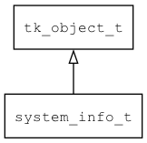

## system\_info\_t
### 概述


当前系统的信息。
----------------------------------
### 函数
<p id="system_info_t_methods">

| 函数名称 | 说明 | 
| -------- | ------------ | 
| <a href="#system_info_t_system_info">system\_info</a> | 获取system_info对象。 |
| <a href="#system_info_t_system_info_create">system\_info\_create</a> | 创建system_info对象。 |
| <a href="#system_info_t_system_info_deinit">system\_info\_deinit</a> | 释放system_info对象。 |
| <a href="#system_info_t_system_info_fix_font_name">system\_info\_fix\_font\_name</a> | 修正字体名称，如果为NULL，返回缺省字体。 |
| <a href="#system_info_t_system_info_init">system\_info\_init</a> | 初始化system_info对象。 |
| <a href="#system_info_t_system_info_set_default_font">system\_info\_set\_default\_font</a> | 设置缺省字体。 |
| <a href="#system_info_t_system_info_set_device_pixel_ratio">system\_info\_set\_device\_pixel\_ratio</a> | 设置LCD密度。 |
| <a href="#system_info_t_system_info_set_font_scale">system\_info\_set\_font\_scale</a> | 设置字体缩放比例。 |
| <a href="#system_info_t_system_info_set_lcd_h">system\_info\_set\_lcd\_h</a> | 设置LCD高度。 |
| <a href="#system_info_t_system_info_set_lcd_orientation">system\_info\_set\_lcd\_orientation</a> | 设置LCD的旋转角度。 |
| <a href="#system_info_t_system_info_set_lcd_type">system\_info\_set\_lcd\_type</a> | 设置LCD类型。 |
| <a href="#system_info_t_system_info_set_lcd_w">system\_info\_set\_lcd\_w</a> | 设置LCD宽度。 |
### 属性
<p id="system_info_t_properties">

| 属性名称 | 类型 | 说明 | 
| -------- | ----- | ------------ | 
| <a href="#system_info_t_app_name">app\_name</a> | const char* | 应用程序的名称。 |
| <a href="#system_info_t_app_root">app\_root</a> | const char* | 应用程序的根目录，用于定位资源文件。 |
| <a href="#system_info_t_app_type">app\_type</a> | app\_type\_t | 应用程序的类型。 |
| <a href="#system_info_t_country">country</a> | const char* | locale中的国家。 |
| <a href="#system_info_t_default_font">default\_font</a> | const char* | 缺省字体。 |
| <a href="#system_info_t_device_orientation">device\_orientation</a> | const char* | 显示屏的方向名称，可选值："portrait"表示竖屏，"landscape"表示横屏。 |
| <a href="#system_info_t_device_pixel_ratio">device\_pixel\_ratio</a> | float\_t | 显示屏的密度。 |
| <a href="#system_info_t_font_scale">font\_scale</a> | float\_t | 字体缩放比例，用于实现字体整体放大。 |
| <a href="#system_info_t_language">language</a> | const char* | locale中的语言。 |
| <a href="#system_info_t_lcd_h">lcd\_h</a> | uint32\_t | 显示屏的高度。 |
| <a href="#system_info_t_lcd_orientation">lcd\_orientation</a> | lcd\_orientation\_t | 显示屏的旋转角度。 |
| <a href="#system_info_t_lcd_type">lcd\_type</a> | lcd\_type\_t | 显示屏的类型。 |
| <a href="#system_info_t_lcd_w">lcd\_w</a> | uint32\_t | 显示屏的宽度。 |
#### system\_info 函数
-----------------------

* 函数功能：

> <p id="system_info_t_system_info">获取system_info对象。

* 函数原型：

```
system_info_t* system_info ();
```

* 参数说明：

| 参数 | 类型 | 说明 |
| -------- | ----- | --------- |
| 返回值 | system\_info\_t* | 返回system\_info对象。 |
#### system\_info\_create 函数
-----------------------

* 函数功能：

> <p id="system_info_t_system_info_create">创建system_info对象。

* 函数原型：

```
system_info_t* system_info_create (app_type_t app_type, const char* app_name, const char* app_root);
```

* 参数说明：

| 参数 | 类型 | 说明 |
| -------- | ----- | --------- |
| 返回值 | system\_info\_t* | 返回创建的对象指针。 |
| app\_type | app\_type\_t | 应用程序的类型。 |
| app\_name | const char* | 应用程序的名称。 |
| app\_root | const char* | 应用程序的根目录，用于定位资源文件。 |
#### system\_info\_deinit 函数
-----------------------

* 函数功能：

> <p id="system_info_t_system_info_deinit">释放system_info对象。

* 函数原型：

```
ret_t system_info_deinit ();
```

* 参数说明：

| 参数 | 类型 | 说明 |
| -------- | ----- | --------- |
| 返回值 | ret\_t | 返回RET\_OK表示成功，否则表示失败。 |
#### system\_info\_fix\_font\_name 函数
-----------------------

* 函数功能：

> <p id="system_info_t_system_info_fix_font_name">修正字体名称，如果为NULL，返回缺省字体。

* 函数原型：

```
const char* system_info_fix_font_name (const char* name);
```

* 参数说明：

| 参数 | 类型 | 说明 |
| -------- | ----- | --------- |
| 返回值 | const char* | 返回有效的字体名称。 |
| name | const char* | 字体名称。 |
#### system\_info\_init 函数
-----------------------

* 函数功能：

> <p id="system_info_t_system_info_init">初始化system_info对象。

* 函数原型：

```
ret_t system_info_init (app_type_t app_type, const char* app_name, const char* app_root);
```

* 参数说明：

| 参数 | 类型 | 说明 |
| -------- | ----- | --------- |
| 返回值 | ret\_t | 返回RET\_OK表示成功，否则表示失败。 |
| app\_type | app\_type\_t | 应用程序的类型。 |
| app\_name | const char* | 应用程序的名称。 |
| app\_root | const char* | 应用程序的根目录，用于定位资源文件。 |
#### system\_info\_set\_default\_font 函数
-----------------------

* 函数功能：

> <p id="system_info_t_system_info_set_default_font">设置缺省字体。

* 函数原型：

```
ret_t system_info_set_default_font (system_info_t* info info, const char* default_font);
```

* 参数说明：

| 参数 | 类型 | 说明 |
| -------- | ----- | --------- |
| 返回值 | ret\_t | 返回RET\_OK表示成功，否则表示失败。 |
| info | system\_info\_t* info | system\_info对象。 |
| default\_font | const char* | 缺省字体。 |
#### system\_info\_set\_device\_pixel\_ratio 函数
-----------------------

* 函数功能：

> <p id="system_info_t_system_info_set_device_pixel_ratio">设置LCD密度。

* 函数原型：

```
ret_t system_info_set_device_pixel_ratio (system_info_t* info info, float_t device_pixel_ratio);
```

* 参数说明：

| 参数 | 类型 | 说明 |
| -------- | ----- | --------- |
| 返回值 | ret\_t | 返回RET\_OK表示成功，否则表示失败。 |
| info | system\_info\_t* info | system\_info对象。 |
| device\_pixel\_ratio | float\_t | 设置LCD密度。 |
#### system\_info\_set\_font\_scale 函数
-----------------------

* 函数功能：

> <p id="system_info_t_system_info_set_font_scale">设置字体缩放比例。

* 函数原型：

```
ret_t system_info_set_font_scale (system_info_t* info info, float_t font_scale);
```

* 参数说明：

| 参数 | 类型 | 说明 |
| -------- | ----- | --------- |
| 返回值 | ret\_t | 返回RET\_OK表示成功，否则表示失败。 |
| info | system\_info\_t* info | system\_info对象。 |
| font\_scale | float\_t | 字体缩放比例。 |
#### system\_info\_set\_lcd\_h 函数
-----------------------

* 函数功能：

> <p id="system_info_t_system_info_set_lcd_h">设置LCD高度。

* 函数原型：

```
ret_t system_info_set_lcd_h (system_info_t* info info, uint32_t lcd_h);
```

* 参数说明：

| 参数 | 类型 | 说明 |
| -------- | ----- | --------- |
| 返回值 | ret\_t | 返回RET\_OK表示成功，否则表示失败。 |
| info | system\_info\_t* info | system\_info对象。 |
| lcd\_h | uint32\_t | 设置LCD高度。 |
#### system\_info\_set\_lcd\_orientation 函数
-----------------------

* 函数功能：

> <p id="system_info_t_system_info_set_lcd_orientation">设置LCD的旋转角度。

* 函数原型：

```
ret_t system_info_set_lcd_orientation (system_info_t* info info, lcd_orientation_t lcd_orientation);
```

* 参数说明：

| 参数 | 类型 | 说明 |
| -------- | ----- | --------- |
| 返回值 | ret\_t | 返回RET\_OK表示成功，否则表示失败。 |
| info | system\_info\_t* info | system\_info对象。 |
| lcd\_orientation | lcd\_orientation\_t | 设置LCD的旋转角度。 |
#### system\_info\_set\_lcd\_type 函数
-----------------------

* 函数功能：

> <p id="system_info_t_system_info_set_lcd_type">设置LCD类型。

* 函数原型：

```
ret_t system_info_set_lcd_type (system_info_t* info info, lcd_type_t lcd_type);
```

* 参数说明：

| 参数 | 类型 | 说明 |
| -------- | ----- | --------- |
| 返回值 | ret\_t | 返回RET\_OK表示成功，否则表示失败。 |
| info | system\_info\_t* info | system\_info对象。 |
| lcd\_type | lcd\_type\_t | 设置LCD类型。 |
#### system\_info\_set\_lcd\_w 函数
-----------------------

* 函数功能：

> <p id="system_info_t_system_info_set_lcd_w">设置LCD宽度。

* 函数原型：

```
ret_t system_info_set_lcd_w (system_info_t* info info, uint32_t lcd_w);
```

* 参数说明：

| 参数 | 类型 | 说明 |
| -------- | ----- | --------- |
| 返回值 | ret\_t | 返回RET\_OK表示成功，否则表示失败。 |
| info | system\_info\_t* info | system\_info对象。 |
| lcd\_w | uint32\_t | 设置LCD宽度。 |
#### app\_name 属性
-----------------------
> <p id="system_info_t_app_name">应用程序的名称。

* 类型：const char*

| 特性 | 是否支持 |
| -------- | ----- |
| 可直接读取 | 是 |
| 可直接修改 | 否 |
#### app\_root 属性
-----------------------
> <p id="system_info_t_app_root">应用程序的根目录，用于定位资源文件。

* 类型：const char*

| 特性 | 是否支持 |
| -------- | ----- |
| 可直接读取 | 是 |
| 可直接修改 | 否 |
#### app\_type 属性
-----------------------
> <p id="system_info_t_app_type">应用程序的类型。

* 类型：app\_type\_t

| 特性 | 是否支持 |
| -------- | ----- |
| 可直接读取 | 是 |
| 可直接修改 | 否 |
#### country 属性
-----------------------
> <p id="system_info_t_country">locale中的国家。

> 只能通过object\_get\_prop函数访问。

* 类型：const char*

| 特性 | 是否支持 |
| -------- | ----- |
| 可直接读取 | 是 |
| 可直接修改 | 否 |
#### default\_font 属性
-----------------------
> <p id="system_info_t_default_font">缺省字体。

* 类型：const char*

| 特性 | 是否支持 |
| -------- | ----- |
| 可直接读取 | 是 |
| 可直接修改 | 否 |
#### device\_orientation 属性
-----------------------
> <p id="system_info_t_device_orientation">显示屏的方向名称，可选值："portrait"表示竖屏，"landscape"表示横屏。

> 只能通过object\_get\_prop函数访问。

* 类型：const char*

| 特性 | 是否支持 |
| -------- | ----- |
| 可直接读取 | 是 |
| 可直接修改 | 否 |
#### device\_pixel\_ratio 属性
-----------------------
> <p id="system_info_t_device_pixel_ratio">显示屏的密度。

* 类型：float\_t

| 特性 | 是否支持 |
| -------- | ----- |
| 可直接读取 | 是 |
| 可直接修改 | 否 |
#### font\_scale 属性
-----------------------
> <p id="system_info_t_font_scale">字体缩放比例，用于实现字体整体放大。

* 类型：float\_t

| 特性 | 是否支持 |
| -------- | ----- |
| 可直接读取 | 是 |
| 可直接修改 | 否 |
#### language 属性
-----------------------
> <p id="system_info_t_language">locale中的语言。

> 只能通过object\_get\_prop函数访问。

* 类型：const char*

| 特性 | 是否支持 |
| -------- | ----- |
| 可直接读取 | 是 |
| 可直接修改 | 否 |
#### lcd\_h 属性
-----------------------
> <p id="system_info_t_lcd_h">显示屏的高度。

* 类型：uint32\_t

| 特性 | 是否支持 |
| -------- | ----- |
| 可直接读取 | 是 |
| 可直接修改 | 否 |
#### lcd\_orientation 属性
-----------------------
> <p id="system_info_t_lcd_orientation">显示屏的旋转角度。

* 类型：lcd\_orientation\_t

| 特性 | 是否支持 |
| -------- | ----- |
| 可直接读取 | 是 |
| 可直接修改 | 否 |
#### lcd\_type 属性
-----------------------
> <p id="system_info_t_lcd_type">显示屏的类型。

* 类型：lcd\_type\_t

| 特性 | 是否支持 |
| -------- | ----- |
| 可直接读取 | 是 |
| 可直接修改 | 否 |
#### lcd\_w 属性
-----------------------
> <p id="system_info_t_lcd_w">显示屏的宽度。

* 类型：uint32\_t

| 特性 | 是否支持 |
| -------- | ----- |
| 可直接读取 | 是 |
| 可直接修改 | 否 |
