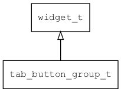

## tab\_button\_group\_t
### 概述


 标签按钮分组控件。

 一个简单的容器，主要用于对标签按钮进行布局和管理。

 tab\_button\_group\_t是[widget\_t](widget_t.md)的子类控件，
 widget\_t的函数均适用于tab\_button\_group\_t控件。

 在xml中使用"tab\_button\_group"标签创建标签按钮分组控件。如：

 ```xml
   <tab_button_group x="c" y="bottom:10" w="90%" h="30" compact="true" >
     <tab_button text="General"/>
     <tab_button text="Network" value="true" />
     <tab_button text="Security"/>
   </tab_button_group>
 ```

 > 更多用法请参考：
 [tab control](https://github.com/zlgopen/awtk/blob/master/demos/assets/raw/ui/)

 可用通过style来设置控件的显示风格，如颜色等等。如：

 ```xml
 <tab_button_group>
  <style name="default">
   <normal/>
  </style>
 </tab_button_group>
 ```


----------------------------------
### 函数
<p id="tab_button_group_t_methods">

| 函数名称 | 说明 | 
| -------- | ------------ | 
| <a href="#tab_button_group_t_tab_button_group_cast">tab\_button\_group\_cast</a> | 转换tab_button_group对象(供脚本语言使用)。 |
| <a href="#tab_button_group_t_tab_button_group_create">tab\_button\_group\_create</a> | 创建tab_button_group对象 |
### 属性
<p id="tab_button_group_t_properties">

| 名属性称 | 类型 | 说明 | 
| -------- | ----- | ------------ | 
| <a href="#tab_button_group_t_compact">compact</a> | bool\_t | 紧凑型排版子控件。 |
#### tab\_button\_group\_cast 函数
-----------------------

* 函数功能：

> <p id="tab_button_group_t_tab_button_group_cast"> 转换tab_button_group对象(供脚本语言使用)。


* 函数原型：

```
widget_t* tab_button_group_cast (widget_t* widget);
```

* 参数说明：

| 参数 | 类型 | 说明 |
| -------- | ----- | --------- |
| 返回值 | widget\_t* | tab\_button\_group对象。 |
| widget | widget\_t* | tab\_button\_group对象。 |
#### tab\_button\_group\_create 函数
-----------------------

* 函数功能：

> <p id="tab_button_group_t_tab_button_group_create"> 创建tab_button_group对象


* 函数原型：

```
widget_t* tab_button_group_create (widget_t* parent, xy_t x, xy_t y, wh_t w, wh_t h);
```

* 参数说明：

| 参数 | 类型 | 说明 |
| -------- | ----- | --------- |
| 返回值 | widget\_t* | 对象。 |
| parent | widget\_t* | 父控件 |
| x | xy\_t | x坐标 |
| y | xy\_t | y坐标 |
| w | wh\_t | 宽度 |
| h | wh\_t | 高度 |
#### compact 属性
-----------------------
> <p id="tab_button_group_t_compact"> 紧凑型排版子控件。


* 类型：bool\_t

| 特性 | 是否支持 |
| -------- | ----- |
| 可直接读取 | 是 |
| 可直接修改 | 否 |
| 可持久化   | 是 |
| 可脚本化   | 是 |
| 可在IDE中设置 | 是 |
| 可在XML中设置 | 是 |
| 可通过widget\_get\_prop读取 | 是 |
| 可通过widget\_set\_prop修改 | 是 |
