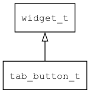

## tab\_button\_t
### 概述


标签按钮控件。

标签按钮有点类似单选按钮，但点击标签按钮之后会自动切换当前的标签页。

tab\_button\_t是[widget\_t](widget_t.md)的子类控件，widget\_t的函数均适用于tab\_button\_t控件。

在xml中使用"tab\_button"标签创建标签按钮控件。如：

```xml
<!-- tab_button_view_page1.xml -->
<view w="100%" h="100%">
<label x="c" y="m" w="100%" h="60" text="page1" />
<button name="close" x="c" y="bottom:100" w="80" h="40" text="Close" />
</view>
```

```xml
<!-- tab_button dynamic load UI -->
<pages name="pages" x="right" y="0" w="70%" h="100%">
</pages>
<list_view x="0" y="0" w="30%" h="100%" item_height="40" auto_hide_scroll_bar="true">
<scroll_view name="view" x="0"  y="0" w="-12" h="100%">
<tab_button text="page1" load_ui="tab_button_view_page1" value="true"/>
<tab_button text="page2" load_ui="tab_button_view_page2" />
<tab_button text="page3" load_ui="tab_button_view_page3" />
<scroll_view />
<scroll_bar_d name="bar" x="right" y="0" w="12" h="100%" value="0"/>
</list_view>
```

```xml
<!-- tab_button static load UI -->
<tab_button_group x="c" y="bottom:10" w="90%" h="30" compact="true" >
<tab_button text="General"/>
<tab_button text="Network" value="true" />
<tab_button text="Security"/>
</tab_button_group>
```

标签按钮一般放在标签按钮分组中，布局由标签按钮分组控件决定，不需要指定自己的布局参数和坐标。

> 更多用法请参考：
[tab control](https://github.com/zlgopen/awtk/blob/master/design/default/ui/)

可用通过style来设置控件的显示风格，如字体的大小和颜色等等。如：

```xml
<tab_button>
<style name="default" border_color="#a0a0a0"  text_color="black">
<normal     bg_color="#d0d0d0" />
<pressed    bg_color="#f0f0f0" />
<over       bg_color="#e0e0e0" />
<normal_of_active     bg_color="#f0f0f0" />
<pressed_of_active    bg_color="#f0f0f0" />
<over_of_active       bg_color="#f0f0f0" />
</style>
</tab_button>
```
----------------------------------
### 函数
<p id="tab_button_t_methods">

| 函数名称 | 说明 | 
| -------- | ------------ | 
| <a href="#tab_button_t_tab_button_cast">tab\_button\_cast</a> | 转换tab_button对象(供脚本语言使用)。 |
| <a href="#tab_button_t_tab_button_create">tab\_button\_create</a> | 创建tab_button对象 |
| <a href="#tab_button_t_tab_button_set_active_icon">tab\_button\_set\_active\_icon</a> | 设置控件的active图标。 |
| <a href="#tab_button_t_tab_button_set_icon">tab\_button\_set\_icon</a> | 设置控件的图标。 |
| <a href="#tab_button_t_tab_button_set_load_ui">tab\_button\_set\_load\_ui</a> | 设置控件动态加载显示UI。 |
| <a href="#tab_button_t_tab_button_set_value">tab\_button\_set\_value</a> | 设置为当前标签。 |
### 属性
<p id="tab_button_t_properties">

| 属性名称 | 类型 | 说明 | 
| -------- | ----- | ------------ | 
| <a href="#tab_button_t_active_icon">active\_icon</a> | char* | 当前项的图标的名称。 |
| <a href="#tab_button_t_icon">icon</a> | char* | 非当前项的图标的名称。 |
| <a href="#tab_button_t_load_ui">load\_ui</a> | char* | 激活后加载的UI名字。 |
| <a href="#tab_button_t_value">value</a> | bool\_t | 值。 |
### 事件
<p id="tab_button_t_events">

| 事件名称 | 类型  | 说明 | 
| -------- | ----- | ------- | 
| EVT\_VALUE\_WILL\_CHANGE | event\_t | 值(激活状态)即将改变事件。 |
| EVT\_VALUE\_CHANGED | event\_t | 值(激活状态)改变事件。 |
#### tab\_button\_cast 函数
-----------------------

* 函数功能：

> <p id="tab_button_t_tab_button_cast">转换tab_button对象(供脚本语言使用)。

* 函数原型：

```
widget_t* tab_button_cast (widget_t* widget);
```

* 参数说明：

| 参数 | 类型 | 说明 |
| -------- | ----- | --------- |
| 返回值 | widget\_t* | tab\_button对象。 |
| widget | widget\_t* | tab\_button对象。 |
#### tab\_button\_create 函数
-----------------------

* 函数功能：

> <p id="tab_button_t_tab_button_create">创建tab_button对象

* 函数原型：

```
widget_t* tab_button_create (widget_t* parent, xy_t x, xy_t y, wh_t w, wh_t h);
```

* 参数说明：

| 参数 | 类型 | 说明 |
| -------- | ----- | --------- |
| 返回值 | widget\_t* | 对象。 |
| parent | widget\_t* | 父控件 |
| x | xy\_t | x坐标 |
| y | xy\_t | y坐标 |
| w | wh\_t | 宽度 |
| h | wh\_t | 高度 |
#### tab\_button\_set\_active\_icon 函数
-----------------------

* 函数功能：

> <p id="tab_button_t_tab_button_set_active_icon">设置控件的active图标。

* 函数原型：

```
ret_t tab_button_set_active_icon (widget_t* widget, char* name);
```

* 参数说明：

| 参数 | 类型 | 说明 |
| -------- | ----- | --------- |
| 返回值 | ret\_t | 返回RET\_OK表示成功，否则表示失败。 |
| widget | widget\_t* | tab\_button对象。 |
| name | char* | 当前项的图标。 |
#### tab\_button\_set\_icon 函数
-----------------------

* 函数功能：

> <p id="tab_button_t_tab_button_set_icon">设置控件的图标。

* 函数原型：

```
ret_t tab_button_set_icon (widget_t* widget, char* name);
```

* 参数说明：

| 参数 | 类型 | 说明 |
| -------- | ----- | --------- |
| 返回值 | ret\_t | 返回RET\_OK表示成功，否则表示失败。 |
| widget | widget\_t* | tab\_button对象。 |
| name | char* | 当前项的图标。 |
#### tab\_button\_set\_load\_ui 函数
-----------------------

* 函数功能：

> <p id="tab_button_t_tab_button_set_load_ui">设置控件动态加载显示UI。

* 函数原型：

```
ret_t tab_button_set_load_ui (widget_t* widget, char* name);
```

* 参数说明：

| 参数 | 类型 | 说明 |
| -------- | ----- | --------- |
| 返回值 | ret\_t | 返回RET\_OK表示成功，否则表示失败。 |
| widget | widget\_t* | tab\_button对象。 |
| name | char* | 动态加载UI的资源名称。 |
#### tab\_button\_set\_value 函数
-----------------------

* 函数功能：

> <p id="tab_button_t_tab_button_set_value">设置为当前标签。

* 函数原型：

```
ret_t tab_button_set_value (widget_t* widget, uint32_t value);
```

* 参数说明：

| 参数 | 类型 | 说明 |
| -------- | ----- | --------- |
| 返回值 | ret\_t | 返回RET\_OK表示成功，否则表示失败。 |
| widget | widget\_t* | tab\_button对象。 |
| value | uint32\_t | 是否为当前标签。 |
#### active\_icon 属性
-----------------------
> <p id="tab_button_t_active_icon">当前项的图标的名称。

* 类型：char*

| 特性 | 是否支持 |
| -------- | ----- |
| 可直接读取 | 是 |
| 可直接修改 | 否 |
| 可持久化   | 是 |
| 可脚本化   | 是 |
| 可在IDE中设置 | 是 |
| 可在XML中设置 | 是 |
| 可通过widget\_get\_prop读取 | 是 |
| 可通过widget\_set\_prop修改 | 是 |
#### icon 属性
-----------------------
> <p id="tab_button_t_icon">非当前项的图标的名称。

* 类型：char*

| 特性 | 是否支持 |
| -------- | ----- |
| 可直接读取 | 是 |
| 可直接修改 | 否 |
| 可持久化   | 是 |
| 可脚本化   | 是 |
| 可在IDE中设置 | 是 |
| 可在XML中设置 | 是 |
| 可通过widget\_get\_prop读取 | 是 |
| 可通过widget\_set\_prop修改 | 是 |
#### load\_ui 属性
-----------------------
> <p id="tab_button_t_load_ui">激活后加载的UI名字。

* 类型：char*

| 特性 | 是否支持 |
| -------- | ----- |
| 可直接读取 | 是 |
| 可直接修改 | 否 |
| 可持久化   | 是 |
| 可脚本化   | 是 |
| 可在IDE中设置 | 是 |
| 可在XML中设置 | 是 |
| 可通过widget\_get\_prop读取 | 是 |
| 可通过widget\_set\_prop修改 | 是 |
#### value 属性
-----------------------
> <p id="tab_button_t_value">值。

* 类型：bool\_t

| 特性 | 是否支持 |
| -------- | ----- |
| 可直接读取 | 是 |
| 可直接修改 | 否 |
| 可持久化   | 是 |
| 可脚本化   | 是 |
| 可在IDE中设置 | 是 |
| 可在XML中设置 | 是 |
| 可通过widget\_get\_prop读取 | 是 |
| 可通过widget\_set\_prop修改 | 是 |
