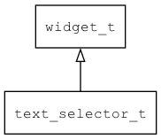

## text\_selector\_t
### 概述


文本选择器控件，通常用于选择日期和时间等。

> XXX: 目前需要先设置options和visible_nr，再设置其它参数(在XML中也需要按此顺序)。

text\_selector\_t是[widget\_t](widget_t.md)的子类控件，widget\_t的函数均适用于text\_selector\_t控件。

在xml中使用"text\_selector"标签创建文本选择器控件。如：

```xml
<text_selector options="red;green;blue;gold;orange" visible_nr="3" text="red"/>
```

> 更多用法请参考：[text\_selector.xml](
https://github.com/zlgopen/awtk/blob/master/design/default/ui/text_selector.xml)

在c代码中使用函数text\_selector\_create创建文本选择器控件。如：

```c
widget_t* ts = text_selector_create(win, 10, 10, 80, 150);
text_selector_set_options(ts, "1:red;2:green;3:blue;4:orange;5:gold");
text_selector_set_value(ts, 1);
widget_use_style(ts, "dark");
```

> 完整示例请参考：[text\_selector demo](
https://github.com/zlgopen/awtk-c-demos/blob/master/demos/text_selector.c)

可用通过style来设置控件的显示风格，如字体和背景颜色等。如：

```xml
<style name="dark" fg_color="#a0a0a0"  text_color="black" text_align_h="center">
<normal     bg_color="#ffffff" mask_color="#404040" border_color="#404040"/>
</style>
```

> 更多用法请参考：[theme default](
https://github.com/zlgopen/awtk/blob/master/design/default/styles/default.xml#L443)
----------------------------------
### 函数
<p id="text_selector_t_methods">

| 函数名称 | 说明 | 
| -------- | ------------ | 
| <a href="#text_selector_t_text_selector_append_option">text\_selector\_append\_option</a> | 追加一个选项。 |
| <a href="#text_selector_t_text_selector_cast">text\_selector\_cast</a> | 转换text_selector对象(供脚本语言使用)。 |
| <a href="#text_selector_t_text_selector_count_options">text\_selector\_count\_options</a> | 获取选项个数。 |
| <a href="#text_selector_t_text_selector_create">text\_selector\_create</a> | 创建text_selector对象 |
| <a href="#text_selector_t_text_selector_get_option">text\_selector\_get\_option</a> | 获取第index个选项。 |
| <a href="#text_selector_t_text_selector_get_text">text\_selector\_get\_text</a> | 获取text_selector的文本。 |
| <a href="#text_selector_t_text_selector_get_value">text\_selector\_get\_value</a> | 获取text_selector的值。 |
| <a href="#text_selector_t_text_selector_reset_options">text\_selector\_reset\_options</a> | 重置所有选项。 |
| <a href="#text_selector_t_text_selector_set_options">text\_selector\_set\_options</a> | 设置选项。 |
| <a href="#text_selector_t_text_selector_set_range_options">text\_selector\_set\_range\_options</a> | 设置一系列的整数选项。 |
| <a href="#text_selector_t_text_selector_set_selected_index">text\_selector\_set\_selected\_index</a> | 设置第index个选项为当前选中的选项。 |
| <a href="#text_selector_t_text_selector_set_text">text\_selector\_set\_text</a> | 设置text_selector的文本。 |
| <a href="#text_selector_t_text_selector_set_value">text\_selector\_set\_value</a> | 设置text_selector的值。 |
| <a href="#text_selector_t_text_selector_set_visible_nr">text\_selector\_set\_visible\_nr</a> | 设置可见的选项数。 |
### 属性
<p id="text_selector_t_properties">

| 属性名称 | 类型 | 说明 | 
| -------- | ----- | ------------ | 
| <a href="#text_selector_t_options">options</a> | char* | 设置可选项(冒号分隔值和文本，分号分隔选项，如:1:red;2:green;3:blue)。 |
| <a href="#text_selector_t_selected_index">selected\_index</a> | int32\_t | 当前选中的选项。 |
| <a href="#text_selector_t_visible_nr">visible\_nr</a> | uint32\_t | 可见的选项数量(只能是3或者5，缺省为5)。 |
### 事件
<p id="text_selector_t_events">

| 事件名称 | 类型  | 说明 | 
| -------- | ----- | ------- | 
| EVT\_VALUE\_WILL\_CHANGE | event\_t | 值(当前项)即将改变事件。 |
| EVT\_VALUE\_CHANGED | event\_t | 值(当前项)改变事件。 |
#### text\_selector\_append\_option 函数
-----------------------

* 函数功能：

> <p id="text_selector_t_text_selector_append_option">追加一个选项。

* 函数原型：

```
ret_t text_selector_append_option (widget_t* widget, int32_t value, char* text);
```

* 参数说明：

| 参数 | 类型 | 说明 |
| -------- | ----- | --------- |
| 返回值 | ret\_t | 返回RET\_OK表示成功，否则表示失败。 |
| widget | widget\_t* | text\_selector对象。 |
| value | int32\_t | 值。 |
| text | char* | 文本。 |
#### text\_selector\_cast 函数
-----------------------

* 函数功能：

> <p id="text_selector_t_text_selector_cast">转换text_selector对象(供脚本语言使用)。

* 函数原型：

```
widget_t* text_selector_cast (widget_t* widget);
```

* 参数说明：

| 参数 | 类型 | 说明 |
| -------- | ----- | --------- |
| 返回值 | widget\_t* | text\_selector对象。 |
| widget | widget\_t* | text\_selector对象。 |
#### text\_selector\_count\_options 函数
-----------------------

* 函数功能：

> <p id="text_selector_t_text_selector_count_options">获取选项个数。

* 函数原型：

```
int32_t text_selector_count_options (widget_t* widget);
```

* 参数说明：

| 参数 | 类型 | 说明 |
| -------- | ----- | --------- |
| 返回值 | int32\_t | 返回选项个数。 |
| widget | widget\_t* | text\_selector对象。 |
#### text\_selector\_create 函数
-----------------------

* 函数功能：

> <p id="text_selector_t_text_selector_create">创建text_selector对象

* 函数原型：

```
widget_t* text_selector_create (widget_t* parent, xy_t x, xy_t y, wh_t w, wh_t h);
```

* 参数说明：

| 参数 | 类型 | 说明 |
| -------- | ----- | --------- |
| 返回值 | widget\_t* | 对象。 |
| parent | widget\_t* | 父控件 |
| x | xy\_t | x坐标 |
| y | xy\_t | y坐标 |
| w | wh\_t | 宽度 |
| h | wh\_t | 高度 |
#### text\_selector\_get\_option 函数
-----------------------

* 函数功能：

> <p id="text_selector_t_text_selector_get_option">获取第index个选项。

* 函数原型：

```
text_selector_option_t* text_selector_get_option (widget_t* widget, uint32_t index);
```

* 参数说明：

| 参数 | 类型 | 说明 |
| -------- | ----- | --------- |
| 返回值 | text\_selector\_option\_t* | 成功返回选项，失败返回NULL。 |
| widget | widget\_t* | text\_selector对象。 |
| index | uint32\_t | 选项的索引。 |
#### text\_selector\_get\_text 函数
-----------------------

* 函数功能：

> <p id="text_selector_t_text_selector_get_text">获取text_selector的文本。

* 函数原型：

```
const char* text_selector_get_text (widget_t* widget);
```

* 参数说明：

| 参数 | 类型 | 说明 |
| -------- | ----- | --------- |
| 返回值 | const char* | 返回文本。 |
| widget | widget\_t* | text\_selector对象。 |
#### text\_selector\_get\_value 函数
-----------------------

* 函数功能：

> <p id="text_selector_t_text_selector_get_value">获取text_selector的值。

* 函数原型：

```
int32_t text_selector_get_value (widget_t* widget);
```

* 参数说明：

| 参数 | 类型 | 说明 |
| -------- | ----- | --------- |
| 返回值 | int32\_t | 返回值。 |
| widget | widget\_t* | text\_selector对象。 |
#### text\_selector\_reset\_options 函数
-----------------------

* 函数功能：

> <p id="text_selector_t_text_selector_reset_options">重置所有选项。

* 函数原型：

```
ret_t text_selector_reset_options (widget_t* widget);
```

* 参数说明：

| 参数 | 类型 | 说明 |
| -------- | ----- | --------- |
| 返回值 | ret\_t | 返回RET\_OK表示成功，否则表示失败。 |
| widget | widget\_t* | text\_selector对象。 |
#### text\_selector\_set\_options 函数
-----------------------

* 函数功能：

> <p id="text_selector_t_text_selector_set_options">设置选项。

* 函数原型：

```
ret_t text_selector_set_options (widget_t* widget, char* options);
```

* 参数说明：

| 参数 | 类型 | 说明 |
| -------- | ----- | --------- |
| 返回值 | ret\_t | 返回RET\_OK表示成功，否则表示失败。 |
| widget | widget\_t* | text\_selector对象。 |
| options | char* | 选项。 |
#### text\_selector\_set\_range\_options 函数
-----------------------

* 函数功能：

> <p id="text_selector_t_text_selector_set_range_options">设置一系列的整数选项。

* 函数原型：

```
ret_t text_selector_set_range_options (widget_t* widget, int32_t start, uint32_t nr, int32_t step);
```

* 参数说明：

| 参数 | 类型 | 说明 |
| -------- | ----- | --------- |
| 返回值 | ret\_t | 返回RET\_OK表示成功，否则表示失败。 |
| widget | widget\_t* | text\_selector对象。 |
| start | int32\_t | 起始值。 |
| nr | uint32\_t | 个数。 |
| step | int32\_t | 步长。 |
#### text\_selector\_set\_selected\_index 函数
-----------------------

* 函数功能：

> <p id="text_selector_t_text_selector_set_selected_index">设置第index个选项为当前选中的选项。

* 函数原型：

```
ret_t text_selector_set_selected_index (widget_t* widget, uint32_t index);
```

* 参数说明：

| 参数 | 类型 | 说明 |
| -------- | ----- | --------- |
| 返回值 | ret\_t | 返回RET\_OK表示成功，否则表示失败。 |
| widget | widget\_t* | text\_selector对象。 |
| index | uint32\_t | 选项的索引。 |
#### text\_selector\_set\_text 函数
-----------------------

* 函数功能：

> <p id="text_selector_t_text_selector_set_text">设置text_selector的文本。

* 函数原型：

```
ret_t text_selector_set_text (widget_t* widget, const char* text);
```

* 参数说明：

| 参数 | 类型 | 说明 |
| -------- | ----- | --------- |
| 返回值 | ret\_t | 返回RET\_OK表示成功，否则表示失败。 |
| widget | widget\_t* | text\_selector对象。 |
| text | const char* | 文本。 |
#### text\_selector\_set\_value 函数
-----------------------

* 函数功能：

> <p id="text_selector_t_text_selector_set_value">设置text_selector的值。

* 函数原型：

```
ret_t text_selector_set_value (widget_t* widget, int32_t value);
```

* 参数说明：

| 参数 | 类型 | 说明 |
| -------- | ----- | --------- |
| 返回值 | ret\_t | 返回RET\_OK表示成功，否则表示失败。 |
| widget | widget\_t* | text\_selector对象。 |
| value | int32\_t | 值。 |
#### text\_selector\_set\_visible\_nr 函数
-----------------------

* 函数功能：

> <p id="text_selector_t_text_selector_set_visible_nr">设置可见的选项数。

* 函数原型：

```
ret_t text_selector_set_visible_nr (widget_t* widget, uint32_t visible_nr);
```

* 参数说明：

| 参数 | 类型 | 说明 |
| -------- | ----- | --------- |
| 返回值 | ret\_t | 返回RET\_OK表示成功，否则表示失败。 |
| widget | widget\_t* | text\_selector对象。 |
| visible\_nr | uint32\_t | 选项数。 |
#### options 属性
-----------------------
> <p id="text_selector_t_options">设置可选项(冒号分隔值和文本，分号分隔选项，如:1:red;2:green;3:blue)。
对于数值选项，也可以指定一个范围，用『-』分隔起始值、结束值和格式。
如："1-7-%02d"表示1到7，格式为『02d』，格式为可选，缺省为『%d』。

* 类型：char*

| 特性 | 是否支持 |
| -------- | ----- |
| 可直接读取 | 是 |
| 可直接修改 | 否 |
| 可持久化   | 是 |
| 可脚本化   | 是 |
| 可在IDE中设置 | 是 |
| 可在XML中设置 | 是 |
| 可通过widget\_get\_prop读取 | 是 |
| 可通过widget\_set\_prop修改 | 是 |
#### selected\_index 属性
-----------------------
> <p id="text_selector_t_selected_index">当前选中的选项。

* 类型：int32\_t

| 特性 | 是否支持 |
| -------- | ----- |
| 可直接读取 | 是 |
| 可直接修改 | 否 |
| 可持久化   | 是 |
| 可脚本化   | 是 |
| 可在IDE中设置 | 是 |
| 可在XML中设置 | 是 |
| 可通过widget\_get\_prop读取 | 是 |
| 可通过widget\_set\_prop修改 | 是 |
#### visible\_nr 属性
-----------------------
> <p id="text_selector_t_visible_nr">可见的选项数量(只能是3或者5，缺省为5)。

* 类型：uint32\_t

| 特性 | 是否支持 |
| -------- | ----- |
| 可直接读取 | 是 |
| 可直接修改 | 否 |
| 可持久化   | 是 |
| 可脚本化   | 是 |
| 可在IDE中设置 | 是 |
| 可在XML中设置 | 是 |
| 可通过widget\_get\_prop读取 | 是 |
| 可通过widget\_set\_prop修改 | 是 |
