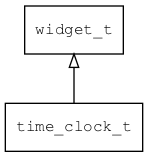

## time\_clock\_t
### 概述


模拟时钟控件。

time\_clock\_t是[widget\_t](widget_t.md)的子类控件，widget\_t的函数均适用于time\_clock\_t控件。

在xml中使用"time\_clock"标签创建模拟时钟控件。如：

```xml
<time_clock x="c" y="m" w="300" h="300" bg_image="clock_bg" image="clock"
hour_image="clock_hour" minute_image="clock_minute" second_image="clock_second"/>
```

> 更多用法请参考：[time\_clock.xml](
https://github.com/zlgopen/awtk/blob/master/design/default/ui/time_clock.xml)

在c代码中使用函数time\_clock\_create创建模拟时钟控件。如：

```c
widget_t* tc = time_clock_create(win, 10, 10, 240, 240);
time_clock_set_image(tc, "clock");
time_clock_set_bg_image(tc, "clock_bg");
time_clock_set_hour_image(tc, "clock_hour");
time_clock_set_minute_image(tc, "clock_minute");
time_clock_set_second_image(tc, "clock_second");
```

> 完整示例请参考：[time_clock demo](
https://github.com/zlgopen/awtk-c-demos/blob/master/demos/time_clock.c)

time\_clock一般不需要设置style。
----------------------------------
### 函数
<p id="time_clock_t_methods">

| 函数名称 | 说明 | 
| -------- | ------------ | 
| <a href="#time_clock_t_time_clock_cast">time\_clock\_cast</a> | 转换为time_clock对象(供脚本语言使用)。 |
| <a href="#time_clock_t_time_clock_create">time\_clock\_create</a> | 创建time_clock对象 |
| <a href="#time_clock_t_time_clock_set_bg_image">time\_clock\_set\_bg\_image</a> | 设置背景图片。 |
| <a href="#time_clock_t_time_clock_set_hour">time\_clock\_set\_hour</a> | 设置小时的值。 |
| <a href="#time_clock_t_time_clock_set_hour_anchor">time\_clock\_set\_hour\_anchor</a> | 设置小时指针的旋转锚点。 |
| <a href="#time_clock_t_time_clock_set_hour_image">time\_clock\_set\_hour\_image</a> | 设置小时的图片。 |
| <a href="#time_clock_t_time_clock_set_image">time\_clock\_set\_image</a> | 设置中心图片。 |
| <a href="#time_clock_t_time_clock_set_minute">time\_clock\_set\_minute</a> | 设置分钟的值。 |
| <a href="#time_clock_t_time_clock_set_minute_anchor">time\_clock\_set\_minute\_anchor</a> | 设置分钟指针的旋转锚点。 |
| <a href="#time_clock_t_time_clock_set_minute_image">time\_clock\_set\_minute\_image</a> | 设置分钟的图片。 |
| <a href="#time_clock_t_time_clock_set_second">time\_clock\_set\_second</a> | 设置秒的值。 |
| <a href="#time_clock_t_time_clock_set_second_anchor">time\_clock\_set\_second\_anchor</a> | 设置秒钟指针的旋转锚点。 |
| <a href="#time_clock_t_time_clock_set_second_image">time\_clock\_set\_second\_image</a> | 设置秒的图片。 |
### 属性
<p id="time_clock_t_properties">

| 属性名称 | 类型 | 说明 | 
| -------- | ----- | ------------ | 
| <a href="#time_clock_t_bg_image">bg\_image</a> | char* | 背景图片。 |
| <a href="#time_clock_t_hour">hour</a> | int32\_t | 小时。 |
| <a href="#time_clock_t_hour_anchor_x">hour\_anchor\_x</a> | char* | 时针图片旋转锚点x坐标。(后面加上px为像素点，不加px为相对百分比坐标0.0f到1.0f) |
| <a href="#time_clock_t_hour_anchor_y">hour\_anchor\_y</a> | char* | 时针图片旋转锚点y坐标。(后面加上px为像素点，不加px为相对百分比坐标0.0f到1.0f) |
| <a href="#time_clock_t_hour_image">hour\_image</a> | char* | 时针图片。 |
| <a href="#time_clock_t_image">image</a> | char* | 中心图片。 |
| <a href="#time_clock_t_minute">minute</a> | int32\_t | 分钟。 |
| <a href="#time_clock_t_minute_anchor_x">minute\_anchor\_x</a> | char* | 分针图片旋转锚点x坐标。(后面加上px为像素点，不加px为相对百分比坐标0.0f到1.0f) |
| <a href="#time_clock_t_minute_anchor_y">minute\_anchor\_y</a> | char* | 分针图片旋转锚点y坐标。(后面加上px为像素点，不加px为相对百分比坐标0.0f到1.0f) |
| <a href="#time_clock_t_minute_image">minute\_image</a> | char* | 分针图片。 |
| <a href="#time_clock_t_second">second</a> | int32\_t | 秒。 |
| <a href="#time_clock_t_second_anchor_x">second\_anchor\_x</a> | char* | 秒针图片旋转锚点x坐标。(后面加上px为像素点，不加px为相对百分比坐标0.0f到1.0f) |
| <a href="#time_clock_t_second_anchor_y">second\_anchor\_y</a> | char* | 秒针图片旋转锚点y坐标。(后面加上px为像素点，不加px为相对百分比坐标0.0f到1.0f) |
| <a href="#time_clock_t_second_image">second\_image</a> | char* | 秒针图片。 |
#### time\_clock\_cast 函数
-----------------------

* 函数功能：

> <p id="time_clock_t_time_clock_cast">转换为time_clock对象(供脚本语言使用)。

* 函数原型：

```
widget_t* time_clock_cast (widget_t* widget);
```

* 参数说明：

| 参数 | 类型 | 说明 |
| -------- | ----- | --------- |
| 返回值 | widget\_t* | time\_clock对象。 |
| widget | widget\_t* | time\_clock对象。 |
#### time\_clock\_create 函数
-----------------------

* 函数功能：

> <p id="time_clock_t_time_clock_create">创建time_clock对象

* 函数原型：

```
widget_t* time_clock_create (widget_t* parent, xy_t x, xy_t y, wh_t w, wh_t h);
```

* 参数说明：

| 参数 | 类型 | 说明 |
| -------- | ----- | --------- |
| 返回值 | widget\_t* | 对象。 |
| parent | widget\_t* | 父控件 |
| x | xy\_t | x坐标 |
| y | xy\_t | y坐标 |
| w | wh\_t | 宽度 |
| h | wh\_t | 高度 |
#### time\_clock\_set\_bg\_image 函数
-----------------------

* 函数功能：

> <p id="time_clock_t_time_clock_set_bg_image">设置背景图片。

* 函数原型：

```
ret_t time_clock_set_bg_image (widget_t* widget, const char* bg_image);
```

* 参数说明：

| 参数 | 类型 | 说明 |
| -------- | ----- | --------- |
| 返回值 | ret\_t | 返回RET\_OK表示成功，否则表示失败。 |
| widget | widget\_t* | 控件对象。 |
| bg\_image | const char* | 背景图片。 |
#### time\_clock\_set\_hour 函数
-----------------------

* 函数功能：

> <p id="time_clock_t_time_clock_set_hour">设置小时的值。

* 函数原型：

```
ret_t time_clock_set_hour (widget_t* widget, int32_t hour);
```

* 参数说明：

| 参数 | 类型 | 说明 |
| -------- | ----- | --------- |
| 返回值 | ret\_t | 返回RET\_OK表示成功，否则表示失败。 |
| widget | widget\_t* | 控件对象。 |
| hour | int32\_t | 小时的值。 |
#### time\_clock\_set\_hour\_anchor 函数
-----------------------

* 函数功能：

> <p id="time_clock_t_time_clock_set_hour_anchor">设置小时指针的旋转锚点。
> 后面加上px为像素点，不加px为相对百分比坐标0.0f到1.0f

* 函数原型：

```
ret_t time_clock_set_hour_anchor (widget_t* widget, const char* anchor_x, const char* anchor_y);
```

* 参数说明：

| 参数 | 类型 | 说明 |
| -------- | ----- | --------- |
| 返回值 | ret\_t | 返回RET\_OK表示成功，否则表示失败。 |
| widget | widget\_t* | 控件对象。 |
| anchor\_x | const char* | 指针的锚点坐标x。 |
| anchor\_y | const char* | 指针的锚点坐标y。 |
#### time\_clock\_set\_hour\_image 函数
-----------------------

* 函数功能：

> <p id="time_clock_t_time_clock_set_hour_image">设置小时的图片。

* 函数原型：

```
ret_t time_clock_set_hour_image (widget_t* widget, const char* hour);
```

* 参数说明：

| 参数 | 类型 | 说明 |
| -------- | ----- | --------- |
| 返回值 | ret\_t | 返回RET\_OK表示成功，否则表示失败。 |
| widget | widget\_t* | 控件对象。 |
| hour | const char* | 小时的图片。 |
#### time\_clock\_set\_image 函数
-----------------------

* 函数功能：

> <p id="time_clock_t_time_clock_set_image">设置中心图片。

* 函数原型：

```
ret_t time_clock_set_image (widget_t* widget, const char* image);
```

* 参数说明：

| 参数 | 类型 | 说明 |
| -------- | ----- | --------- |
| 返回值 | ret\_t | 返回RET\_OK表示成功，否则表示失败。 |
| widget | widget\_t* | 控件对象。 |
| image | const char* | 图片。 |
#### time\_clock\_set\_minute 函数
-----------------------

* 函数功能：

> <p id="time_clock_t_time_clock_set_minute">设置分钟的值。

* 函数原型：

```
ret_t time_clock_set_minute (widget_t* widget, int32_t minute);
```

* 参数说明：

| 参数 | 类型 | 说明 |
| -------- | ----- | --------- |
| 返回值 | ret\_t | 返回RET\_OK表示成功，否则表示失败。 |
| widget | widget\_t* | 控件对象。 |
| minute | int32\_t | 分钟的值。 |
#### time\_clock\_set\_minute\_anchor 函数
-----------------------

* 函数功能：

> <p id="time_clock_t_time_clock_set_minute_anchor">设置分钟指针的旋转锚点。
> 后面加上px为像素点，不加px为相对百分比坐标0.0f到1.0f

* 函数原型：

```
ret_t time_clock_set_minute_anchor (widget_t* widget, const char* anchor_x, const char* anchor_y);
```

* 参数说明：

| 参数 | 类型 | 说明 |
| -------- | ----- | --------- |
| 返回值 | ret\_t | 返回RET\_OK表示成功，否则表示失败。 |
| widget | widget\_t* | 控件对象。 |
| anchor\_x | const char* | 指针的锚点坐标x。 |
| anchor\_y | const char* | 指针的锚点坐标y。 |
#### time\_clock\_set\_minute\_image 函数
-----------------------

* 函数功能：

> <p id="time_clock_t_time_clock_set_minute_image">设置分钟的图片。

* 函数原型：

```
ret_t time_clock_set_minute_image (widget_t* widget, const char* minute_image);
```

* 参数说明：

| 参数 | 类型 | 说明 |
| -------- | ----- | --------- |
| 返回值 | ret\_t | 返回RET\_OK表示成功，否则表示失败。 |
| widget | widget\_t* | 控件对象。 |
| minute\_image | const char* | 分钟的图片。 |
#### time\_clock\_set\_second 函数
-----------------------

* 函数功能：

> <p id="time_clock_t_time_clock_set_second">设置秒的值。

* 函数原型：

```
ret_t time_clock_set_second (widget_t* widget, int32_t second);
```

* 参数说明：

| 参数 | 类型 | 说明 |
| -------- | ----- | --------- |
| 返回值 | ret\_t | 返回RET\_OK表示成功，否则表示失败。 |
| widget | widget\_t* | 控件对象。 |
| second | int32\_t | 秒的值。 |
#### time\_clock\_set\_second\_anchor 函数
-----------------------

* 函数功能：

> <p id="time_clock_t_time_clock_set_second_anchor">设置秒钟指针的旋转锚点。
> 后面加上px为像素点，不加px为相对百分比坐标0.0f到1.0f

* 函数原型：

```
ret_t time_clock_set_second_anchor (widget_t* widget, const char* anchor_x, const char* anchor_y);
```

* 参数说明：

| 参数 | 类型 | 说明 |
| -------- | ----- | --------- |
| 返回值 | ret\_t | 返回RET\_OK表示成功，否则表示失败。 |
| widget | widget\_t* | 控件对象。 |
| anchor\_x | const char* | 指针的锚点坐标x。 |
| anchor\_y | const char* | 指针的锚点坐标y。 |
#### time\_clock\_set\_second\_image 函数
-----------------------

* 函数功能：

> <p id="time_clock_t_time_clock_set_second_image">设置秒的图片。

* 函数原型：

```
ret_t time_clock_set_second_image (widget_t* widget, const char* second_image);
```

* 参数说明：

| 参数 | 类型 | 说明 |
| -------- | ----- | --------- |
| 返回值 | ret\_t | 返回RET\_OK表示成功，否则表示失败。 |
| widget | widget\_t* | 控件对象。 |
| second\_image | const char* | 秒的图片。 |
#### bg\_image 属性
-----------------------
> <p id="time_clock_t_bg_image">背景图片。

* 类型：char*

| 特性 | 是否支持 |
| -------- | ----- |
| 可直接读取 | 是 |
| 可直接修改 | 否 |
| 可持久化   | 是 |
| 可脚本化   | 是 |
| 可在IDE中设置 | 是 |
| 可在XML中设置 | 是 |
| 可通过widget\_get\_prop读取 | 是 |
| 可通过widget\_set\_prop修改 | 是 |
#### hour 属性
-----------------------
> <p id="time_clock_t_hour">小时。

* 类型：int32\_t

| 特性 | 是否支持 |
| -------- | ----- |
| 可直接读取 | 是 |
| 可直接修改 | 否 |
| 可持久化   | 是 |
| 可脚本化   | 是 |
| 可在IDE中设置 | 是 |
| 可在XML中设置 | 是 |
| 可通过widget\_get\_prop读取 | 是 |
| 可通过widget\_set\_prop修改 | 是 |
#### hour\_anchor\_x 属性
-----------------------
> <p id="time_clock_t_hour_anchor_x">时针图片旋转锚点x坐标。(后面加上px为像素点，不加px为相对百分比坐标0.0f到1.0f)

* 类型：char*

| 特性 | 是否支持 |
| -------- | ----- |
| 可直接读取 | 是 |
| 可直接修改 | 否 |
| 可持久化   | 是 |
| 可脚本化   | 是 |
| 可在IDE中设置 | 是 |
| 可在XML中设置 | 是 |
| 可通过widget\_get\_prop读取 | 是 |
| 可通过widget\_set\_prop修改 | 是 |
#### hour\_anchor\_y 属性
-----------------------
> <p id="time_clock_t_hour_anchor_y">时针图片旋转锚点y坐标。(后面加上px为像素点，不加px为相对百分比坐标0.0f到1.0f)

* 类型：char*

| 特性 | 是否支持 |
| -------- | ----- |
| 可直接读取 | 是 |
| 可直接修改 | 否 |
| 可持久化   | 是 |
| 可脚本化   | 是 |
| 可在IDE中设置 | 是 |
| 可在XML中设置 | 是 |
| 可通过widget\_get\_prop读取 | 是 |
| 可通过widget\_set\_prop修改 | 是 |
#### hour\_image 属性
-----------------------
> <p id="time_clock_t_hour_image">时针图片。

* 类型：char*

| 特性 | 是否支持 |
| -------- | ----- |
| 可直接读取 | 是 |
| 可直接修改 | 否 |
| 可持久化   | 是 |
| 可脚本化   | 是 |
| 可在IDE中设置 | 是 |
| 可在XML中设置 | 是 |
| 可通过widget\_get\_prop读取 | 是 |
| 可通过widget\_set\_prop修改 | 是 |
#### image 属性
-----------------------
> <p id="time_clock_t_image">中心图片。

* 类型：char*

| 特性 | 是否支持 |
| -------- | ----- |
| 可直接读取 | 是 |
| 可直接修改 | 否 |
| 可持久化   | 是 |
| 可脚本化   | 是 |
| 可在IDE中设置 | 是 |
| 可在XML中设置 | 是 |
| 可通过widget\_get\_prop读取 | 是 |
| 可通过widget\_set\_prop修改 | 是 |
#### minute 属性
-----------------------
> <p id="time_clock_t_minute">分钟。

* 类型：int32\_t

| 特性 | 是否支持 |
| -------- | ----- |
| 可直接读取 | 是 |
| 可直接修改 | 否 |
| 可持久化   | 是 |
| 可脚本化   | 是 |
| 可在IDE中设置 | 是 |
| 可在XML中设置 | 是 |
| 可通过widget\_get\_prop读取 | 是 |
| 可通过widget\_set\_prop修改 | 是 |
#### minute\_anchor\_x 属性
-----------------------
> <p id="time_clock_t_minute_anchor_x">分针图片旋转锚点x坐标。(后面加上px为像素点，不加px为相对百分比坐标0.0f到1.0f)

* 类型：char*

| 特性 | 是否支持 |
| -------- | ----- |
| 可直接读取 | 是 |
| 可直接修改 | 否 |
| 可持久化   | 是 |
| 可脚本化   | 是 |
| 可在IDE中设置 | 是 |
| 可在XML中设置 | 是 |
| 可通过widget\_get\_prop读取 | 是 |
| 可通过widget\_set\_prop修改 | 是 |
#### minute\_anchor\_y 属性
-----------------------
> <p id="time_clock_t_minute_anchor_y">分针图片旋转锚点y坐标。(后面加上px为像素点，不加px为相对百分比坐标0.0f到1.0f)

* 类型：char*

| 特性 | 是否支持 |
| -------- | ----- |
| 可直接读取 | 是 |
| 可直接修改 | 否 |
| 可持久化   | 是 |
| 可脚本化   | 是 |
| 可在IDE中设置 | 是 |
| 可在XML中设置 | 是 |
| 可通过widget\_get\_prop读取 | 是 |
| 可通过widget\_set\_prop修改 | 是 |
#### minute\_image 属性
-----------------------
> <p id="time_clock_t_minute_image">分针图片。

* 类型：char*

| 特性 | 是否支持 |
| -------- | ----- |
| 可直接读取 | 是 |
| 可直接修改 | 否 |
| 可持久化   | 是 |
| 可脚本化   | 是 |
| 可在IDE中设置 | 是 |
| 可在XML中设置 | 是 |
| 可通过widget\_get\_prop读取 | 是 |
| 可通过widget\_set\_prop修改 | 是 |
#### second 属性
-----------------------
> <p id="time_clock_t_second">秒。

* 类型：int32\_t

| 特性 | 是否支持 |
| -------- | ----- |
| 可直接读取 | 是 |
| 可直接修改 | 否 |
| 可持久化   | 是 |
| 可脚本化   | 是 |
| 可在IDE中设置 | 是 |
| 可在XML中设置 | 是 |
| 可通过widget\_get\_prop读取 | 是 |
| 可通过widget\_set\_prop修改 | 是 |
#### second\_anchor\_x 属性
-----------------------
> <p id="time_clock_t_second_anchor_x">秒针图片旋转锚点x坐标。(后面加上px为像素点，不加px为相对百分比坐标0.0f到1.0f)

* 类型：char*

| 特性 | 是否支持 |
| -------- | ----- |
| 可直接读取 | 是 |
| 可直接修改 | 否 |
| 可持久化   | 是 |
| 可脚本化   | 是 |
| 可在IDE中设置 | 是 |
| 可在XML中设置 | 是 |
| 可通过widget\_get\_prop读取 | 是 |
| 可通过widget\_set\_prop修改 | 是 |
#### second\_anchor\_y 属性
-----------------------
> <p id="time_clock_t_second_anchor_y">秒针图片旋转锚点y坐标。(后面加上px为像素点，不加px为相对百分比坐标0.0f到1.0f)

* 类型：char*

| 特性 | 是否支持 |
| -------- | ----- |
| 可直接读取 | 是 |
| 可直接修改 | 否 |
| 可持久化   | 是 |
| 可脚本化   | 是 |
| 可在IDE中设置 | 是 |
| 可在XML中设置 | 是 |
| 可通过widget\_get\_prop读取 | 是 |
| 可通过widget\_set\_prop修改 | 是 |
#### second\_image 属性
-----------------------
> <p id="time_clock_t_second_image">秒针图片。

* 类型：char*

| 特性 | 是否支持 |
| -------- | ----- |
| 可直接读取 | 是 |
| 可直接修改 | 否 |
| 可持久化   | 是 |
| 可脚本化   | 是 |
| 可在IDE中设置 | 是 |
| 可在XML中设置 | 是 |
| 可通过widget\_get\_prop读取 | 是 |
| 可通过widget\_set\_prop修改 | 是 |
