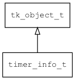

## timer\_info\_t
### 概述


单个定时器的信息。
----------------------------------
### 函数
<p id="timer_info_t_methods">

| 函数名称 | 说明 | 
| -------- | ------------ | 
| <a href="#timer_info_t_timer_info_cast">timer\_info\_cast</a> | 转换为timer_info对象(供脚本语言使用)。 |
### 属性
<p id="timer_info_t_properties">

| 属性名称 | 类型 | 说明 | 
| -------- | ----- | ------------ | 
| <a href="#timer_info_t_ctx">ctx</a> | void* | 定时器回调函数的上下文 |
| <a href="#timer_info_t_duration">duration</a> | uint32\_t | 时间间隔(单位为毫秒)。 |
| <a href="#timer_info_t_id">id</a> | uint32\_t | 定时器的ID |
| <a href="#timer_info_t_now">now</a> | uint64\_t | 当前时间(相对时间，单位为毫秒)。 |
| <a href="#timer_info_t_on_destroy">on\_destroy</a> | tk\_destroy\_t | 定时器销毁时的回调函数。 |
| <a href="#timer_info_t_on_destroy_ctx">on\_destroy\_ctx</a> | void* | 定时器销毁时的回调函数上下文。 |
| <a href="#timer_info_t_on_timer">on\_timer</a> | timer\_func\_t | 定时器回调函数。 |
| <a href="#timer_info_t_start">start</a> | uint64\_t | 起始时间(相对时间，单位为毫秒)。 |
#### timer\_info\_cast 函数
-----------------------

* 函数功能：

> <p id="timer_info_t_timer_info_cast">转换为timer_info对象(供脚本语言使用)。

* 函数原型：

```
timer_info_t* timer_info_cast (timer_info_t* timer);
```

* 参数说明：

| 参数 | 类型 | 说明 |
| -------- | ----- | --------- |
| 返回值 | timer\_info\_t* | timer\_info对象。 |
| timer | timer\_info\_t* | timer\_info对象。 |
#### ctx 属性
-----------------------
> <p id="timer_info_t_ctx">定时器回调函数的上下文

* 类型：void*

| 特性 | 是否支持 |
| -------- | ----- |
| 可直接读取 | 是 |
| 可直接修改 | 否 |
| 可脚本化   | 是 |
#### duration 属性
-----------------------
> <p id="timer_info_t_duration">时间间隔(单位为毫秒)。

* 类型：uint32\_t

| 特性 | 是否支持 |
| -------- | ----- |
| 可直接读取 | 是 |
| 可直接修改 | 否 |
#### id 属性
-----------------------
> <p id="timer_info_t_id">定时器的ID

> 为TK\_INVALID\_ID时表示无效定时器。

* 类型：uint32\_t

| 特性 | 是否支持 |
| -------- | ----- |
| 可直接读取 | 是 |
| 可直接修改 | 否 |
| 可脚本化   | 是 |
#### now 属性
-----------------------
> <p id="timer_info_t_now">当前时间(相对时间，单位为毫秒)。

* 类型：uint64\_t

| 特性 | 是否支持 |
| -------- | ----- |
| 可直接读取 | 是 |
| 可直接修改 | 否 |
| 可脚本化   | 是 |
#### on\_destroy 属性
-----------------------
> <p id="timer_info_t_on_destroy">定时器销毁时的回调函数。

* 类型：tk\_destroy\_t

| 特性 | 是否支持 |
| -------- | ----- |
| 可直接读取 | 是 |
| 可直接修改 | 否 |
#### on\_destroy\_ctx 属性
-----------------------
> <p id="timer_info_t_on_destroy_ctx">定时器销毁时的回调函数上下文。

* 类型：void*

| 特性 | 是否支持 |
| -------- | ----- |
| 可直接读取 | 是 |
| 可直接修改 | 否 |
#### on\_timer 属性
-----------------------
> <p id="timer_info_t_on_timer">定时器回调函数。

* 类型：timer\_func\_t

| 特性 | 是否支持 |
| -------- | ----- |
| 可直接读取 | 是 |
| 可直接修改 | 否 |
#### start 属性
-----------------------
> <p id="timer_info_t_start">起始时间(相对时间，单位为毫秒)。

* 类型：uint64\_t

| 特性 | 是否支持 |
| -------- | ----- |
| 可直接读取 | 是 |
| 可直接修改 | 否 |
