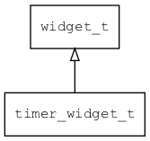

## timer\_widget\_t
### 概述


定时器。
> 主要目的是方便以拖拽的方式创建定时器，并用AWBlock编写简单的事件处理程序。
在xml中使用"timer"标签创建控件。如：

```xml
<!-- ui -->
<timer x="c" y="50" w="100" h="100" duration="1000"/>
```

可用通过style来设置控件的显示风格，如字体的大小和颜色等等。如：
> 本控件默认不可见，无需指定style。

```xml
<!-- style -->
<timer>
<style name="default" font_size="32">
<normal text_color="black" />
</style>
</timer>
```
----------------------------------
### 函数
<p id="timer_widget_t_methods">

| 函数名称 | 说明 | 
| -------- | ------------ | 
| <a href="#timer_widget_t_timer_widget_cast">timer\_widget\_cast</a> | 转换为timer_widget对象(供脚本语言使用)。 |
| <a href="#timer_widget_t_timer_widget_create">timer\_widget\_create</a> | 创建timer_widget对象 |
| <a href="#timer_widget_t_timer_widget_get_widget_vtable">timer\_widget\_get\_widget\_vtable</a> | 获取 timer_widget 虚表。 |
| <a href="#timer_widget_t_timer_widget_set_duration">timer\_widget\_set\_duration</a> | 设置 时长(ms)。 |
### 属性
<p id="timer_widget_t_properties">

| 属性名称 | 类型 | 说明 | 
| -------- | ----- | ------------ | 
| <a href="#timer_widget_t_duration">duration</a> | uint32\_t | 时长(ms)。 |
### 事件
<p id="timer_widget_t_events">

| 事件名称 | 类型  | 说明 | 
| -------- | ----- | ------- | 
| EVT\_TIMER | event\_t | 定时器事件。 |
#### timer\_widget\_cast 函数
-----------------------

* 函数功能：

> <p id="timer_widget_t_timer_widget_cast">转换为timer_widget对象(供脚本语言使用)。

* 函数原型：

```
widget_t* timer_widget_cast (widget_t* widget);
```

* 参数说明：

| 参数 | 类型 | 说明 |
| -------- | ----- | --------- |
| 返回值 | widget\_t* | timer\_widget对象。 |
| widget | widget\_t* | timer\_widget对象。 |
#### timer\_widget\_create 函数
-----------------------

* 函数功能：

> <p id="timer_widget_t_timer_widget_create">创建timer_widget对象

* 函数原型：

```
widget_t* timer_widget_create (widget_t* parent, xy_t x, xy_t y, wh_t w, wh_t h);
```

* 参数说明：

| 参数 | 类型 | 说明 |
| -------- | ----- | --------- |
| 返回值 | widget\_t* | timer\_widget对象。 |
| parent | widget\_t* | 父控件 |
| x | xy\_t | x坐标 |
| y | xy\_t | y坐标 |
| w | wh\_t | 宽度 |
| h | wh\_t | 高度 |
#### timer\_widget\_get\_widget\_vtable 函数
-----------------------

* 函数功能：

> <p id="timer_widget_t_timer_widget_get_widget_vtable">获取 timer_widget 虚表。

* 函数原型：

```
const widget_vtable_t* timer_widget_get_widget_vtable ();
```

* 参数说明：

| 参数 | 类型 | 说明 |
| -------- | ----- | --------- |
| 返回值 | const widget\_vtable\_t* | 成功返回 timer\_widget 虚表。 |
#### timer\_widget\_set\_duration 函数
-----------------------

* 函数功能：

> <p id="timer_widget_t_timer_widget_set_duration">设置 时长(ms)。

* 函数原型：

```
ret_t timer_widget_set_duration (widget_t* widget, uint32_t duration);
```

* 参数说明：

| 参数 | 类型 | 说明 |
| -------- | ----- | --------- |
| 返回值 | ret\_t | 返回RET\_OK表示成功，否则表示失败。 |
| widget | widget\_t* | widget对象。 |
| duration | uint32\_t | 时长(ms)。 |
#### duration 属性
-----------------------
> <p id="timer_widget_t_duration">时长(ms)。

* 类型：uint32\_t

| 特性 | 是否支持 |
| -------- | ----- |
| 可直接读取 | 是 |
| 可直接修改 | 否 |
| 可持久化   | 是 |
| 可脚本化   | 是 |
| 可在IDE中设置 | 是 |
| 可在XML中设置 | 是 |
| 可通过widget\_get\_prop读取 | 是 |
| 可通过widget\_set\_prop修改 | 是 |
