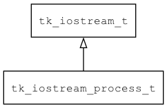

## tk\_iostream\_process\_t
### 概述


基于子程序实现的输入流。
备注：如果需要在 Windows 平台运行，请在应用程序初始化时，调用 tk_socket_init 函数初始化 socket。
----------------------------------
### 函数
<p id="tk_iostream_process_t_methods">

| 函数名称 | 说明 | 
| -------- | ------------ | 
| <a href="#tk_iostream_process_t_tk_iostream_process_create">tk\_iostream\_process\_create</a> | 创建iostream对象。 |
| <a href="#tk_iostream_process_t_tk_iostream_process_kill">tk\_iostream\_process\_kill</a> | 杀死子进程流。 |
| <a href="#tk_iostream_process_t_tk_iostream_process_set_work_dir">tk\_iostream\_process\_set\_work\_dir</a> | 设置子进程流工作目录。 |
| <a href="#tk_iostream_process_t_tk_iostream_process_start">tk\_iostream\_process\_start</a> | 启动子进程流。 |
### 属性
<p id="tk_iostream_process_t_properties">

| 属性名称 | 类型 | 说明 | 
| -------- | ----- | ------------ | 
| <a href="#tk_iostream_process_t_argc">argc</a> | uint32\_t | 参数列表长度。 |
| <a href="#tk_iostream_process_t_args">args</a> | const char** | 参数列表。 |
| <a href="#tk_iostream_process_t_file_path">file\_path</a> | char* | 子进程路径。 |
#### tk\_iostream\_process\_create 函数
-----------------------

* 函数功能：

> <p id="tk_iostream_process_t_tk_iostream_process_create">创建iostream对象。
备注：如果需要在 Windows 平台运行，请在应用程序初始化时，调用 tk_socket_init 函数初始化 socket。

* 函数原型：

```
tk_iostream_t* tk_iostream_process_create (const char* file_path, const char** args, uint32_t argc);
```

* 参数说明：

| 参数 | 类型 | 说明 |
| -------- | ----- | --------- |
| 返回值 | tk\_iostream\_t* | 返回iostream对象。 |
| file\_path | const char* | 子进程程序路径。(如果为空的话，使用命令行来执行参数) |
| args | const char** | 子进程参数。 |
| argc | uint32\_t | 子进程参数长度。 |
#### tk\_iostream\_process\_kill 函数
-----------------------

* 函数功能：

> <p id="tk_iostream_process_t_tk_iostream_process_kill">杀死子进程流。

* 函数原型：

```
ret_t tk_iostream_process_kill (tk_iostream_t* iostream);
```

* 参数说明：

| 参数 | 类型 | 说明 |
| -------- | ----- | --------- |
| 返回值 | ret\_t | 返回RET\_OK表示成功，否则表示失败。 |
| iostream | tk\_iostream\_t* | 子程序对象。 |
#### tk\_iostream\_process\_set\_work\_dir 函数
-----------------------

* 函数功能：

> <p id="tk_iostream_process_t_tk_iostream_process_set_work_dir">设置子进程流工作目录。

* 函数原型：

```
ret_t tk_iostream_process_set_work_dir (tk_iostream_t* iostream, const char* work_dir);
```

* 参数说明：

| 参数 | 类型 | 说明 |
| -------- | ----- | --------- |
| 返回值 | ret\_t | 返回RET\_OK表示成功，否则表示失败。 |
| iostream | tk\_iostream\_t* | 子程序对象。 |
| work\_dir | const char* | 工作目录。 |
#### tk\_iostream\_process\_start 函数
-----------------------

* 函数功能：

> <p id="tk_iostream_process_t_tk_iostream_process_start">启动子进程流。

* 函数原型：

```
ret_t tk_iostream_process_start (tk_iostream_t* iostream);
```

* 参数说明：

| 参数 | 类型 | 说明 |
| -------- | ----- | --------- |
| 返回值 | ret\_t | 返回RET\_OK表示成功，否则表示失败。 |
| iostream | tk\_iostream\_t* | 子程序对象。 |
#### argc 属性
-----------------------
> <p id="tk_iostream_process_t_argc">参数列表长度。

* 类型：uint32\_t

| 特性 | 是否支持 |
| -------- | ----- |
| 可直接读取 | 是 |
| 可直接修改 | 否 |
#### args 属性
-----------------------
> <p id="tk_iostream_process_t_args">参数列表。

* 类型：const char**

| 特性 | 是否支持 |
| -------- | ----- |
| 可直接读取 | 是 |
| 可直接修改 | 否 |
#### file\_path 属性
-----------------------
> <p id="tk_iostream_process_t_file_path">子进程路径。

* 类型：char*

| 特性 | 是否支持 |
| -------- | ----- |
| 可直接读取 | 是 |
| 可直接修改 | 否 |
