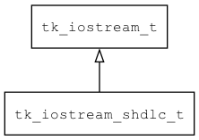

## tk\_iostream\_shdlc\_t
### 概述


基于简化版的HDLC协议实现可靠的iostream。

一般用于串口通信。
----------------------------------
### 函数
<p id="tk_iostream_shdlc_t_methods">

| 函数名称 | 说明 | 
| -------- | ------------ | 
| <a href="#tk_iostream_shdlc_t_tk_iostream_shdlc_create">tk\_iostream\_shdlc\_create</a> | 创建iostream对象。 |
#### tk\_iostream\_shdlc\_create 函数
-----------------------

* 函数功能：

> <p id="tk_iostream_shdlc_t_tk_iostream_shdlc_create">创建iostream对象。

本函数自动增加real_iostream的引用计数。

* 函数原型：

```
tk_iostream_t* tk_iostream_shdlc_create (tk_iostream_t* real_iostream);
```

* 参数说明：

| 参数 | 类型 | 说明 |
| -------- | ----- | --------- |
| 返回值 | tk\_iostream\_t* | 返回iostream对象。 |
| real\_iostream | tk\_iostream\_t* | 底层的iostream。 |
