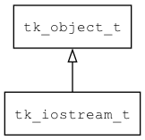

## tk\_iostream\_t
### 概述


输入输出流的接口。
----------------------------------
### 函数
<p id="tk_iostream_t_methods">

| 函数名称 | 说明 | 
| -------- | ------------ | 
| <a href="#tk_iostream_t_tk_iostream_get_istream">tk\_iostream\_get\_istream</a> | 获取输入流对象。 |
| <a href="#tk_iostream_t_tk_iostream_get_ostream">tk\_iostream\_get\_ostream</a> | 获取输出流对象。 |
| <a href="#tk_iostream_t_tk_iostream_read">tk\_iostream\_read</a> | 读取数据。 |
| <a href="#tk_iostream_t_tk_iostream_read_len">tk\_iostream\_read\_len</a> | 读取指定长度的数据。 |
| <a href="#tk_iostream_t_tk_iostream_write">tk\_iostream\_write</a> | 写入数据。 |
| <a href="#tk_iostream_t_tk_iostream_write_len">tk\_iostream\_write\_len</a> | 写入指定长度的数据。 |
#### tk\_iostream\_get\_istream 函数
-----------------------

* 函数功能：

> <p id="tk_iostream_t_tk_iostream_get_istream">获取输入流对象。

* 函数原型：

```
tk_istream_t* tk_iostream_get_istream (tk_iostream_t* stream);
```

* 参数说明：

| 参数 | 类型 | 说明 |
| -------- | ----- | --------- |
| 返回值 | tk\_istream\_t* | 返回输入流对象。 |
| stream | tk\_iostream\_t* | iostream对象。 |
#### tk\_iostream\_get\_ostream 函数
-----------------------

* 函数功能：

> <p id="tk_iostream_t_tk_iostream_get_ostream">获取输出流对象。

* 函数原型：

```
tk_ostream_t* tk_iostream_get_ostream (tk_iostream_t* stream);
```

* 参数说明：

| 参数 | 类型 | 说明 |
| -------- | ----- | --------- |
| 返回值 | tk\_ostream\_t* | 返回输出流对象。 |
| stream | tk\_iostream\_t* | iostream对象。 |
#### tk\_iostream\_read 函数
-----------------------

* 函数功能：

> <p id="tk_iostream_t_tk_iostream_read">读取数据。

* 函数原型：

```
int32_t tk_iostream_read (tk_iostream_t* stream, void* buff, uint32_t max_size);
```

* 参数说明：

| 参数 | 类型 | 说明 |
| -------- | ----- | --------- |
| 返回值 | int32\_t | 返回负数表示读取失败，否则返回实际读取数据的长度。 |
| stream | tk\_iostream\_t* | iostream对象。 |
| buff | void* | 返回数据的缓冲区。 |
| max\_size | uint32\_t | 缓冲区的大小。 |
#### tk\_iostream\_read\_len 函数
-----------------------

* 函数功能：

> <p id="tk_iostream_t_tk_iostream_read_len">读取指定长度的数据。

* 函数原型：

```
int32_t tk_iostream_read_len (tk_iostream_t* stream, void* buff, uint32_t max_size, uint32_t timeout_ms);
```

* 参数说明：

| 参数 | 类型 | 说明 |
| -------- | ----- | --------- |
| 返回值 | int32\_t | 返回负数表示读取失败，否则返回实际读取数据的长度。 |
| stream | tk\_iostream\_t* | iostream对象。 |
| buff | void* | 返回数据的缓冲区。 |
| max\_size | uint32\_t | 缓冲区的大小。 |
| timeout\_ms | uint32\_t | timeout. |
#### tk\_iostream\_write 函数
-----------------------

* 函数功能：

> <p id="tk_iostream_t_tk_iostream_write">写入数据。

* 函数原型：

```
int32_t tk_iostream_write (tk_iostream_t* stream, const void* buff, uint32_t max_size);
```

* 参数说明：

| 参数 | 类型 | 说明 |
| -------- | ----- | --------- |
| 返回值 | int32\_t | 返回负数表示写入失败，否则返回实际写入数据的长度。 |
| stream | tk\_iostream\_t* | iostream对象。 |
| buff | const void* | 返回数据的缓冲区。 |
| max\_size | uint32\_t | 缓冲区的大小。 |
#### tk\_iostream\_write\_len 函数
-----------------------

* 函数功能：

> <p id="tk_iostream_t_tk_iostream_write_len">写入指定长度的数据。

* 函数原型：

```
int32_t tk_iostream_write_len (tk_iostream_t* stream, const void* buff, uint32_t max_size, uint32_t timeout_ms);
```

* 参数说明：

| 参数 | 类型 | 说明 |
| -------- | ----- | --------- |
| 返回值 | int32\_t | 返回负数表示写入失败，否则返回实际写入数据的长度。 |
| stream | tk\_iostream\_t* | iostream对象。 |
| buff | const void* | 数据的缓冲区。 |
| max\_size | uint32\_t | 缓冲区的大小。 |
| timeout\_ms | uint32\_t | timeout. |
