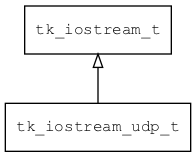

## tk\_iostream\_udp\_t
### 概述


基于UDP实现的输入输出流。
----------------------------------
### 函数
<p id="tk_iostream_udp_t_methods">

| 函数名称 | 说明 | 
| -------- | ------------ | 
| <a href="#tk_iostream_udp_t_tk_iostream_udp_create">tk\_iostream\_udp\_create</a> | 创建iostream对象(客户端)。 |
| <a href="#tk_iostream_udp_t_tk_iostream_udp_create_client">tk\_iostream\_udp\_create\_client</a> | 创建iostream对象(客户端)。 |
#### tk\_iostream\_udp\_create 函数
-----------------------

* 函数功能：

> <p id="tk_iostream_udp_t_tk_iostream_udp_create">创建iostream对象(客户端)。

* 函数原型：

```
tk_iostream_t* tk_iostream_udp_create (int sock);
```

* 参数说明：

| 参数 | 类型 | 说明 |
| -------- | ----- | --------- |
| 返回值 | tk\_iostream\_t* | 返回iostream对象。 |
| sock | int | socket |
#### tk\_iostream\_udp\_create\_client 函数
-----------------------

* 函数功能：

> <p id="tk_iostream_udp_t_tk_iostream_udp_create_client">创建iostream对象(客户端)。

* 函数原型：

```
tk_iostream_t* tk_iostream_udp_create_client (const char* host, int port);
```

* 参数说明：

| 参数 | 类型 | 说明 |
| -------- | ----- | --------- |
| 返回值 | tk\_iostream\_t* | 返回iostream对象。 |
| host | const char* | 服务器地址。 |
| port | int | 端口。 |
