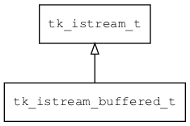

## tk\_istream\_buffered\_t
### 概述


缓冲输入流。

如果调用者每次只读取少量数据，可以使用本类对底层istream进行装饰，以提高读取效率。
----------------------------------
### 函数
<p id="tk_istream_buffered_t_methods">

| 函数名称 | 说明 | 
| -------- | ------------ | 
| <a href="#tk_istream_buffered_t_tk_istream_buffered_create">tk\_istream\_buffered\_create</a> | 创建istream对象。 |
#### tk\_istream\_buffered\_create 函数
-----------------------

* 函数功能：

> <p id="tk_istream_buffered_t_tk_istream_buffered_create">创建istream对象。

本函数自动增加real_ostream的引用计数。

* 函数原型：

```
tk_istream_t* tk_istream_buffered_create (tk_istream_t* real_istream, uint32_t buffer_size);
```

* 参数说明：

| 参数 | 类型 | 说明 |
| -------- | ----- | --------- |
| 返回值 | tk\_istream\_t* | 返回istream对象。 |
| real\_istream | tk\_istream\_t* | 实际的istream。 |
| buffer\_size | uint32\_t | 缓冲区的大小。 |
