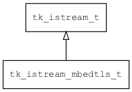

## tk\_istream\_mbedtls\_t
### 概述


基于MBEDTLS实现的输入流。
----------------------------------
### 函数
<p id="tk_istream_mbedtls_t_methods">

| 函数名称 | 说明 | 
| -------- | ------------ | 
| <a href="#tk_istream_mbedtls_t_tk_istream_mbedtls_create">tk\_istream\_mbedtls\_create</a> | 创建istream对象。 |
#### tk\_istream\_mbedtls\_create 函数
-----------------------

* 函数功能：

> <p id="tk_istream_mbedtls_t_tk_istream_mbedtls_create">创建istream对象。

* 函数原型：

```
tk_istream_t* tk_istream_mbedtls_create (mbedtls_ssl_context* ssl);
```

* 参数说明：

| 参数 | 类型 | 说明 |
| -------- | ----- | --------- |
| 返回值 | tk\_istream\_t* | 返回istream对象。 |
| ssl | mbedtls\_ssl\_context* | ssl对象。 |
