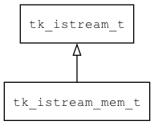

## tk\_istream\_mem\_t
### 概述


基于内存实现的输入流。
----------------------------------
### 函数
<p id="tk_istream_mem_t_methods">

| 函数名称 | 说明 | 
| -------- | ------------ | 
| <a href="#tk_istream_mem_t_tk_istream_mem_create">tk\_istream\_mem\_create</a> | 创建istream对象。 |
#### tk\_istream\_mem\_create 函数
-----------------------

* 函数功能：

> <p id="tk_istream_mem_t_tk_istream_mem_create">创建istream对象。

* 函数原型：

```
tk_istream_t* tk_istream_mem_create (uint8_t* buff, uint32_t size, uint32_t packet_size, bool_t own_the_buff);
```

* 参数说明：

| 参数 | 类型 | 说明 |
| -------- | ----- | --------- |
| 返回值 | tk\_istream\_t* | 返回istream对象。 |
| buff | uint8\_t* | 返回数据的缓冲区。 |
| size | uint32\_t | 缓冲区的大小。 |
| packet\_size | uint32\_t | 缺省一次读取的数据的长度。 |
| own\_the\_buff | bool\_t | 是否让istream对象拥有buff。 |
