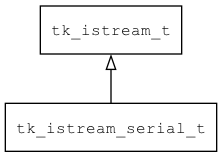

## tk\_istream\_serial\_t
### 概述


基于串口实现的输入流。
----------------------------------
### 函数
<p id="tk_istream_serial_t_methods">

| 函数名称 | 说明 | 
| -------- | ------------ | 
| <a href="#tk_istream_serial_t_tk_istream_serial_create">tk\_istream\_serial\_create</a> | 创建istream对象。 |
#### tk\_istream\_serial\_create 函数
-----------------------

* 函数功能：

> <p id="tk_istream_serial_t_tk_istream_serial_create">创建istream对象。

* 函数原型：

```
tk_istream_t* tk_istream_serial_create (int fd);
```

* 参数说明：

| 参数 | 类型 | 说明 |
| -------- | ----- | --------- |
| 返回值 | tk\_istream\_t* | 返回istream对象。 |
| fd | int | fd。 |
