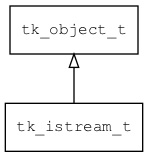

## tk\_istream\_t
### 概述


输入流的接口。
----------------------------------
### 函数
<p id="tk_istream_t_methods">

| 函数名称 | 说明 | 
| -------- | ------------ | 
| <a href="#tk_istream_t_tk_istream_flush">tk\_istream\_flush</a> | 刷新数据。 |
| <a href="#tk_istream_t_tk_istream_read">tk\_istream\_read</a> | 读取数据。 |
| <a href="#tk_istream_t_tk_istream_read_len">tk\_istream\_read\_len</a> | 读取指定长度的数据。 |
| <a href="#tk_istream_t_tk_istream_read_line">tk\_istream\_read\_line</a> | 读取一行数据。 |
| <a href="#tk_istream_t_tk_istream_seek">tk\_istream\_seek</a> | 设置偏移量。 |
| <a href="#tk_istream_t_tk_istream_wait_for_data">tk\_istream\_wait\_for\_data</a> | 等待数据。 |
#### tk\_istream\_flush 函数
-----------------------

* 函数功能：

> <p id="tk_istream_t_tk_istream_flush">刷新数据。

* 函数原型：

```
ret_t tk_istream_flush (tk_istream_t* stream);
```

* 参数说明：

| 参数 | 类型 | 说明 |
| -------- | ----- | --------- |
| 返回值 | ret\_t | 返回RET\_OK表示成功，否则表示失败。 |
| stream | tk\_istream\_t* | istream对象。 |
#### tk\_istream\_read 函数
-----------------------

* 函数功能：

> <p id="tk_istream_t_tk_istream_read">读取数据。

* 函数原型：

```
int32_t tk_istream_read (tk_istream_t* stream, void* buff, uint32_t max_size);
```

* 参数说明：

| 参数 | 类型 | 说明 |
| -------- | ----- | --------- |
| 返回值 | int32\_t | 返回负数表示读取失败，否则返回实际读取数据的长度。 |
| stream | tk\_istream\_t* | istream对象。 |
| buff | void* | 返回数据的缓冲区。 |
| max\_size | uint32\_t | 缓冲区的大小。 |
#### tk\_istream\_read\_len 函数
-----------------------

* 函数功能：

> <p id="tk_istream_t_tk_istream_read_len">读取指定长度的数据。

* 函数原型：

```
int32_t tk_istream_read_len (tk_istream_t* stream, void* buff, uint32_t max_size, uint32_t timeout_ms);
```

* 参数说明：

| 参数 | 类型 | 说明 |
| -------- | ----- | --------- |
| 返回值 | int32\_t | 返回负数表示读取失败，否则返回实际读取数据的长度。 |
| stream | tk\_istream\_t* | istream对象。 |
| buff | void* | 返回数据的缓冲区。 |
| max\_size | uint32\_t | 缓冲区的大小。 |
| timeout\_ms | uint32\_t | timeout. |
#### tk\_istream\_read\_line 函数
-----------------------

* 函数功能：

> <p id="tk_istream_t_tk_istream_read_line">读取一行数据。

* 函数原型：

```
int32_t tk_istream_read_line (tk_istream_t* stream, void* buff, uint32_t max_size, uint32_t timeout_ms);
```

* 参数说明：

| 参数 | 类型 | 说明 |
| -------- | ----- | --------- |
| 返回值 | int32\_t | 返回负数表示读取失败，否则返回实际读取数据的长度。 |
| stream | tk\_istream\_t* | istream对象。 |
| buff | void* | 返回数据的缓冲区。 |
| max\_size | uint32\_t | 缓冲区的大小。 |
| timeout\_ms | uint32\_t | timeout. |
#### tk\_istream\_seek 函数
-----------------------

* 函数功能：

> <p id="tk_istream_t_tk_istream_seek">设置偏移量。

* 函数原型：

```
ret_t tk_istream_seek (tk_istream_t* stream, uint32_t offset);
```

* 参数说明：

| 参数 | 类型 | 说明 |
| -------- | ----- | --------- |
| 返回值 | ret\_t | 返回RET\_OK表示成功，否则表示失败。 |
| stream | tk\_istream\_t* | istream对象。 |
| offset | uint32\_t | 偏移量。 |
#### tk\_istream\_wait\_for\_data 函数
-----------------------

* 函数功能：

> <p id="tk_istream_t_tk_istream_wait_for_data">等待数据。

* 函数原型：

```
ret_t tk_istream_wait_for_data (tk_istream_t* stream, uint32_t timeout_ms);
```

* 参数说明：

| 参数 | 类型 | 说明 |
| -------- | ----- | --------- |
| 返回值 | ret\_t | 返回RET\_OK表示成功，否则表示失败。 |
| stream | tk\_istream\_t* | istream对象。 |
| timeout\_ms | uint32\_t | 超时时间。 |
