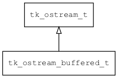

## tk\_ostream\_buffered\_t
### 概述


先将数据写入一个缓存区，调用flush时才真正写入底层的ostream。
----------------------------------
### 函数
<p id="tk_ostream_buffered_t_methods">

| 函数名称 | 说明 | 
| -------- | ------------ | 
| <a href="#tk_ostream_buffered_t_tk_ostream_buffered_create">tk\_ostream\_buffered\_create</a> | 创建ostream对象。 |
| <a href="#tk_ostream_buffered_t_tk_ostream_buffered_get_size">tk\_ostream\_buffered\_get\_size</a> | 获取当前缓存数据的长度。 |
#### tk\_ostream\_buffered\_create 函数
-----------------------

* 函数功能：

> <p id="tk_ostream_buffered_t_tk_ostream_buffered_create">创建ostream对象。

本函数自动增加real_ostream的引用计数。

* 函数原型：

```
tk_ostream_t* tk_ostream_buffered_create (tk_ostream_t* real_ostream);
```

* 参数说明：

| 参数 | 类型 | 说明 |
| -------- | ----- | --------- |
| 返回值 | tk\_ostream\_t* | 返回ostream对象。 |
| real\_ostream | tk\_ostream\_t* | 实际的ostream对象。 |
#### tk\_ostream\_buffered\_get\_size 函数
-----------------------

* 函数功能：

> <p id="tk_ostream_buffered_t_tk_ostream_buffered_get_size">获取当前缓存数据的长度。

* 函数原型：

```
uint32_t tk_ostream_buffered_get_size (tk_ostream_t* ostream);
```

* 参数说明：

| 参数 | 类型 | 说明 |
| -------- | ----- | --------- |
| 返回值 | uint32\_t | 返回缓存数据的长度。 |
| ostream | tk\_ostream\_t* | ostream对象。 |
