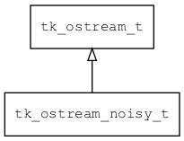

## tk\_ostream\_noisy\_t
### 概述


在输出流中注入错误，方便进行可靠性测试。
----------------------------------
### 函数
<p id="tk_ostream_noisy_t_methods">

| 函数名称 | 说明 | 
| -------- | ------------ | 
| <a href="#tk_ostream_noisy_t_tk_ostream_noisy_create">tk\_ostream\_noisy\_create</a> | 创建ostream对象。 |
### 属性
<p id="tk_ostream_noisy_t_properties">

| 属性名称 | 类型 | 说明 | 
| -------- | ----- | ------------ | 
| <a href="#tk_ostream_noisy_t_error_count">error\_count</a> | uint32\_t | 注入的错误数。 |
| <a href="#tk_ostream_noisy_t_error_level">error\_level</a> | uint32\_t | error level. |
| <a href="#tk_ostream_noisy_t_write_count">write\_count</a> | uint32\_t | 写入的次数。 |
#### tk\_ostream\_noisy\_create 函数
-----------------------

* 函数功能：

> <p id="tk_ostream_noisy_t_tk_ostream_noisy_create">创建ostream对象。

> 只能由iostream_noisy调用。

* 函数原型：

```
tk_ostream_t* tk_ostream_noisy_create (tk_ostream_t* real_ostream);
```

* 参数说明：

| 参数 | 类型 | 说明 |
| -------- | ----- | --------- |
| 返回值 | tk\_ostream\_t* | 返回ostream对象。 |
| real\_ostream | tk\_ostream\_t* | 实际的ostream对象。 |
#### error\_count 属性
-----------------------
> <p id="tk_ostream_noisy_t_error_count">注入的错误数。

* 类型：uint32\_t

#### error\_level 属性
-----------------------
> <p id="tk_ostream_noisy_t_error_level">error level.

* 类型：uint32\_t

#### write\_count 属性
-----------------------
> <p id="tk_ostream_noisy_t_write_count">写入的次数。

* 类型：uint32\_t

