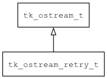

## tk\_ostream\_retry\_t
### 概述


如果写数据失败，将数据放入ring_buffer，后面再重试(flush)。

如果重试次数超出最大值，则丢掉数据。
----------------------------------
### 函数
<p id="tk_ostream_retry_t_methods">

| 函数名称 | 说明 | 
| -------- | ------------ | 
| <a href="#tk_ostream_retry_t_tk_ostream_retry_clear_buffer">tk\_ostream\_retry\_clear\_buffer</a> | 清除缓存的数据。 |
| <a href="#tk_ostream_retry_t_tk_ostream_retry_create">tk\_ostream\_retry\_create</a> | 创建ostream对象。 |
| <a href="#tk_ostream_retry_t_tk_ostream_retry_set_discard_policy">tk\_ostream\_retry\_set\_discard\_policy</a> | 设置数据丢弃策略。 |
| <a href="#tk_ostream_retry_t_tk_ostream_retry_set_max_buffer_size">tk\_ostream\_retry\_set\_max\_buffer\_size</a> | 设置最大缓存大小。 |
| <a href="#tk_ostream_retry_t_tk_ostream_retry_set_max_retry_times">tk\_ostream\_retry\_set\_max\_retry\_times</a> | 设置最大尝试次数。 |
### 属性
<p id="tk_ostream_retry_t_properties">

| 属性名称 | 类型 | 说明 | 
| -------- | ----- | ------------ | 
| <a href="#tk_ostream_retry_t_discard_bytes">discard\_bytes</a> | uint32\_t | 总共丢弃数据的字节数。 |
| <a href="#tk_ostream_retry_t_discard_packets">discard\_packets</a> | uint32\_t | 总共丢弃数据包的个数。 |
| <a href="#tk_ostream_retry_t_discard_policy">discard\_policy</a> | data\_discard\_policy\_t | 缓存不够时，丢弃数据包的策略。 |
| <a href="#tk_ostream_retry_t_max_retry_times">max\_retry\_times</a> | uint32\_t | 尝试次数超过指定的值时丢弃该数据包。 |
| <a href="#tk_ostream_retry_t_pending_bytes">pending\_bytes</a> | uint32\_t | 待重写的数据大小。 |
| <a href="#tk_ostream_retry_t_pending_packets">pending\_packets</a> | uint32\_t | 待重写的数据包的个数。 |
| <a href="#tk_ostream_retry_t_timeout">timeout</a> | uint32\_t | 写超时时间(ms)。 |
#### tk\_ostream\_retry\_clear\_buffer 函数
-----------------------

* 函数功能：

> <p id="tk_ostream_retry_t_tk_ostream_retry_clear_buffer">清除缓存的数据。

* 函数原型：

```
ret_t tk_ostream_retry_clear_buffer (tk_ostream_t* ostream);
```

* 参数说明：

| 参数 | 类型 | 说明 |
| -------- | ----- | --------- |
| 返回值 | ret\_t | 返回RET\_OK表示成功，否则表示失败。 |
| ostream | tk\_ostream\_t* | ostream对象。 |
#### tk\_ostream\_retry\_create 函数
-----------------------

* 函数功能：

> <p id="tk_ostream_retry_t_tk_ostream_retry_create">创建ostream对象。

本函数自动增加real_ostream的引用计数。

* 函数原型：

```
tk_ostream_t* tk_ostream_retry_create (tk_ostream_t* real_ostream);
```

* 参数说明：

| 参数 | 类型 | 说明 |
| -------- | ----- | --------- |
| 返回值 | tk\_ostream\_t* | 返回ostream对象。 |
| real\_ostream | tk\_ostream\_t* | 实际的ostream对象。 |
#### tk\_ostream\_retry\_set\_discard\_policy 函数
-----------------------

* 函数功能：

> <p id="tk_ostream_retry_t_tk_ostream_retry_set_discard_policy">设置数据丢弃策略。

* 函数原型：

```
ret_t tk_ostream_retry_set_discard_policy (tk_ostream_t* ostream, data_discard_policy_t discard_policy);
```

* 参数说明：

| 参数 | 类型 | 说明 |
| -------- | ----- | --------- |
| 返回值 | ret\_t | 返回RET\_OK表示成功，否则表示失败。 |
| ostream | tk\_ostream\_t* | ostream对象。 |
| discard\_policy | data\_discard\_policy\_t | 丢弃策略。 |
#### tk\_ostream\_retry\_set\_max\_buffer\_size 函数
-----------------------

* 函数功能：

> <p id="tk_ostream_retry_t_tk_ostream_retry_set_max_buffer_size">设置最大缓存大小。

* 函数原型：

```
ret_t tk_ostream_retry_set_max_buffer_size (tk_ostream_t* ostream, uint32_t max_buffer_size);
```

* 参数说明：

| 参数 | 类型 | 说明 |
| -------- | ----- | --------- |
| 返回值 | ret\_t | 返回RET\_OK表示成功，否则表示失败。 |
| ostream | tk\_ostream\_t* | ostream对象。 |
| max\_buffer\_size | uint32\_t | 缓存大小。 |
#### tk\_ostream\_retry\_set\_max\_retry\_times 函数
-----------------------

* 函数功能：

> <p id="tk_ostream_retry_t_tk_ostream_retry_set_max_retry_times">设置最大尝试次数。

* 函数原型：

```
ret_t tk_ostream_retry_set_max_retry_times (tk_ostream_t* ostream, uint32_t max_retry_times);
```

* 参数说明：

| 参数 | 类型 | 说明 |
| -------- | ----- | --------- |
| 返回值 | ret\_t | 返回RET\_OK表示成功，否则表示失败。 |
| ostream | tk\_ostream\_t* | ostream对象。 |
| max\_retry\_times | uint32\_t | 最大尝试次数。 |
#### discard\_bytes 属性
-----------------------
> <p id="tk_ostream_retry_t_discard_bytes">总共丢弃数据的字节数。

* 类型：uint32\_t

| 特性 | 是否支持 |
| -------- | ----- |
| 可直接读取 | 是 |
| 可直接修改 | 否 |
#### discard\_packets 属性
-----------------------
> <p id="tk_ostream_retry_t_discard_packets">总共丢弃数据包的个数。

* 类型：uint32\_t

| 特性 | 是否支持 |
| -------- | ----- |
| 可直接读取 | 是 |
| 可直接修改 | 否 |
#### discard\_policy 属性
-----------------------
> <p id="tk_ostream_retry_t_discard_policy">缓存不够时，丢弃数据包的策略。

* 类型：data\_discard\_policy\_t

| 特性 | 是否支持 |
| -------- | ----- |
| 可直接读取 | 是 |
| 可直接修改 | 否 |
#### max\_retry\_times 属性
-----------------------
> <p id="tk_ostream_retry_t_max_retry_times">尝试次数超过指定的值时丢弃该数据包。

* 类型：uint32\_t

| 特性 | 是否支持 |
| -------- | ----- |
| 可直接读取 | 是 |
| 可直接修改 | 否 |
#### pending\_bytes 属性
-----------------------
> <p id="tk_ostream_retry_t_pending_bytes">待重写的数据大小。

* 类型：uint32\_t

| 特性 | 是否支持 |
| -------- | ----- |
| 可直接读取 | 是 |
| 可直接修改 | 否 |
#### pending\_packets 属性
-----------------------
> <p id="tk_ostream_retry_t_pending_packets">待重写的数据包的个数。

* 类型：uint32\_t

| 特性 | 是否支持 |
| -------- | ----- |
| 可直接读取 | 是 |
| 可直接修改 | 否 |
#### timeout 属性
-----------------------
> <p id="tk_ostream_retry_t_timeout">写超时时间(ms)。

* 类型：uint32\_t

| 特性 | 是否支持 |
| -------- | ----- |
| 可直接读取 | 是 |
| 可直接修改 | 否 |
