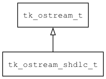

## tk\_ostream\_shdlc\_t
### 概述


reliable ostream base on simple HDLC
----------------------------------
### 函数
<p id="tk_ostream_shdlc_t_methods">

| 函数名称 | 说明 | 
| -------- | ------------ | 
| <a href="#tk_ostream_shdlc_t_tk_ostream_shdlc_create">tk\_ostream\_shdlc\_create</a> | 创建ostream对象。 |
### 属性
<p id="tk_ostream_shdlc_t_properties">

| 属性名称 | 类型 | 说明 | 
| -------- | ----- | ------------ | 
| <a href="#tk_ostream_shdlc_t_compress_threshold">compress\_threshold</a> | uint32\_t | 激活压缩的阈值。 |
| <a href="#tk_ostream_shdlc_t_retry_times">retry\_times</a> | uint32\_t | 失败重传次数。 |
| <a href="#tk_ostream_shdlc_t_timeout">timeout</a> | uint32\_t | 读写超时时间(ms) |
#### tk\_ostream\_shdlc\_create 函数
-----------------------

* 函数功能：

> <p id="tk_ostream_shdlc_t_tk_ostream_shdlc_create">创建ostream对象。

> 只能由iostream_shdlc调用。

* 函数原型：

```
tk_ostream_t* tk_ostream_shdlc_create (tk_iostream_shdlc_t* iostream);
```

* 参数说明：

| 参数 | 类型 | 说明 |
| -------- | ----- | --------- |
| 返回值 | tk\_ostream\_t* | 返回ostream对象。 |
| iostream | tk\_iostream\_shdlc\_t* | iostream对象。 |
#### compress\_threshold 属性
-----------------------
> <p id="tk_ostream_shdlc_t_compress_threshold">激活压缩的阈值。

* 类型：uint32\_t

#### retry\_times 属性
-----------------------
> <p id="tk_ostream_shdlc_t_retry_times">失败重传次数。

* 类型：uint32\_t

#### timeout 属性
-----------------------
> <p id="tk_ostream_shdlc_t_timeout">读写超时时间(ms)

* 类型：uint32\_t

