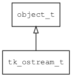

## tk\_ostream\_t
### 概述


输出流的接口。
----------------------------------
### 函数
<p id="tk_ostream_t_methods">

| 函数名称 | 说明 | 
| -------- | ------------ | 
| <a href="#tk_ostream_t_tk_ostream_flush">tk\_ostream\_flush</a> | 刷新数据。 |
| <a href="#tk_ostream_t_tk_ostream_seek">tk\_ostream\_seek</a> | 设置偏移量。 |
| <a href="#tk_ostream_t_tk_ostream_write">tk\_ostream\_write</a> | 写入数据。 |
| <a href="#tk_ostream_t_tk_ostream_write_byte">tk\_ostream\_write\_byte</a> | 写入一个字节的数据。 |
| <a href="#tk_ostream_t_tk_ostream_write_len">tk\_ostream\_write\_len</a> | 写入指定长度的数据。 |
#### tk\_ostream\_flush 函数
-----------------------

* 函数功能：

> <p id="tk_ostream_t_tk_ostream_flush">刷新数据。

* 函数原型：

```
ret_t tk_ostream_flush (tk_ostream_t* stream);
```

* 参数说明：

| 参数 | 类型 | 说明 |
| -------- | ----- | --------- |
| 返回值 | ret\_t | 返回RET\_OK表示成功，否则表示失败。 |
| stream | tk\_ostream\_t* | ostream对象。 |
#### tk\_ostream\_seek 函数
-----------------------

* 函数功能：

> <p id="tk_ostream_t_tk_ostream_seek">设置偏移量。

* 函数原型：

```
ret_t tk_ostream_seek (tk_ostream_t* stream, uint32_t offset);
```

* 参数说明：

| 参数 | 类型 | 说明 |
| -------- | ----- | --------- |
| 返回值 | ret\_t | 返回RET\_OK表示成功，否则表示失败。 |
| stream | tk\_ostream\_t* | ostream对象。 |
| offset | uint32\_t | 偏移量。 |
#### tk\_ostream\_write 函数
-----------------------

* 函数功能：

> <p id="tk_ostream_t_tk_ostream_write">写入数据。

* 函数原型：

```
int32_t tk_ostream_write (tk_ostream_t* stream, const void* buff, uint32_t max_size);
```

* 参数说明：

| 参数 | 类型 | 说明 |
| -------- | ----- | --------- |
| 返回值 | int32\_t | 返回负数表示写入失败，否则返回实际写入数据的长度。 |
| stream | tk\_ostream\_t* | ostream对象。 |
| buff | const void* | 返回数据的缓冲区。 |
| max\_size | uint32\_t | 缓冲区的大小。 |
#### tk\_ostream\_write\_byte 函数
-----------------------

* 函数功能：

> <p id="tk_ostream_t_tk_ostream_write_byte">写入一个字节的数据。

* 函数原型：

```
ret_t tk_ostream_write_byte (tk_ostream_t* stream, uint8_t byte);
```

* 参数说明：

| 参数 | 类型 | 说明 |
| -------- | ----- | --------- |
| 返回值 | ret\_t | 返回RET\_OK表示成功，否则表示失败。 |
| stream | tk\_ostream\_t* | ostream对象。 |
| byte | uint8\_t | 数据。 |
#### tk\_ostream\_write\_len 函数
-----------------------

* 函数功能：

> <p id="tk_ostream_t_tk_ostream_write_len">写入指定长度的数据。

* 函数原型：

```
int32_t tk_ostream_write_len (tk_ostream_t* stream, const void* buff, uint32_t max_size, uint32_t timeout_ms);
```

* 参数说明：

| 参数 | 类型 | 说明 |
| -------- | ----- | --------- |
| 返回值 | int32\_t | 返回负数表示写入失败，否则返回实际写入数据的长度。 |
| stream | tk\_ostream\_t* | ostream对象。 |
| buff | const void* | 数据的缓冲区。 |
| max\_size | uint32\_t | 缓冲区的大小。 |
| timeout\_ms | uint32\_t | timeout. |
