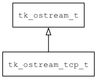

## tk\_ostream\_tcp\_t
### 概述


基于TCP实现的输出流。
----------------------------------
### 函数
<p id="tk_ostream_tcp_t_methods">

| 函数名称 | 说明 | 
| -------- | ------------ | 
| <a href="#tk_ostream_tcp_t_tk_ostream_tcp_create">tk\_ostream\_tcp\_create</a> | 创建ostream对象。 |
#### tk\_ostream\_tcp\_create 函数
-----------------------

* 函数功能：

> <p id="tk_ostream_tcp_t_tk_ostream_tcp_create">创建ostream对象。

* 函数原型：

```
tk_ostream_t* tk_ostream_tcp_create (int sock);
```

* 参数说明：

| 参数 | 类型 | 说明 |
| -------- | ----- | --------- |
| 返回值 | tk\_ostream\_t* | 返回ostream对象。 |
| sock | int | socket. |
