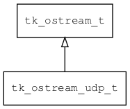

## tk\_ostream\_udp\_t
### 概述


基于UDP实现的输出流。
----------------------------------
### 函数
<p id="tk_ostream_udp_t_methods">

| 函数名称 | 说明 | 
| -------- | ------------ | 
| <a href="#tk_ostream_udp_t_tk_ostream_udp_create">tk\_ostream\_udp\_create</a> | 创建ostream对象。 |
| <a href="#tk_ostream_udp_t_tk_ostream_udp_set_target_with_addr">tk\_ostream\_udp\_set\_target\_with\_addr</a> | 设置目标。 |
| <a href="#tk_ostream_udp_t_tk_ostream_udp_set_target_with_host">tk\_ostream\_udp\_set\_target\_with\_host</a> | 设置目标。 |
#### tk\_ostream\_udp\_create 函数
-----------------------

* 函数功能：

> <p id="tk_ostream_udp_t_tk_ostream_udp_create">创建ostream对象。

* 函数原型：

```
tk_ostream_t* tk_ostream_udp_create (int sock);
```

* 参数说明：

| 参数 | 类型 | 说明 |
| -------- | ----- | --------- |
| 返回值 | tk\_ostream\_t* | 返回ostream对象。 |
| sock | int | socket. |
#### tk\_ostream\_udp\_set\_target\_with\_addr 函数
-----------------------

* 函数功能：

> <p id="tk_ostream_udp_t_tk_ostream_udp_set_target_with_addr">设置目标。

* 函数原型：

```
ret_t tk_ostream_udp_set_target_with_addr (tk_ostream_t* stream, struct sockaddr_in addr);
```

* 参数说明：

| 参数 | 类型 | 说明 |
| -------- | ----- | --------- |
| 返回值 | ret\_t | 返回RET\_OK表示成功，否则表示失败。 |
| stream | tk\_ostream\_t* | ostream对象。 |
| addr | struct sockaddr\_in | 地址。 |
#### tk\_ostream\_udp\_set\_target\_with\_host 函数
-----------------------

* 函数功能：

> <p id="tk_ostream_udp_t_tk_ostream_udp_set_target_with_host">设置目标。

* 函数原型：

```
ret_t tk_ostream_udp_set_target_with_host (tk_ostream_t* stream, const char* host, int port);
```

* 参数说明：

| 参数 | 类型 | 说明 |
| -------- | ----- | --------- |
| 返回值 | ret\_t | 返回RET\_OK表示成功，否则表示失败。 |
| stream | tk\_ostream\_t* | ostream对象。 |
| host | const char* | 主机或IP。 |
| port | int | 端口。 |
