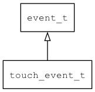

## touch\_event\_t
### 概述


多点触摸事件(目前主要对接 SDL_TouchFingerEvent(SDL_FINGERMOTION/SDL_FINGERDOWN/SDL_FINGERUP))。
----------------------------------
### 函数
<p id="touch_event_t_methods">

| 函数名称 | 说明 | 
| -------- | ------------ | 
| <a href="#touch_event_t_touch_event_cast">touch\_event\_cast</a> | 把event对象转touch_event_t对象。 |
| <a href="#touch_event_t_touch_event_init">touch\_event\_init</a> | 初始化事件。 |
### 属性
<p id="touch_event_t_properties">

| 属性名称 | 类型 | 说明 | 
| -------- | ----- | ------------ | 
| <a href="#touch_event_t_finger_id">finger\_id</a> | int64\_t | 手指ID。 |
| <a href="#touch_event_t_pressure">pressure</a> | float | 压力。 |
| <a href="#touch_event_t_touch_id">touch\_id</a> | int64\_t | 触摸ID。 |
| <a href="#touch_event_t_x">x</a> | float | x坐标(在 0-1 之间，表示与屏幕宽度的比例）。 |
| <a href="#touch_event_t_y">y</a> | float | y坐标(在 0-1 之间，表示与屏幕高度的比例）。 |
#### touch\_event\_cast 函数
-----------------------

* 函数功能：

> <p id="touch_event_t_touch_event_cast">把event对象转touch_event_t对象。

* 函数原型：

```
touch_event_t* touch_event_cast (event_t* event);
```

* 参数说明：

| 参数 | 类型 | 说明 |
| -------- | ----- | --------- |
| 返回值 | touch\_event\_t* | event 对象。 |
| event | event\_t* | event对象。 |
#### touch\_event\_init 函数
-----------------------

* 函数功能：

> <p id="touch_event_t_touch_event_init">初始化事件。

* 函数原型：

```
event_t* touch_event_init (touch_event_t* event, uint32_t type, void* target, int64_t touch_id, int64_t finger_id, float x, float y, float pressure);
```

* 参数说明：

| 参数 | 类型 | 说明 |
| -------- | ----- | --------- |
| 返回值 | event\_t* | event对象。 |
| event | touch\_event\_t* | event对象。 |
| type | uint32\_t | 事件类型。 |
| target | void* | 事件目标。 |
| touch\_id | int64\_t | 触摸ID。 |
| finger\_id | int64\_t | 手指ID。 |
| x | float | x坐标。 |
| y | float | y坐标。 |
| pressure | float | 压力。 |
#### finger\_id 属性
-----------------------
> <p id="touch_event_t_finger_id">手指ID。

* 类型：int64\_t

| 特性 | 是否支持 |
| -------- | ----- |
| 可直接读取 | 是 |
| 可直接修改 | 否 |
| 可脚本化   | 是 |
#### pressure 属性
-----------------------
> <p id="touch_event_t_pressure">压力。

* 类型：float

| 特性 | 是否支持 |
| -------- | ----- |
| 可直接读取 | 是 |
| 可直接修改 | 否 |
| 可脚本化   | 是 |
#### touch\_id 属性
-----------------------
> <p id="touch_event_t_touch_id">触摸ID。

* 类型：int64\_t

| 特性 | 是否支持 |
| -------- | ----- |
| 可直接读取 | 是 |
| 可直接修改 | 否 |
| 可脚本化   | 是 |
#### x 属性
-----------------------
> <p id="touch_event_t_x">x坐标(在 0-1 之间，表示与屏幕宽度的比例）。

* 类型：float

| 特性 | 是否支持 |
| -------- | ----- |
| 可直接读取 | 是 |
| 可直接修改 | 否 |
| 可脚本化   | 是 |
#### y 属性
-----------------------
> <p id="touch_event_t_y">y坐标(在 0-1 之间，表示与屏幕高度的比例）。

* 类型：float

| 特性 | 是否支持 |
| -------- | ----- |
| 可直接读取 | 是 |
| 可直接修改 | 否 |
| 可脚本化   | 是 |
