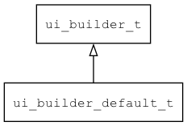

## ui\_builder\_default\_t
### 概述


构建widget树。
----------------------------------
### 函数
<p id="ui_builder_default_t_methods">

| 函数名称 | 说明 | 
| -------- | ------------ | 
| <a href="#ui_builder_default_t_ui_builder_default">ui\_builder\_default</a> | 获取缺省的ui\_builder对象。 |
#### ui\_builder\_default 函数
-----------------------

* 函数功能：

> <p id="ui_builder_default_t_ui_builder_default">获取缺省的ui\_builder对象。

* 函数原型：

```
ui_builder_t* ui_builder_default (const char* name);
```

* 参数说明：

| 参数 | 类型 | 说明 |
| -------- | ----- | --------- |
| 返回值 | ui\_builder\_t* | 返回ui\\_builder对象。 |
| name | const char* | 窗口的缺省名称。 |
