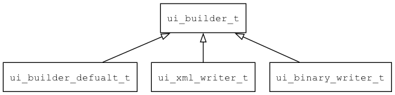

## ui\_builder\_t
### 概述
界面构造器接口。

负责把ui\_loader解析的数据进一步处理，至于具体做什么，由具体实现决定。常见的实现有：

* 构建widget对象树。

* 生成二进制的UI描述数据。

* 生成XML格式的UI描述数据。



----------------------------------
### 函数
<p id="ui_builder_t_methods">

| 函数名称 | 说明 | 
| -------- | ------------ | 
| <a href="#ui_builder_t_ui_builder_on_end">ui\_builder\_on\_end</a> | ui\_loader在解析结束时，调用本函数做些收尾工作。 |
| <a href="#ui_builder_t_ui_builder_on_start">ui\_builder\_on\_start</a> | ui\_loader在解析开始时，调用本函数做些准备工作。 |
| <a href="#ui_builder_t_ui_builder_on_widget_end">ui\_builder\_on\_widget\_end</a> | ui\_loader在解析到widget结束时，调用本函数进一步处理。 |
| <a href="#ui_builder_t_ui_builder_on_widget_prop">ui\_builder\_on\_widget\_prop</a> | ui\_loader在解析到widget的属性时，调用本函数进一步处理。 |
| <a href="#ui_builder_t_ui_builder_on_widget_prop_end">ui\_builder\_on\_widget\_prop\_end</a> | ui\_loader在解析到widget全部属性结束时，调用本函数进一步处理。 |
| <a href="#ui_builder_t_ui_builder_on_widget_start">ui\_builder\_on\_widget\_start</a> | ui\_loader在解析到widget时，调用本函数进一步处理。 |
#### ui\_builder\_on\_end 函数
-----------------------

* 函数功能：

> <p id="ui_builder_t_ui_builder_on_end">ui\_loader在解析结束时，调用本函数做些收尾工作。

* 函数原型：

```
ret_t ui_builder_on_end (ui_builder_t* builder);
```

* 参数说明：

| 参数 | 类型 | 说明 |
| -------- | ----- | --------- |
| 返回值 | ret\_t | 返回RET\_OK表示成功，否则表示失败。 |
| builder | ui\_builder\_t* | builder对象。 |
#### ui\_builder\_on\_start 函数
-----------------------

* 函数功能：

> <p id="ui_builder_t_ui_builder_on_start">ui\_loader在解析开始时，调用本函数做些准备工作。

* 函数原型：

```
ret_t ui_builder_on_start (ui_builder_t* builder);
```

* 参数说明：

| 参数 | 类型 | 说明 |
| -------- | ----- | --------- |
| 返回值 | ret\_t | 返回RET\_OK表示成功，否则表示失败。 |
| builder | ui\_builder\_t* | builder对象。 |
#### ui\_builder\_on\_widget\_end 函数
-----------------------

* 函数功能：

> <p id="ui_builder_t_ui_builder_on_widget_end">ui\_loader在解析到widget结束时，调用本函数进一步处理。

* 函数原型：

```
ret_t ui_builder_on_widget_end (ui_builder_t* builder);
```

* 参数说明：

| 参数 | 类型 | 说明 |
| -------- | ----- | --------- |
| 返回值 | ret\_t | 返回RET\_OK表示成功，否则表示失败。 |
| builder | ui\_builder\_t* | builder对象。 |
#### ui\_builder\_on\_widget\_prop 函数
-----------------------

* 函数功能：

> <p id="ui_builder_t_ui_builder_on_widget_prop">ui\_loader在解析到widget的属性时，调用本函数进一步处理。

* 函数原型：

```
ret_t ui_builder_on_widget_prop (ui_builder_t* builder, const char* name, const char* value);
```

* 参数说明：

| 参数 | 类型 | 说明 |
| -------- | ----- | --------- |
| 返回值 | ret\_t | 返回RET\_OK表示成功，否则表示失败。 |
| builder | ui\_builder\_t* | builder对象。 |
| name | const char* | 属性名。 |
| value | const char* | 属性值。 |
#### ui\_builder\_on\_widget\_prop\_end 函数
-----------------------

* 函数功能：

> <p id="ui_builder_t_ui_builder_on_widget_prop_end">ui\_loader在解析到widget全部属性结束时，调用本函数进一步处理。

* 函数原型：

```
ret_t ui_builder_on_widget_prop_end (ui_builder_t* builder);
```

* 参数说明：

| 参数 | 类型 | 说明 |
| -------- | ----- | --------- |
| 返回值 | ret\_t | 返回RET\_OK表示成功，否则表示失败。 |
| builder | ui\_builder\_t* | builder对象。 |
#### ui\_builder\_on\_widget\_start 函数
-----------------------

* 函数功能：

> <p id="ui_builder_t_ui_builder_on_widget_start">ui\_loader在解析到widget时，调用本函数进一步处理。

* 函数原型：

```
ret_t ui_builder_on_widget_start (ui_builder_t* builder, const widget_desc_t* desc);
```

* 参数说明：

| 参数 | 类型 | 说明 |
| -------- | ----- | --------- |
| 返回值 | ret\_t | 返回RET\_OK表示成功，否则表示失败。 |
| builder | ui\_builder\_t* | builder对象。 |
| desc | const widget\_desc\_t* | widget描述信息。 |
