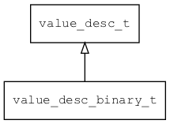

## value\_desc\_binary\_t
### 概述

二进制类型属性描述。
----------------------------------
### 属性

| 属性名称 | 类型 | 说明 | 
| -------- | ----- | ------------ | 
| <a href="#value_desc_binary_t_max">max</a> | uint32\_t | 最大长度。 |
| <a href="#value_desc_binary_t_min">min</a> | uint32\_t | 最小长度。 |
#### max 属性
-----------------------
> 
最大长度。

* 类型：uint32\_t

| 特性 | 是否支持 |
| -------- | ----- |
| 可直接读取 | 是 |
| 可直接修改 | 否 |
#### min 属性
-----------------------
> 
最小长度。

* 类型：uint32\_t

| 特性 | 是否支持 |
| -------- | ----- |
| 可直接读取 | 是 |
| 可直接修改 | 否 |
