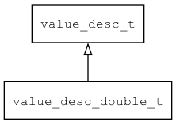

## value\_desc\_double\_t
### 概述

单精度浮点数类型属性描述。
----------------------------------
### 属性

| 属性名称 | 类型 | 说明 | 
| -------- | ----- | ------------ | 
| <a href="#value_desc_double_t_defvalue">defvalue</a> | double | 缺省值。 |
| <a href="#value_desc_double_t_max">max</a> | double | 最大值。 |
| <a href="#value_desc_double_t_min">min</a> | double | 最小值。 |
| <a href="#value_desc_double_t_step">step</a> | double | 步长。 |
| <a href="#value_desc_double_t_unit">unit</a> | const char* | 单位。 |
#### defvalue 属性
-----------------------
> 
缺省值。

* 类型：double

| 特性 | 是否支持 |
| -------- | ----- |
| 可直接读取 | 是 |
| 可直接修改 | 否 |
#### max 属性
-----------------------
> 
最大值。

* 类型：double

| 特性 | 是否支持 |
| -------- | ----- |
| 可直接读取 | 是 |
| 可直接修改 | 否 |
#### min 属性
-----------------------
> 
最小值。

* 类型：double

| 特性 | 是否支持 |
| -------- | ----- |
| 可直接读取 | 是 |
| 可直接修改 | 否 |
#### step 属性
-----------------------
> 
步长。

* 类型：double

| 特性 | 是否支持 |
| -------- | ----- |
| 可直接读取 | 是 |
| 可直接修改 | 否 |
#### unit 属性
-----------------------
> 
单位。

* 类型：const char*

| 特性 | 是否支持 |
| -------- | ----- |
| 可直接读取 | 是 |
| 可直接修改 | 否 |
