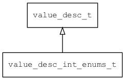

## value\_desc\_int\_enums\_t
### 概述

整数枚举类型属性描述。
----------------------------------
### 属性

| 属性名称 | 类型 | 说明 | 
| -------- | ----- | ------------ | 
| <a href="#value_desc_int_enums_t_defvalue">defvalue</a> | int32\_t | 缺省值。 |
| <a href="#value_desc_int_enums_t_enums">enums</a> | const char** | 枚举值（每一项用英文冒号分隔值和名称）。 |
#### defvalue 属性
-----------------------
> 
缺省值。

* 类型：int32\_t

| 特性 | 是否支持 |
| -------- | ----- |
| 可直接读取 | 是 |
| 可直接修改 | 否 |
#### enums 属性
-----------------------
> 
枚举值（每一项用英文冒号分隔值和名称）。

* 类型：const char**

| 特性 | 是否支持 |
| -------- | ----- |
| 可直接读取 | 是 |
| 可直接修改 | 否 |
