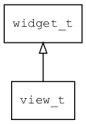

## view\_t
### 概述


一个通用的容器控件。

它本身不提供布局功能，仅提供具有语义的标签，让xml更具有可读性。
子控件的布局可用layout\_children属性指定。
请参考[布局参数](https://github.com/zlgopen/awtk/blob/master/docs/layout.md)。

view\_t是[widget\_t](widget_t.md)的子类控件，widget\_t的函数均适用于view\_t控件。

在xml中使用"view"标签创建view。如：

```xml
<view x="0" y="0" w="100%" h="100%" children_layout="default(c=2,r=2,m=5,s=5)">
</view>
```

可用通过style来设置控件的显示风格，如背景颜色等。如：

```xml
<style name="default" border_color="#a0a0a0">
<normal     bg_color="#f0f0f0" />
</style>
```
----------------------------------
### 函数
<p id="view_t_methods">

| 函数名称 | 说明 | 
| -------- | ------------ | 
| <a href="#view_t_view_cast">view\_cast</a> | 转换为view对象(供脚本语言使用)。 |
| <a href="#view_t_view_create">view\_create</a> | 创建view对象 |
| <a href="#view_t_view_set_default_focused_child">view\_set\_default\_focused\_child</a> | 设置缺省获得焦点的子控件(可用控件名或类型)。 |
### 属性
<p id="view_t_properties">

| 属性名称 | 类型 | 说明 | 
| -------- | ----- | ------------ | 
| <a href="#view_t_default_focused_child">default\_focused\_child</a> | char* | 缺省获得焦点的子控件(可用控件名或类型)。 |
#### view\_cast 函数
-----------------------

* 函数功能：

> <p id="view_t_view_cast">转换为view对象(供脚本语言使用)。

* 函数原型：

```
widget_t* view_cast (widget_t* widget);
```

* 参数说明：

| 参数 | 类型 | 说明 |
| -------- | ----- | --------- |
| 返回值 | widget\_t* | view对象。 |
| widget | widget\_t* | view对象。 |
#### view\_create 函数
-----------------------

* 函数功能：

> <p id="view_t_view_create">创建view对象

* 函数原型：

```
widget_t* view_create (widget_t* parent, xy_t x, xy_t y, wh_t w, wh_t h);
```

* 参数说明：

| 参数 | 类型 | 说明 |
| -------- | ----- | --------- |
| 返回值 | widget\_t* | 对象。 |
| parent | widget\_t* | 父控件 |
| x | xy\_t | x坐标 |
| y | xy\_t | y坐标 |
| w | wh\_t | 宽度 |
| h | wh\_t | 高度 |
#### view\_set\_default\_focused\_child 函数
-----------------------

* 函数功能：

> <p id="view_t_view_set_default_focused_child">设置缺省获得焦点的子控件(可用控件名或类型)。

* 函数原型：

```
ret_t view_set_default_focused_child (widget_t* widget, const char* default_focused_child);
```

* 参数说明：

| 参数 | 类型 | 说明 |
| -------- | ----- | --------- |
| 返回值 | ret\_t | 返回RET\_OK表示成功，否则表示失败。 |
| widget | widget\_t* | 控件对象。 |
| default\_focused\_child | const char* | 缺省获得焦点的子控件(可用控件名或类型)。 |
#### default\_focused\_child 属性
-----------------------
> <p id="view_t_default_focused_child">缺省获得焦点的子控件(可用控件名或类型)。

> view作为pages/slideview的直接子控件才需要设置。
> 正常情况下，一个窗口只能指定一个初始焦点。
> 但是对于pages/slideview来说，可能希望每一个页面都有一个初始焦点，此时可用default\_focused\_child来指定。

* 类型：char*

| 特性 | 是否支持 |
| -------- | ----- |
| 可直接读取 | 是 |
| 可直接修改 | 否 |
| 可持久化   | 是 |
| 可脚本化   | 是 |
| 可在IDE中设置 | 是 |
| 可在XML中设置 | 是 |
| 可通过widget\_get\_prop读取 | 是 |
| 可通过widget\_set\_prop修改 | 是 |
