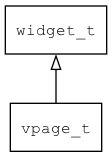

## vpage\_t
### 概述


虚拟页面(根据情况自动加载/卸载页面，并提供入场/出场动画)。

> 虚拟页面只能作为pages的直接子控件使用。

如果指定了ui_asset:

* 当页面切换到后台时自动卸载，并触发EVT\_VPAGE\_CLOSE消息。
* 当页面切换到前台时自动加载，在动画前出发EVT\_VPAGE\_WILL\_OPEN消息，在动画完成时触发 EVT\_VPAGE\_CLOSE消息。

vpage\_t也可以当作普通view嵌入到pages中，让tab控件在切换时具有动画效果。

在xml中使用"vpage"标签创建控件。如：

```xml
<!-- ui -->
<vpage x="c" y="50" w="100" h="100" ui_asset="mypage"/>
```

可用通过style来设置控件的显示风格，如字体的大小和颜色等等(一般无需指定)。如：

```xml
<!-- style -->
<vpage>
<style name="default">
<normal />
</style>
</vpage>
```
----------------------------------
### 函数
<p id="vpage_t_methods">

| 函数名称 | 说明 | 
| -------- | ------------ | 
| <a href="#vpage_t_vpage_cast">vpage\_cast</a> | 转换为vpage对象(供脚本语言使用)。 |
| <a href="#vpage_t_vpage_create">vpage\_create</a> | 创建vpage对象 |
| <a href="#vpage_t_vpage_set_anim_hint">vpage\_set\_anim\_hint</a> | 设置动画类型(vtranslate: 垂直平移，htranslate: 水平平移)。 |
| <a href="#vpage_t_vpage_set_ui_asset">vpage\_set\_ui\_asset</a> | 设置 UI资源名称。 |
### 属性
<p id="vpage_t_properties">

| 属性名称 | 类型 | 说明 | 
| -------- | ----- | ------------ | 
| <a href="#vpage_t_anim_hint">anim\_hint</a> | char* | 动画类型(目前支持：vtranslate: 垂直平移，htranslate: 水平平移)。 |
| <a href="#vpage_t_ui_asset">ui\_asset</a> | char* | UI资源名称。 |
### 事件
<p id="vpage_t_events">

| 事件名称 | 类型  | 说明 | 
| -------- | ----- | ------- | 
| EVT\_VPAGE\_WILL\_OPEN | event\_t | 页面即将打开(动画前)。 |
| EVT\_VPAGE\_OPEN | event\_t | 页面打开完成(动画后)。 |
| EVT\_VPAGE\_CLOSE | event\_t | 页面已经关闭(动画后)。 |
#### vpage\_cast 函数
-----------------------

* 函数功能：

> <p id="vpage_t_vpage_cast">转换为vpage对象(供脚本语言使用)。

* 函数原型：

```
widget_t* vpage_cast (widget_t* widget);
```

* 参数说明：

| 参数 | 类型 | 说明 |
| -------- | ----- | --------- |
| 返回值 | widget\_t* | vpage对象。 |
| widget | widget\_t* | vpage对象。 |
#### vpage\_create 函数
-----------------------

* 函数功能：

> <p id="vpage_t_vpage_create">创建vpage对象

* 函数原型：

```
widget_t* vpage_create (widget_t* parent, xy_t x, xy_t y, wh_t w, wh_t h);
```

* 参数说明：

| 参数 | 类型 | 说明 |
| -------- | ----- | --------- |
| 返回值 | widget\_t* | vpage对象。 |
| parent | widget\_t* | 父控件 |
| x | xy\_t | x坐标 |
| y | xy\_t | y坐标 |
| w | wh\_t | 宽度 |
| h | wh\_t | 高度 |
#### vpage\_set\_anim\_hint 函数
-----------------------

* 函数功能：

> <p id="vpage_t_vpage_set_anim_hint">设置动画类型(vtranslate: 垂直平移，htranslate: 水平平移)。

* 函数原型：

```
ret_t vpage_set_anim_hint (widget_t* widget, const char* anim_hint);
```

* 参数说明：

| 参数 | 类型 | 说明 |
| -------- | ----- | --------- |
| 返回值 | ret\_t | 返回RET\_OK表示成功，否则表示失败。 |
| widget | widget\_t* | widget对象。 |
| anim\_hint | const char* | 动画类型。 |
#### vpage\_set\_ui\_asset 函数
-----------------------

* 函数功能：

> <p id="vpage_t_vpage_set_ui_asset">设置 UI资源名称。

* 函数原型：

```
ret_t vpage_set_ui_asset (widget_t* widget, const char* ui_asset);
```

* 参数说明：

| 参数 | 类型 | 说明 |
| -------- | ----- | --------- |
| 返回值 | ret\_t | 返回RET\_OK表示成功，否则表示失败。 |
| widget | widget\_t* | widget对象。 |
| ui\_asset | const char* | UI资源名称。 |
#### anim\_hint 属性
-----------------------
> <p id="vpage_t_anim_hint">动画类型(目前支持：vtranslate: 垂直平移，htranslate: 水平平移)。

* 类型：char*

| 特性 | 是否支持 |
| -------- | ----- |
| 可直接读取 | 是 |
| 可直接修改 | 否 |
| 可持久化   | 是 |
| 可脚本化   | 是 |
| 可在IDE中设置 | 是 |
| 可在XML中设置 | 是 |
| 可通过widget\_get\_prop读取 | 是 |
| 可通过widget\_set\_prop修改 | 是 |
#### ui\_asset 属性
-----------------------
> <p id="vpage_t_ui_asset">UI资源名称。

* 类型：char*

| 特性 | 是否支持 |
| -------- | ----- |
| 可直接读取 | 是 |
| 可直接修改 | 否 |
| 可持久化   | 是 |
| 可脚本化   | 是 |
| 可在IDE中设置 | 是 |
| 可在XML中设置 | 是 |
| 可通过widget\_get\_prop读取 | 是 |
| 可通过widget\_set\_prop修改 | 是 |
