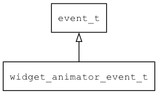

## widget\_animator\_event\_t
### 概述


控件动画事件。
----------------------------------
### 函数
<p id="widget_animator_event_t_methods">

| 函数名称 | 说明 | 
| -------- | ------------ | 
| <a href="#widget_animator_event_t_widget_animator_event_cast">widget\_animator\_event\_cast</a> | 把event对象转widget_animator_event_t对象。 |
| <a href="#widget_animator_event_t_widget_animator_event_init">widget\_animator\_event\_init</a> | 初始化事件。 |
### 属性
<p id="widget_animator_event_t_properties">

| 属性名称 | 类型 | 说明 | 
| -------- | ----- | ------------ | 
| <a href="#widget_animator_event_t_animator">animator</a> | void* | 控件动画句柄。 |
| <a href="#widget_animator_event_t_widget">widget</a> | widget\_t* | 控件对象。 |
#### widget\_animator\_event\_cast 函数
-----------------------

* 函数功能：

> <p id="widget_animator_event_t_widget_animator_event_cast">把event对象转widget_animator_event_t对象。

* 函数原型：

```
widget_animator_event_t* widget_animator_event_cast (event_t* event);
```

* 参数说明：

| 参数 | 类型 | 说明 |
| -------- | ----- | --------- |
| 返回值 | widget\_animator\_event\_t* | event对象。 |
| event | event\_t* | event对象。 |
#### widget\_animator\_event\_init 函数
-----------------------

* 函数功能：

> <p id="widget_animator_event_t_widget_animator_event_init">初始化事件。

* 函数原型：

```
event_t* widget_animator_event_init (widget_animator_event_t* event, uint32_t type, widget_t* widget, void* animator);
```

* 参数说明：

| 参数 | 类型 | 说明 |
| -------- | ----- | --------- |
| 返回值 | event\_t* | event对象。 |
| event | widget\_animator\_event\_t* | event对象。 |
| type | uint32\_t | 类型。 |
| widget | widget\_t* | 控件对象。 |
| animator | void* | 控件动画句柄。 |
#### animator 属性
-----------------------
> <p id="widget_animator_event_t_animator">控件动画句柄。

* 类型：void*

| 特性 | 是否支持 |
| -------- | ----- |
| 可直接读取 | 是 |
| 可直接修改 | 否 |
| 可脚本化   | 是 |
#### widget 属性
-----------------------
> <p id="widget_animator_event_t_widget">控件对象。

* 类型：widget\_t*

| 特性 | 是否支持 |
| -------- | ----- |
| 可直接读取 | 是 |
| 可直接修改 | 否 |
| 可脚本化   | 是 |
