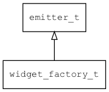

## widget\_factory\_t
### 概述


控件工厂对象。

提供通过类型创建控件的能力。
用户注册自定义控件，可以获得内置控件同等待遇。
----------------------------------
### 函数
<p id="widget_factory_t_methods">

| 函数名称 | 说明 | 
| -------- | ------------ | 
| <a href="#widget_factory_t_widget_factory">widget\_factory</a> | 获取缺省的控件工厂对象。 |
| <a href="#widget_factory_t_widget_factory_create">widget\_factory\_create</a> | 创建控件工厂对象。 |
| <a href="#widget_factory_t_widget_factory_create_widget">widget\_factory\_create\_widget</a> | 创建指定类型的控件。 |
| <a href="#widget_factory_t_widget_factory_destroy">widget\_factory\_destroy</a> | 析构并释放控件工厂对象。 |
| <a href="#widget_factory_t_widget_factory_register">widget\_factory\_register</a> | 注册控件创建函数。 |
| <a href="#widget_factory_t_widget_factory_set">widget\_factory\_set</a> | 设置缺省的控件工厂对象。 |
#### widget\_factory 函数
-----------------------

* 函数功能：

> <p id="widget_factory_t_widget_factory">获取缺省的控件工厂对象。

* 函数原型：

```
widget_factory_t* widget_factory ();
```

* 参数说明：

| 参数 | 类型 | 说明 |
| -------- | ----- | --------- |
| 返回值 | widget\_factory\_t* | 返回控件工厂对象。 |
#### widget\_factory\_create 函数
-----------------------

* 函数功能：

> <p id="widget_factory_t_widget_factory_create">创建控件工厂对象。

* 函数原型：

```
widget_factory_t* widget_factory_create ();
```

* 参数说明：

| 参数 | 类型 | 说明 |
| -------- | ----- | --------- |
| 返回值 | widget\_factory\_t* | 返回控件工厂对象。 |
#### widget\_factory\_create\_widget 函数
-----------------------

* 函数功能：

> <p id="widget_factory_t_widget_factory_create_widget">创建指定类型的控件。

* 函数原型：

```
widget_t* widget_factory_create_widget (widget_factory_t* factory, const char* type, xy_t x, xy_t y, xy_t w, xy_t h);
```

* 参数说明：

| 参数 | 类型 | 说明 |
| -------- | ----- | --------- |
| 返回值 | widget\_t* | 返回控件对象。 |
| factory | widget\_factory\_t* | 控件工厂对象。 |
| type | const char* | 控件类型。 |
| x | xy\_t | 初始X坐标。 |
| y | xy\_t | 初始Y坐标。 |
| w | xy\_t | 初始宽度。 |
| h | xy\_t | 初始高度。 |
#### widget\_factory\_destroy 函数
-----------------------

* 函数功能：

> <p id="widget_factory_t_widget_factory_destroy">析构并释放控件工厂对象。

* 函数原型：

```
ret_t widget_factory_destroy (widget_factory_t* factory);
```

* 参数说明：

| 参数 | 类型 | 说明 |
| -------- | ----- | --------- |
| 返回值 | ret\_t | 返回RET\_OK表示成功，否则表示失败。 |
| factory | widget\_factory\_t* | 控件工厂对象。 |
#### widget\_factory\_register 函数
-----------------------

* 函数功能：

> <p id="widget_factory_t_widget_factory_register">注册控件创建函数。

* 函数原型：

```
ret_t widget_factory_register (widget_factory_t* factory, const char* type, widget_create_t create);
```

* 参数说明：

| 参数 | 类型 | 说明 |
| -------- | ----- | --------- |
| 返回值 | ret\_t | 返回RET\_OK表示成功，否则表示失败。 |
| factory | widget\_factory\_t* | 控件工厂对象。 |
| type | const char* | 控件类型。 |
| create | widget\_create\_t | 创建函数。 |
#### widget\_factory\_set 函数
-----------------------

* 函数功能：

> <p id="widget_factory_t_widget_factory_set">设置缺省的控件工厂对象。

* 函数原型：

```
ret_t widget_factory_set (widget_factory_t* factory);
```

* 参数说明：

| 参数 | 类型 | 说明 |
| -------- | ----- | --------- |
| 返回值 | ret\_t | 返回RET\_OK表示成功，否则表示失败。 |
| factory | widget\_factory\_t* | 控件工厂对象。 |
