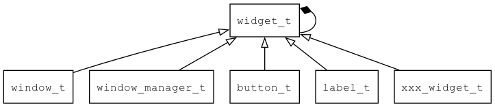
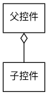
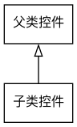

## widget\_t
### 概述
**widget_t** 是所有控件、窗口和窗口管理器的基类。
**widget_t**也是一个容器，可放其它**widget_t**到它的内部，形成一个树形结构。




通常**widget_t**通过一个矩形区域向用户呈现一些信息，接受用户的输入，并据此做出适当的反应。
它负责控件的生命周期、通用状态、事件分发和Style的管理。
本类提供的接口(函数和属性)除非特别说明，一般都适用于子类控件。

为了便于解释，这里特别说明一下几个术语：

* **父控件与子控件**：父控件与子控件指的两个控件的组合关系(这是在运行时决定的)。
比如：在窗口中放一个按钮，此时，我们称按钮是窗口的子控件，窗口是按钮的父控件。




* **子类控件与父类控件**：子类控件与父类控件指的两类控件的继承关系(这是在设计时决定的)。
比如：我们称**button_t**是**widget_t**的子类控件，**widget_t**是**button_t**的父类控件。




widget相关的函数都只能在GUI线程中执行，如果需在非GUI线程中想调用widget相关函数，
请用idle\_queue或timer\_queue进行串行化。
请参考[demo thread](https://github.com/zlgopen/awtk/blob/master/demos/demo_thread_app.c)

**widget\_t**是抽象类，不要直接创建**widget\_t**的实例。控件支持两种创建方式：

* 通过XML创建。如：

```xml
<button x="c" y="m" w="80" h="30" text="OK"/>
```

* 通过代码创建。如：

```c
widget_t* button = button_create(win, 10, 10, 128, 30);
widget_set_text(button, L"OK");
widget_on(button, EVT_CLICK, on_click, NULL);
```
----------------------------------
### 函数
<p id="widget_t_methods">

| 函数名称 | 说明 | 
| -------- | ------------ | 
| <a href="#widget_t_widget_add_child">widget\_add\_child</a> | 加入一个子控件。 |
| <a href="#widget_t_widget_add_idle">widget\_add\_idle</a> | 创建idle。 |
| <a href="#widget_t_widget_add_timer">widget\_add\_timer</a> | 创建定时器。 |
| <a href="#widget_t_widget_add_value">widget\_add\_value</a> | 增加控件的值。 |
| <a href="#widget_t_widget_animate_value_to">widget\_animate\_value\_to</a> | 设置控件的值(以动画形式变化到指定的值)。 |
| <a href="#widget_t_widget_begin_wait_pointer_cursor">widget\_begin\_wait\_pointer\_cursor</a> | 开始等待鼠标指针。 |
| <a href="#widget_t_widget_calc_icon_text_rect">widget\_calc\_icon\_text\_rect</a> | 计算icon text的位置。 |
| <a href="#widget_t_widget_cast">widget\_cast</a> | 转换为widget对象(供脚本语言使用)。 |
| <a href="#widget_t_widget_child">widget\_child</a> | 查找指定名称的子控件(同widget_lookup(widget, name, FALSE))。 |
| <a href="#widget_t_widget_child_on">widget\_child\_on</a> | 为指定名称的子控件注册指定事件的处理函数。 |
| <a href="#widget_t_widget_clone">widget\_clone</a> | clone。 |
| <a href="#widget_t_widget_close_window">widget\_close\_window</a> | 关闭控件所在的窗口。 |
| <a href="#widget_t_widget_count_children">widget\_count\_children</a> | 获取子控件的个数。 |
| <a href="#widget_t_widget_create">widget\_create</a> | 创建控件。仅在子类控件构造函数中使用。 |
| <a href="#widget_t_widget_create_animator">widget\_create\_animator</a> | 创建动画。 |
| <a href="#widget_t_widget_destroy">widget\_destroy</a> | 从父控件中移除控件，并调用unref函数销毁控件。 |
| <a href="#widget_t_widget_destroy_animator">widget\_destroy\_animator</a> | 销毁动画。 |
| <a href="#widget_t_widget_destroy_async">widget\_destroy\_async</a> | 从父控件中移除控件，并调用unref函数销毁控件。 |
| <a href="#widget_t_widget_destroy_children">widget\_destroy\_children</a> | 销毁全部子控件。 |
| <a href="#widget_t_widget_dispatch">widget\_dispatch</a> | 分发一个事件。 |
| <a href="#widget_t_widget_dispatch_event_to_target_recursive">widget\_dispatch\_event\_to\_target\_recursive</a> | 递归分发事件到targe控件。 |
| <a href="#widget_t_widget_dispatch_recursive">widget\_dispatch\_recursive</a> | 分发一个事件控件本身及所有子控件。 |
| <a href="#widget_t_widget_dispatch_simple_event">widget\_dispatch\_simple\_event</a> | 分发一个简单事件。 |
| <a href="#widget_t_widget_dispatch_to_key_target">widget\_dispatch\_to\_key\_target</a> | 递归的分发一个事件到所有key_target子控件。 |
| <a href="#widget_t_widget_dispatch_to_target">widget\_dispatch\_to\_target</a> | 递归的分发一个事件到所有target子控件。 |
| <a href="#widget_t_widget_draw_background">widget\_draw\_background</a> | 根据控件的style绘制背景矩形。 |
| <a href="#widget_t_widget_draw_text_in_rect">widget\_draw\_text\_in\_rect</a> | 在canvas绘制一行文本。 |
| <a href="#widget_t_widget_end_wait_pointer_cursor">widget\_end\_wait\_pointer\_cursor</a> | 结束等待鼠标指针。 |
| <a href="#widget_t_widget_ensure_visible_in_viewport">widget\_ensure\_visible\_in\_viewport</a> | 使控件滚动到可见区域。 |
| <a href="#widget_t_widget_equal">widget\_equal</a> | 判断两个widget是否相同。 |
| <a href="#widget_t_widget_fill_bg_rect">widget\_fill\_bg\_rect</a> | 根据控件的style绘制背景矩形。 |
| <a href="#widget_t_widget_fill_fg_rect">widget\_fill\_fg\_rect</a> | 根据控件的style绘制前景矩形。 |
| <a href="#widget_t_widget_find_animator">widget\_find\_animator</a> | 查找指定名称的动画。 |
| <a href="#widget_t_widget_find_target">widget\_find\_target</a> | 查找x/y坐标对应的子控件。 |
| <a href="#widget_t_widget_focus_first">widget\_focus\_first</a> | 置焦点于第一个控件。 |
| <a href="#widget_t_widget_focus_next">widget\_focus\_next</a> | 把焦点移动下一个控件。 |
| <a href="#widget_t_widget_focus_prev">widget\_focus\_prev</a> | 把焦点移动前一个控件。 |
| <a href="#widget_t_widget_foreach">widget\_foreach</a> | 遍历当前控件及子控件。 |
| <a href="#widget_t_widget_get_assets_manager">widget\_get\_assets\_manager</a> | 获取assets_manager对象。 |
| <a href="#widget_t_widget_get_canvas">widget\_get\_canvas</a> | 获取canvas对象。 |
| <a href="#widget_t_widget_get_child">widget\_get\_child</a> | 获取指定索引的子控件。 |
| <a href="#widget_t_widget_get_font_manager">widget\_get\_font\_manager</a> | 获取font_manager对象。 |
| <a href="#widget_t_widget_get_image_manager">widget\_get\_image\_manager</a> | 获取image_manager对象。 |
| <a href="#widget_t_widget_get_locale_info">widget\_get\_locale\_info</a> | 获取locale_info对象。 |
| <a href="#widget_t_widget_get_native_window">widget\_get\_native\_window</a> | 获取原生窗口对象。 |
| <a href="#widget_t_widget_get_prop">widget\_get\_prop</a> | 获取控件指定属性的值。 |
| <a href="#widget_t_widget_get_prop_bool">widget\_get\_prop\_bool</a> | 获取布尔格式的属性。 |
| <a href="#widget_t_widget_get_prop_default_value">widget\_get\_prop\_default\_value</a> | 获取控件指定属性的缺省值(在持久化控件时，无需保存缺省值)。 |
| <a href="#widget_t_widget_get_prop_int">widget\_get\_prop\_int</a> | 获取整数格式的属性。 |
| <a href="#widget_t_widget_get_prop_pointer">widget\_get\_prop\_pointer</a> | 获取指针格式的属性。 |
| <a href="#widget_t_widget_get_prop_str">widget\_get\_prop\_str</a> | 获取字符串格式的属性。 |
| <a href="#widget_t_widget_get_state_for_style">widget\_get\_state\_for\_style</a> | 把控件的状态转成获取style选要的状态，一般只在子类中使用。 |
| <a href="#widget_t_widget_get_text">widget\_get\_text</a> | 获取控件的文本。 |
| <a href="#widget_t_widget_get_type">widget\_get\_type</a> | 获取当前控件的类型名称。 |
| <a href="#widget_t_widget_get_value">widget\_get\_value</a> | 获取控件的值。只是对widget\_get\_prop的包装，值的意义由子类控件决定。 |
| <a href="#widget_t_widget_get_window">widget\_get\_window</a> | 获取当前控件所在的窗口。 |
| <a href="#widget_t_widget_get_window_manager">widget\_get\_window\_manager</a> | 获取当前的窗口管理器。 |
| <a href="#widget_t_widget_grab">widget\_grab</a> | 让指定子控件抓住事件。 |
| <a href="#widget_t_widget_index_of">widget\_index\_of</a> | 获取控件在父控件中的索引编号。 |
| <a href="#widget_t_widget_init">widget\_init</a> | 初始化控件。仅在子类控件构造函数中使用。 |
| <a href="#widget_t_widget_insert_child">widget\_insert\_child</a> | 插入子控件到指定的位置。 |
| <a href="#widget_t_widget_invalidate">widget\_invalidate</a> | 请求重绘指定的区域，如果widget->dirty已经为TRUE，直接返回。 |
| <a href="#widget_t_widget_invalidate_force">widget\_invalidate\_force</a> | 请求强制重绘控件。 |
| <a href="#widget_t_widget_is_designing_window">widget\_is\_designing\_window</a> | 判断当前控件是否是设计窗口。 |
| <a href="#widget_t_widget_is_dialog">widget\_is\_dialog</a> | 检查控件是否是对话框类型。 |
| <a href="#widget_t_widget_is_direct_parent_of">widget\_is\_direct\_parent\_of</a> | 判断当前控件是否是指定控件的直系父控件。 |
| <a href="#widget_t_widget_is_instance_of">widget\_is\_instance\_of</a> | 检查控件是否是指定的类型。 |
| <a href="#widget_t_widget_is_keyboard">widget\_is\_keyboard</a> | 判断当前控件是否是keyboard。 |
| <a href="#widget_t_widget_is_normal_window">widget\_is\_normal\_window</a> | 检查控件是否是普通窗口类型。 |
| <a href="#widget_t_widget_is_opened_popup">widget\_is\_opened\_popup</a> | 检查控件弹出窗口控件是否已经打开了（而非挂起状态）。 |
| <a href="#widget_t_widget_is_parent_of">widget\_is\_parent\_of</a> | 判断当前控件是否是指定控件的父控件(包括非直系)。 |
| <a href="#widget_t_widget_is_point_in">widget\_is\_point\_in</a> | 判断一个点是否在控件内。 |
| <a href="#widget_t_widget_is_popup">widget\_is\_popup</a> | 检查控件是否是弹出窗口类型。 |
| <a href="#widget_t_widget_is_system_bar">widget\_is\_system\_bar</a> | 检查控件是否是system bar类型。 |
| <a href="#widget_t_widget_is_window">widget\_is\_window</a> | 判断当前控件是否是窗口。 |
| <a href="#widget_t_widget_is_window_manager">widget\_is\_window\_manager</a> | 判断当前控件是否是窗口管理器。 |
| <a href="#widget_t_widget_is_window_opened">widget\_is\_window\_opened</a> | 判断当前控件所在的窗口是否已经打开。 |
| <a href="#widget_t_widget_layout">widget\_layout</a> | 布局当前控件及子控件。 |
| <a href="#widget_t_widget_layout_children">widget\_layout\_children</a> | layout子控件。 |
| <a href="#widget_t_widget_load_asset">widget\_load\_asset</a> | 加载资源。 |
| <a href="#widget_t_widget_load_image">widget\_load\_image</a> | 加载图片。 |
| <a href="#widget_t_widget_lookup">widget\_lookup</a> | 查找指定名称的子控件(返回第一个)。 |
| <a href="#widget_t_widget_lookup_by_type">widget\_lookup\_by\_type</a> | 查找指定类型的子控件(返回第一个)。 |
| <a href="#widget_t_widget_measure_text">widget\_measure\_text</a> | 计算文本的宽度。 |
| <a href="#widget_t_widget_move">widget\_move</a> | 移动控件。 |
| <a href="#widget_t_widget_move_resize">widget\_move\_resize</a> | 移动控件并调整控件的大小。 |
| <a href="#widget_t_widget_off">widget\_off</a> | 注销指定事件的处理函数。 |
| <a href="#widget_t_widget_off_by_ctx">widget\_off\_by\_ctx</a> | 注销指定ctx的事件处理函数。 |
| <a href="#widget_t_widget_off_by_func">widget\_off\_by\_func</a> | 注销指定函数的事件处理函数。 |
| <a href="#widget_t_widget_off_by_tag">widget\_off\_by\_tag</a> | 注销指定tag的事件处理函数。 |
| <a href="#widget_t_widget_on">widget\_on</a> | 注册指定事件的处理函数。 |
| <a href="#widget_t_widget_on_paint_background">widget\_on\_paint\_background</a> | 绘制背景。 |
| <a href="#widget_t_widget_on_paint_border">widget\_on\_paint\_border</a> | 绘制边框。 |
| <a href="#widget_t_widget_on_paint_children">widget\_on\_paint\_children</a> | 绘制子控件。 |
| <a href="#widget_t_widget_on_paint_self">widget\_on\_paint\_self</a> | 绘制自身。 |
| <a href="#widget_t_widget_on_with_tag">widget\_on\_with\_tag</a> | 注册指定tag的事件处理函数。 |
| <a href="#widget_t_widget_paint">widget\_paint</a> | 绘制控件到一个canvas上。 |
| <a href="#widget_t_widget_paint_helper">widget\_paint\_helper</a> | 帮助子控件实现自己的绘制函数。 |
| <a href="#widget_t_widget_pause_animator">widget\_pause\_animator</a> | 暂停动画。 |
| <a href="#widget_t_widget_prepare_text_style">widget\_prepare\_text\_style</a> | 从widget的style中取出字体名称、大小和颜色数据，设置到canvas中。 |
| <a href="#widget_t_widget_re_translate_text">widget\_re\_translate\_text</a> | 语言改变后，重新翻译控件上的文本(包括子控件)。 |
| <a href="#widget_t_widget_ref">widget\_ref</a> | 增加控件的引用计数。 |
| <a href="#widget_t_widget_remove_child">widget\_remove\_child</a> | 移出指定的子控件(并不销毁)。 |
| <a href="#widget_t_widget_remove_timer">widget\_remove\_timer</a> | 删除指定的timer。 |
| <a href="#widget_t_widget_reset_canvas">widget\_reset\_canvas</a> | 重置canvas对象。for designer only,调用者需要unload全部图片 |
| <a href="#widget_t_widget_resize">widget\_resize</a> | 调整控件的大小。 |
| <a href="#widget_t_widget_restack">widget\_restack</a> | 调整控件在父控件中的位置序数。 |
| <a href="#widget_t_widget_set_animation">widget\_set\_animation</a> | 设置控件的动画参数(仅用于在UI文件使用)。 |
| <a href="#widget_t_widget_set_animator_time_scale">widget\_set\_animator\_time\_scale</a> | 设置动画的时间倍率，<0: 时间倒退，<1: 时间变慢，>1 时间变快。 |
| <a href="#widget_t_widget_set_as_key_target">widget\_set\_as\_key\_target</a> | 递归的把父控件的key_target设置为自己。 |
| <a href="#widget_t_widget_set_child_text_utf8">widget\_set\_child\_text\_utf8</a> | 设置子控件的文本。 |
| <a href="#widget_t_widget_set_child_text_with_double">widget\_set\_child\_text\_with\_double</a> | 用一个浮点数去设置子控件的文本。 |
| <a href="#widget_t_widget_set_children_layout">widget\_set\_children\_layout</a> | 设置子控件的布局参数。 |
| <a href="#widget_t_widget_set_dirty_rect_tolerance">widget\_set\_dirty\_rect\_tolerance</a> | 设置控件脏矩形超出控件本身大小的最大范围(一般不用指定)。 |
| <a href="#widget_t_widget_set_enable">widget\_set\_enable</a> | 设置控件的可用性。 |
| <a href="#widget_t_widget_set_feedback">widget\_set\_feedback</a> | 设置控件是否启用反馈。 |
| <a href="#widget_t_widget_set_floating">widget\_set\_floating</a> | 设置控件的floating标志。 |
| <a href="#widget_t_widget_set_focusable">widget\_set\_focusable</a> | 设置控件是否可获得焦点。 |
| <a href="#widget_t_widget_set_focused">widget\_set\_focused</a> | 设置控件是否获得焦点。 |
| <a href="#widget_t_widget_set_name">widget\_set\_name</a> | 设置控件的名称。 |
| <a href="#widget_t_widget_set_need_relayout_children">widget\_set\_need\_relayout\_children</a> | 设置控件需要relayout标识。 |
| <a href="#widget_t_widget_set_opacity">widget\_set\_opacity</a> | 设置控件的不透明度。 |
| <a href="#widget_t_widget_set_pointer_cursor">widget\_set\_pointer\_cursor</a> | 设置鼠标指针的图片名。 |
| <a href="#widget_t_widget_set_prop">widget\_set\_prop</a> | 设置控件指定属性的值。 |
| <a href="#widget_t_widget_set_prop_bool">widget\_set\_prop\_bool</a> | 设置布尔格式的属性。 |
| <a href="#widget_t_widget_set_prop_int">widget\_set\_prop\_int</a> | 设置整数格式的属性。 |
| <a href="#widget_t_widget_set_prop_pointer">widget\_set\_prop\_pointer</a> | 设置指针格式的属性。 |
| <a href="#widget_t_widget_set_prop_str">widget\_set\_prop\_str</a> | 设置字符串格式的属性。 |
| <a href="#widget_t_widget_set_self_layout">widget\_set\_self\_layout</a> | 设置控件自己的布局参数。 |
| <a href="#widget_t_widget_set_self_layout_params">widget\_set\_self\_layout\_params</a> | 设置控件自己的布局(缺省布局器)参数(过时，请用widget\_set\_self\_layout)。 |
| <a href="#widget_t_widget_set_sensitive">widget\_set\_sensitive</a> | 设置控件是否接受用户事件。 |
| <a href="#widget_t_widget_set_state">widget\_set\_state</a> | 设置控件的状态。 |
| <a href="#widget_t_widget_set_style">widget\_set\_style</a> | 设置widget私有样式。 |
| <a href="#widget_t_widget_set_style_color">widget\_set\_style\_color</a> | 设置颜色类型的style。 |
| <a href="#widget_t_widget_set_style_int">widget\_set\_style\_int</a> | 设置整数类型的style。 |
| <a href="#widget_t_widget_set_style_str">widget\_set\_style\_str</a> | 设置字符串类型的style。 |
| <a href="#widget_t_widget_set_text">widget\_set\_text</a> | 设置控件的文本。 |
| <a href="#widget_t_widget_set_text_utf8">widget\_set\_text\_utf8</a> | 设置控件的文本。 |
| <a href="#widget_t_widget_set_theme">widget\_set\_theme</a> | 设置theme的名称，用于动态切换主题。名称与当前主题名称相同，则重新加载全部资源。 |
| <a href="#widget_t_widget_set_tr_text">widget\_set\_tr\_text</a> | 获取翻译之后的文本，然后调用widget_set_text。 |
| <a href="#widget_t_widget_set_value">widget\_set\_value</a> | 设置控件的值。 |
| <a href="#widget_t_widget_set_visible">widget\_set\_visible</a> | 设置控件的可见性。 |
| <a href="#widget_t_widget_set_visible_only">widget\_set\_visible\_only</a> | 设置控件的可见性(不触发repaint和relayout)。 |
| <a href="#widget_t_widget_start_animator">widget\_start\_animator</a> | 播放动画。 |
| <a href="#widget_t_widget_stop_animator">widget\_stop\_animator</a> | 停止动画(控件的相应属性回归原位)。 |
| <a href="#widget_t_widget_stroke_border_rect">widget\_stroke\_border\_rect</a> | 根据控件的style绘制边框矩形。 |
| <a href="#widget_t_widget_take_snapshot">widget\_take\_snapshot</a> | 创建一个bitmap对象，将控件绘制到bitmap上，并返回bitmap对象。 |
| <a href="#widget_t_widget_take_snapshot_rect">widget\_take\_snapshot\_rect</a> | 创建一个bitmap对象，将控件绘制到bitmap上并且可以设置该控件的截屏区域，返回bitmap对象。 |
| <a href="#widget_t_widget_to_global">widget\_to\_global</a> | 将控件内的本地坐标转换成全局坐标。 |
| <a href="#widget_t_widget_to_local">widget\_to\_local</a> | 将屏幕坐标转换成控件内的本地坐标，即相对于控件左上角的坐标。 |
| <a href="#widget_t_widget_to_screen">widget\_to\_screen</a> | 将控件内的本地坐标转换成屏幕上的坐标。 |
| <a href="#widget_t_widget_to_xml">widget\_to\_xml</a> | 将widget转换成xml。 |
| <a href="#widget_t_widget_ungrab">widget\_ungrab</a> | 让指定子控件放弃抓住事件。 |
| <a href="#widget_t_widget_unload_asset">widget\_unload\_asset</a> | 卸载资源。 |
| <a href="#widget_t_widget_unload_image">widget\_unload\_image</a> | 卸载图片。 |
| <a href="#widget_t_widget_unref">widget\_unref</a> | 减少控件的引用计数。引用计数为0时销毁控件。 |
| <a href="#widget_t_widget_update_pointer_cursor">widget\_update\_pointer\_cursor</a> | 更新鼠标指针。 |
| <a href="#widget_t_widget_update_style">widget\_update\_style</a> | 让控件根据自己当前状态更新style。 |
| <a href="#widget_t_widget_update_style_recursive">widget\_update\_style\_recursive</a> | 让控件及子控件根据自己当前状态更新style。 |
| <a href="#widget_t_widget_use_style">widget\_use\_style</a> | 启用指定的主题。 |
### 属性
<p id="widget_t_properties">

| 属性名称 | 类型 | 说明 | 
| -------- | ----- | ------------ | 
| <a href="#widget_t_animation">animation</a> | char* | 动画参数。请参考[控件动画](https://github.com/zlgopen/awtk/blob/master/docs/widget_animator.md) |
| <a href="#widget_t_astyle">astyle</a> | style\_t* | Style对象。 |
| <a href="#widget_t_auto_created">auto\_created</a> | bool\_t | 是否由父控件自动创建。 |
| <a href="#widget_t_children">children</a> | darray\_t* | 全部子控件。 |
| <a href="#widget_t_children_layout">children\_layout</a> | children\_layouter\_t* | 子控件布局器。请参考[控件布局参数](https://github.com/zlgopen/awtk/blob/master/docs/layout.md) |
| <a href="#widget_t_custom_props">custom\_props</a> | object\_t* | 自定义属性。 |
| <a href="#widget_t_destroying">destroying</a> | bool\_t | 标识控件正在被销毁。 |
| <a href="#widget_t_dirty">dirty</a> | bool\_t | 标识控件是否需要重绘。 |
| <a href="#widget_t_dirty_rect_tolerance">dirty\_rect\_tolerance</a> | uint16\_t | 脏矩形超出控件本身大小的最大范围(一般不用指定)。 |
| <a href="#widget_t_emitter">emitter</a> | emitter\_t* | 事件发射器。 |
| <a href="#widget_t_enable">enable</a> | bool\_t | 启用/禁用状态。 |
| <a href="#widget_t_feedback">feedback</a> | bool\_t | 是否启用按键音、触屏音和震动等反馈。 |
| <a href="#widget_t_floating">floating</a> | bool\_t | 标识控件是否启用浮动布局，不受父控件的children_layout的控制。 |
| <a href="#widget_t_focusable">focusable</a> | bool\_t | 是否支持焦点停留。 |
| <a href="#widget_t_focused">focused</a> | bool\_t | 是否得到焦点。 |
| <a href="#widget_t_h">h</a> | wh\_t | 高度。 |
| <a href="#widget_t_initializing">initializing</a> | bool\_t | 标识控件正在初始化。 |
| <a href="#widget_t_loading">loading</a> | bool\_t | 标识控件正在加载。 |
| <a href="#widget_t_name">name</a> | char* | 控件名字。 |
| <a href="#widget_t_need_relayout_children">need\_relayout\_children</a> | bool\_t | 标识控件是否需要重新layout子控件。 |
| <a href="#widget_t_need_update_style">need\_update\_style</a> | bool\_t | 标识控件是否需要update style。 |
| <a href="#widget_t_opacity">opacity</a> | uint8\_t | 不透明度(0-255)，0完全透明，255完全不透明。 |
| <a href="#widget_t_parent">parent</a> | widget\_t* | 父控件 |
| <a href="#widget_t_pointer_cursor">pointer\_cursor</a> | char* | 鼠标光标图片名称。 |
| <a href="#widget_t_ref_count">ref\_count</a> | int32\_t | 引用计数，计数为0时销毁。 |
| <a href="#widget_t_self_layout">self\_layout</a> | self\_layouter\_t* | 控件布局器。请参考[控件布局参数](https://github.com/zlgopen/awtk/blob/master/docs/layout.md) |
| <a href="#widget_t_sensitive">sensitive</a> | bool\_t | 是否接受用户事件。 |
| <a href="#widget_t_state">state</a> | uint8\_t | 控件的状态(取值参考widget_state_t)。 |
| <a href="#widget_t_style">style</a> | char* | style的名称。 |
| <a href="#widget_t_text">text</a> | wstr\_t | 文本。用途视具体情况而定。 |
| <a href="#widget_t_tr_text">tr\_text</a> | char* | 保存用于翻译的字符串。 |
| <a href="#widget_t_visible">visible</a> | bool\_t | 是否可见。 |
| <a href="#widget_t_vt">vt</a> | widget\_vtable\_t | 虚函数表。 |
| <a href="#widget_t_w">w</a> | wh\_t | 宽度。 |
| <a href="#widget_t_with_focus_state">with\_focus\_state</a> | bool\_t | 是否支持焦点状态。 |
| <a href="#widget_t_x">x</a> | xy\_t | x坐标(相对于父控件的x坐标)。 |
| <a href="#widget_t_y">y</a> | xy\_t | y坐标(相对于父控件的y坐标)。 |
### 事件
<p id="widget_t_events">

| 事件名称 | 类型  | 说明 | 
| -------- | ----- | ------- | 
| EVT\_WILL\_MOVE | event\_t | 控件移动前触发。 |
| EVT\_MOVE | event\_t | 控件移动后触发。 |
| EVT\_WILL\_RESIZE | event\_t | 控件调整大小前触发。 |
| EVT\_RESIZE | event\_t | 控件调整大小后触发。 |
| EVT\_WILL\_MOVE\_RESIZE | event\_t | 控件移动并调整大小前触发。 |
| EVT\_MOVE\_RESIZE | event\_t | 控件移动并调整大小后触发。 |
| EVT\_PROP\_WILL\_CHANGE | prop\_change\_event\_t | 控件属性改变前触发(通过set\_prop设置属性，才会触发)。 |
| EVT\_PROP\_CHANGED | prop\_change\_event\_t | 控件属性改变后触发(通过set\_prop设置属性，才会触发)。 |
| EVT\_BEFORE\_PAINT | paint\_event\_t | 控件绘制前触发。 |
| EVT\_AFTER\_PAINT | paint\_event\_t | 控件绘制完成时触发。 |
| EVT\_FOCUS | event\_t | 控件得到焦点时触发。 |
| EVT\_BLUR | event\_t | 控件失去焦点时触发。 |
| EVT\_WHEEL | wheel\_event\_t | 鼠标滚轮事件。 |
| EVT\_POINTER\_LEAVE | pointer\_event\_t | 鼠标指针离开控件时触发。 |
| EVT\_POINTER\_ENTER | pointer\_event\_t | 鼠标指针进入控件时触发。 |
| EVT\_KEY\_DOWN | pointer\_event\_t | 键按下事件。 |
| EVT\_KEY\_UP | pointer\_event\_t | 键释放事件。 |
| EVT\_POINTER\_DOWN | pointer\_event\_t | 指针设备按下事件。 |
| EVT\_POINTER\_DOWN\_ABORT | pointer\_event\_t | 取消指针设备按下事件。 |
| EVT\_POINTER\_MOVE | pointer\_event\_t | 指针设备移动事件。 |
| EVT\_POINTER\_UP | pointer\_event\_t | 指针设备释放事件。 |
| EVT\_DESTROY | event\_t | 控件销毁时触发。 |
#### widget\_add\_child 函数
-----------------------

* 函数功能：

> <p id="widget_t_widget_add_child">加入一个子控件。

* 函数原型：

```
ret_t widget_add_child (widget_t* widget, widget_t* child);
```

* 参数说明：

| 参数 | 类型 | 说明 |
| -------- | ----- | --------- |
| 返回值 | ret\_t | 返回RET\_OK表示成功，否则表示失败。 |
| widget | widget\_t* | 控件对象。 |
| child | widget\_t* | 子控件对象。 |
#### widget\_add\_idle 函数
-----------------------

* 函数功能：

> <p id="widget_t_widget_add_idle">创建idle。
该idle在控件销毁时自动销毁，**idle\_info\_t**的ctx为widget。
如果idle的生命周期与控件无关，请直接调用**idle_add**，以避免不必要的内存开销。

* 函数原型：

```
uint32_t widget_add_idle (widget_t* widget, idle_func_t on_idle);
```

* 参数说明：

| 参数 | 类型 | 说明 |
| -------- | ----- | --------- |
| 返回值 | uint32\_t | 返回idle的ID，TK\_INVALID\_ID表示失败。 |
| widget | widget\_t* | 控件对象。 |
| on\_idle | idle\_func\_t | idle回调函数。 |
#### widget\_add\_timer 函数
-----------------------

* 函数功能：

> <p id="widget_t_widget_add_timer">创建定时器。
该定时器在控件销毁时自动销毁，**timer\_info\_t**的ctx为widget。
如果定时器的生命周期与控件无关，请直接调用**timer_add**，以避免不必要的内存开销。

使用示例：

```c
static ret_t digit_clock_on_timer(const timer_info_t* info) {
widget_t* widget = WIDGET(info->ctx);

return RET_REPEAT;
}
...
widget_add_timer(widget, digit_clock_on_timer, 1000);

```

* 函数原型：

```
uint32_t widget_add_timer (widget_t* widget, timer_func_t on_timer, uint32_t duration_ms);
```

* 参数说明：

| 参数 | 类型 | 说明 |
| -------- | ----- | --------- |
| 返回值 | uint32\_t | 返回timer的ID，TK\_INVALID\_ID表示失败。 |
| widget | widget\_t* | 控件对象。 |
| on\_timer | timer\_func\_t | timer回调函数。 |
| duration\_ms | uint32\_t | 时间。 |
#### widget\_add\_value 函数
-----------------------

* 函数功能：

> <p id="widget_t_widget_add_value">增加控件的值。
只是对widget\_set\_prop的包装，值的意义由子类控件决定。

* 函数原型：

```
ret_t widget_add_value (widget_t* widget, int32_t delta);
```

* 参数说明：

| 参数 | 类型 | 说明 |
| -------- | ----- | --------- |
| 返回值 | ret\_t | 返回RET\_OK表示成功，否则表示失败。 |
| widget | widget\_t* | 控件对象。 |
| delta | int32\_t | 增量。 |
#### widget\_animate\_value\_to 函数
-----------------------

* 函数功能：

> <p id="widget_t_widget_animate_value_to">设置控件的值(以动画形式变化到指定的值)。
只是对widget\_set\_prop的包装，值的意义由子类控件决定。

* 函数原型：

```
ret_t widget_animate_value_to (widget_t* widget, int32_t value, uint32_t duration);
```

* 参数说明：

| 参数 | 类型 | 说明 |
| -------- | ----- | --------- |
| 返回值 | ret\_t | 返回RET\_OK表示成功，否则表示失败。 |
| widget | widget\_t* | 控件对象。 |
| value | int32\_t | 值。 |
| duration | uint32\_t | 动画持续时间(毫秒)。 |
#### widget\_begin\_wait\_pointer\_cursor 函数
-----------------------

* 函数功能：

> <p id="widget_t_widget_begin_wait_pointer_cursor">开始等待鼠标指针。

* 函数原型：

```
ret_t widget_begin_wait_pointer_cursor (widget_t* widget, bool_t ignore_user_input);
```

* 参数说明：

| 参数 | 类型 | 说明 |
| -------- | ----- | --------- |
| 返回值 | ret\_t | 返回RET\_OK表示成功，否则表示失败。。 |
| widget | widget\_t* | 控件对象。 |
| ignore\_user\_input | bool\_t | 是否忽略用户输入。 |
#### widget\_calc\_icon\_text\_rect 函数
-----------------------

* 函数功能：

> <p id="widget_t_widget_calc_icon_text_rect">计算icon text的位置。

* 函数原型：

```
ret_t widget_calc_icon_text_rect ();
```

* 参数说明：

| 参数 | 类型 | 说明 |
| -------- | ----- | --------- |
| 返回值 | ret\_t | 返回RET\_OK表示成功，否则表示失败。。 |
#### widget\_cast 函数
-----------------------

* 函数功能：

> <p id="widget_t_widget_cast">转换为widget对象(供脚本语言使用)。

* 函数原型：

```
widget_t* widget_cast (widget_t* widget);
```

* 参数说明：

| 参数 | 类型 | 说明 |
| -------- | ----- | --------- |
| 返回值 | widget\_t* | widget对象。 |
| widget | widget\_t* | widget对象。 |
#### widget\_child 函数
-----------------------

* 函数功能：

> <p id="widget_t_widget_child">查找指定名称的子控件(同widget_lookup(widget, name, FALSE))。

* 函数原型：

```
widget_t* widget_child (widget_t* widget, const char* name);
```

* 参数说明：

| 参数 | 类型 | 说明 |
| -------- | ----- | --------- |
| 返回值 | widget\_t* | 子控件或NULL。 |
| widget | widget\_t* | 控件对象。 |
| name | const char* | 子控件的名称。 |
#### widget\_child\_on 函数
-----------------------

* 函数功能：

> <p id="widget_t_widget_child_on">为指定名称的子控件注册指定事件的处理函数。
递归查找指定名称的子控件，然后为其注册指定事件的处理函数。

* 函数原型：

```
uint32_t widget_child_on (widget_t* widget, const char* name, event_type_t type, event_func_t on_event, void* ctx);
```

* 参数说明：

| 参数 | 类型 | 说明 |
| -------- | ----- | --------- |
| 返回值 | uint32\_t | 返回id，用于widget\_off。 |
| widget | widget\_t* | 控件对象。 |
| name | const char* | 子控件的名称。 |
| type | event\_type\_t | 事件类型。 |
| on\_event | event\_func\_t | 事件处理函数。 |
| ctx | void* | 事件处理函数上下文。 |
#### widget\_clone 函数
-----------------------

* 函数功能：

> <p id="widget_t_widget_clone">clone。

* 函数原型：

```
widget_t* widget_clone (widget_t* widget, widget_t* parent);
```

* 参数说明：

| 参数 | 类型 | 说明 |
| -------- | ----- | --------- |
| 返回值 | widget\_t* | 返回clone的对象。 |
| widget | widget\_t* | 控件对象。 |
| parent | widget\_t* | clone新控件的parent对象。 |
#### widget\_close\_window 函数
-----------------------

* 函数功能：

> <p id="widget_t_widget_close_window">关闭控件所在的窗口。

* 函数原型：

```
ret_t widget_close_window (widget_t* widget);
```

* 参数说明：

| 参数 | 类型 | 说明 |
| -------- | ----- | --------- |
| 返回值 | ret\_t | 返回RET\_OK表示成功，否则表示失败。 |
| widget | widget\_t* | widget对象。 |
#### widget\_count\_children 函数
-----------------------

* 函数功能：

> <p id="widget_t_widget_count_children">获取子控件的个数。

* 函数原型：

```
int32_t widget_count_children (widget_t* widget);
```

* 参数说明：

| 参数 | 类型 | 说明 |
| -------- | ----- | --------- |
| 返回值 | int32\_t | 子控件的个数。 |
| widget | widget\_t* | 控件对象。 |
#### widget\_create 函数
-----------------------

* 函数功能：

> <p id="widget_t_widget_create">创建控件。仅在子类控件构造函数中使用。

* 函数原型：

```
widget_t* widget_create (widget_t* parent, widget_vtable_t* vt, xy_t x, xy_t y, wh_t w, wh_t h);
```

* 参数说明：

| 参数 | 类型 | 说明 |
| -------- | ----- | --------- |
| 返回值 | widget\_t* | widget对象本身。 |
| parent | widget\_t* | widget的父控件。 |
| vt | widget\_vtable\_t* | 虚表。 |
| x | xy\_t | x坐标 |
| y | xy\_t | y坐标 |
| w | wh\_t | 宽度 |
| h | wh\_t | 高度 |
#### widget\_create\_animator 函数
-----------------------

* 函数功能：

> <p id="widget_t_widget_create_animator">创建动画。
请参考[控件动画](https://github.com/zlgopen/awtk/blob/master/docs/widget_animator.md)

* 除非指定auto_start=false，动画创建后自动启动。
* 除非指定auto_destroy=false，动画播放完成后自动销毁。

* 函数原型：

```
ret_t widget_create_animator (widget_t* widget, const char* animation);
```

* 参数说明：

| 参数 | 类型 | 说明 |
| -------- | ----- | --------- |
| 返回值 | ret\_t | 返回RET\_OK表示成功，否则表示失败。 |
| widget | widget\_t* | 控件对象。 |
| animation | const char* | 动画参数。 |
#### widget\_destroy 函数
-----------------------

* 函数功能：

> <p id="widget_t_widget_destroy">从父控件中移除控件，并调用unref函数销毁控件。

> 一般无需直接调用，关闭窗口时，自动销毁相关控件。

* 函数原型：

```
ret_t widget_destroy (widget_t* widget);
```

* 参数说明：

| 参数 | 类型 | 说明 |
| -------- | ----- | --------- |
| 返回值 | ret\_t | 返回RET\_OK表示成功，否则表示失败。 |
| widget | widget\_t* | 控件对象。 |
#### widget\_destroy\_animator 函数
-----------------------

* 函数功能：

> <p id="widget_t_widget_destroy_animator">销毁动画。
请参考[控件动画](https://github.com/zlgopen/awtk/blob/master/docs/widget_animator.md)

* 1.widget为NULL时，销毁所有名称为name的动画。
* 2.name为NULL时，销毁所有widget相关的动画。
* 3.widget和name均为NULL，销毁所有动画。

* 函数原型：

```
ret_t widget_destroy_animator (widget_t* widget, const char* name);
```

* 参数说明：

| 参数 | 类型 | 说明 |
| -------- | ----- | --------- |
| 返回值 | ret\_t | 返回RET\_OK表示成功，否则表示失败。 |
| widget | widget\_t* | 控件对象。 |
| name | const char* | 动画名称。 |
#### widget\_destroy\_async 函数
-----------------------

* 函数功能：

> <p id="widget_t_widget_destroy_async">从父控件中移除控件，并调用unref函数销毁控件。

> 一般无需直接调用，关闭窗口时，自动销毁相关控件。

* 函数原型：

```
ret_t widget_destroy_async (widget_t* widget);
```

* 参数说明：

| 参数 | 类型 | 说明 |
| -------- | ----- | --------- |
| 返回值 | ret\_t | 返回RET\_OK表示成功，否则表示失败。 |
| widget | widget\_t* | 控件对象。 |
#### widget\_destroy\_children 函数
-----------------------

* 函数功能：

> <p id="widget_t_widget_destroy_children">销毁全部子控件。

* 函数原型：

```
ret_t widget_destroy_children (widget_t* widget);
```

* 参数说明：

| 参数 | 类型 | 说明 |
| -------- | ----- | --------- |
| 返回值 | ret\_t | 返回RET\_OK表示成功，否则表示失败。 |
| widget | widget\_t* | 控件对象。 |
#### widget\_dispatch 函数
-----------------------

* 函数功能：

> <p id="widget_t_widget_dispatch">分发一个事件。

* 函数原型：

```
ret_t widget_dispatch (widget_t* widget, event_t* e);
```

* 参数说明：

| 参数 | 类型 | 说明 |
| -------- | ----- | --------- |
| 返回值 | ret\_t | 返回RET\_OK表示成功，否则表示失败。 |
| widget | widget\_t* | 控件对象。 |
| e | event\_t* | 事件。 |
#### widget\_dispatch\_event\_to\_target\_recursive 函数
-----------------------

* 函数功能：

> <p id="widget_t_widget_dispatch_event_to_target_recursive">递归分发事件到targe控件。

* 函数原型：

```
ret_t widget_dispatch_event_to_target_recursive (widget_t* widget, event_t* e);
```

* 参数说明：

| 参数 | 类型 | 说明 |
| -------- | ----- | --------- |
| 返回值 | ret\_t | 返回RET\_OK表示成功，否则表示失败。 |
| widget | widget\_t* | 控件对象。 |
| e | event\_t* | 事件对象。 |
#### widget\_dispatch\_recursive 函数
-----------------------

* 函数功能：

> <p id="widget_t_widget_dispatch_recursive">分发一个事件控件本身及所有子控件。

* 函数原型：

```
ret_t widget_dispatch_recursive (widget_t* widget, event_t* e);
```

* 参数说明：

| 参数 | 类型 | 说明 |
| -------- | ----- | --------- |
| 返回值 | ret\_t | 返回RET\_OK表示成功，否则表示失败。 |
| widget | widget\_t* | 控件对象。 |
| e | event\_t* | 事件。 |
#### widget\_dispatch\_simple\_event 函数
-----------------------

* 函数功能：

> <p id="widget_t_widget_dispatch_simple_event">分发一个简单事件。

* 函数原型：

```
ret_t widget_dispatch_simple_event (widget_t* widget, uint32_t type);
```

* 参数说明：

| 参数 | 类型 | 说明 |
| -------- | ----- | --------- |
| 返回值 | ret\_t | 返回RET\_OK表示成功，否则表示失败。 |
| widget | widget\_t* | 控件对象。 |
| type | uint32\_t | 事件类型。 |
#### widget\_dispatch\_to\_key\_target 函数
-----------------------

* 函数功能：

> <p id="widget_t_widget_dispatch_to_key_target">递归的分发一个事件到所有key_target子控件。

* 函数原型：

```
ret_t widget_dispatch_to_key_target (widget_t* widget, event_t* e);
```

* 参数说明：

| 参数 | 类型 | 说明 |
| -------- | ----- | --------- |
| 返回值 | ret\_t | 返回RET\_OK表示成功，否则表示失败。 |
| widget | widget\_t* | 控件对象。 |
| e | event\_t* | 事件。 |
#### widget\_dispatch\_to\_target 函数
-----------------------

* 函数功能：

> <p id="widget_t_widget_dispatch_to_target">递归的分发一个事件到所有target子控件。

* 函数原型：

```
ret_t widget_dispatch_to_target (widget_t* widget, event_t* e);
```

* 参数说明：

| 参数 | 类型 | 说明 |
| -------- | ----- | --------- |
| 返回值 | ret\_t | 返回RET\_OK表示成功，否则表示失败。 |
| widget | widget\_t* | 控件对象。 |
| e | event\_t* | 事件。 |
#### widget\_draw\_background 函数
-----------------------

* 函数功能：

> <p id="widget_t_widget_draw_background">根据控件的style绘制背景矩形。

* 函数原型：

```
ret_t widget_draw_background (widget_t* widget, canvas_t* c);
```

* 参数说明：

| 参数 | 类型 | 说明 |
| -------- | ----- | --------- |
| 返回值 | ret\_t | 返回RET\_OK表示成功，否则表示失败。 |
| widget | widget\_t* | 控件对象。 |
| c | canvas\_t* | 画布对象。 |
#### widget\_draw\_text\_in\_rect 函数
-----------------------

* 函数功能：

> <p id="widget_t_widget_draw_text_in_rect">在canvas绘制一行文本。

* 函数原型：

```
ret_t widget_draw_text_in_rect (widget_t* widget, canvas_t* c, const wchar_t* str, uint32_t size, rect_t* r, bool_t ellipses);
```

* 参数说明：

| 参数 | 类型 | 说明 |
| -------- | ----- | --------- |
| 返回值 | ret\_t | 返回RET\_OK表示成功，否则表示失败。 |
| widget | widget\_t* | 控件对象。 |
| c | canvas\_t* | 画布对象。 |
| str | const wchar\_t* | 文本。 |
| size | uint32\_t | 文本长度。 |
| r | rect\_t* | 矩形区域。 |
| ellipses | bool\_t | 宽度不够时是否显示省略号。 |
#### widget\_end\_wait\_pointer\_cursor 函数
-----------------------

* 函数功能：

> <p id="widget_t_widget_end_wait_pointer_cursor">结束等待鼠标指针。

* 函数原型：

```
ret_t widget_end_wait_pointer_cursor (widget_t* widget);
```

* 参数说明：

| 参数 | 类型 | 说明 |
| -------- | ----- | --------- |
| 返回值 | ret\_t | 返回RET\_OK表示成功，否则表示失败。。 |
| widget | widget\_t* | 控件对象。 |
#### widget\_ensure\_visible\_in\_viewport 函数
-----------------------

* 函数功能：

> <p id="widget_t_widget_ensure_visible_in_viewport">使控件滚动到可见区域。

* 函数原型：

```
ret_t widget_ensure_visible_in_viewport (widget_t* widget);
```

* 参数说明：

| 参数 | 类型 | 说明 |
| -------- | ----- | --------- |
| 返回值 | ret\_t | 返回。 |
| widget | widget\_t* | 控件对象。 |
#### widget\_equal 函数
-----------------------

* 函数功能：

> <p id="widget_t_widget_equal">判断两个widget是否相同。

* 函数原型：

```
bool_t widget_equal (widget_t* widget, widget_t* other);
```

* 参数说明：

| 参数 | 类型 | 说明 |
| -------- | ----- | --------- |
| 返回值 | bool\_t | 返回TRUE表示相同，否则表示不同。 |
| widget | widget\_t* | 控件对象。 |
| other | widget\_t* | 要比较的控件对象。 |
#### widget\_fill\_bg\_rect 函数
-----------------------

* 函数功能：

> <p id="widget_t_widget_fill_bg_rect">根据控件的style绘制背景矩形。

* 函数原型：

```
ret_t widget_fill_bg_rect (widget_t* widget, canvas_t* c, rect_t* r, image_draw_type_t draw_type);
```

* 参数说明：

| 参数 | 类型 | 说明 |
| -------- | ----- | --------- |
| 返回值 | ret\_t | 返回RET\_OK表示成功，否则表示失败。 |
| widget | widget\_t* | 控件对象。 |
| c | canvas\_t* | 画布对象。 |
| r | rect\_t* | 矩形区域。 |
| draw\_type | image\_draw\_type\_t | 图片缺省绘制方式。 |
#### widget\_fill\_fg\_rect 函数
-----------------------

* 函数功能：

> <p id="widget_t_widget_fill_fg_rect">根据控件的style绘制前景矩形。

* 函数原型：

```
ret_t widget_fill_fg_rect (widget_t* widget, canvas_t* c, rect_t* r, image_draw_type_t draw_type);
```

* 参数说明：

| 参数 | 类型 | 说明 |
| -------- | ----- | --------- |
| 返回值 | ret\_t | 返回RET\_OK表示成功，否则表示失败。 |
| widget | widget\_t* | 控件对象。 |
| c | canvas\_t* | 画布对象。 |
| r | rect\_t* | 矩形区域。 |
| draw\_type | image\_draw\_type\_t | 图片缺省绘制方式。 |
#### widget\_find\_animator 函数
-----------------------

* 函数功能：

> <p id="widget_t_widget_find_animator">查找指定名称的动画。

* 函数原型：

```
widget_animator_t* widget_find_animator (widget_t* widget, const char* name);
```

* 参数说明：

| 参数 | 类型 | 说明 |
| -------- | ----- | --------- |
| 返回值 | widget\_animator\_t* | 成功返回动画对象，失败返回NULL。 |
| widget | widget\_t* | 控件对象。 |
| name | const char* | 动画名称。 |
#### widget\_find\_target 函数
-----------------------

* 函数功能：

> <p id="widget_t_widget_find_target">查找x/y坐标对应的子控件。

* 函数原型：

```
widget* widget_find_target (widget_t* widget, xy_t x, xy_t y);
```

* 参数说明：

| 参数 | 类型 | 说明 |
| -------- | ----- | --------- |
| 返回值 | widget* | 子控件或NULL。 |
| widget | widget\_t* | 控件对象。 |
| x | xy\_t | x坐标。 |
| y | xy\_t | y坐标。 |
#### widget\_focus\_first 函数
-----------------------

* 函数功能：

> <p id="widget_t_widget_focus_first">置焦点于第一个控件。

* 函数原型：

```
ret_t widget_focus_first (widget_t* widget);
```

* 参数说明：

| 参数 | 类型 | 说明 |
| -------- | ----- | --------- |
| 返回值 | ret\_t | 返回RET\_OK表示成功，否则表示失败。 |
| widget | widget\_t* | 控件对象。 |
#### widget\_focus\_next 函数
-----------------------

* 函数功能：

> <p id="widget_t_widget_focus_next">把焦点移动下一个控件。

>widget必须是当前焦点控件。

* 函数原型：

```
ret_t widget_focus_next (widget_t* widget);
```

* 参数说明：

| 参数 | 类型 | 说明 |
| -------- | ----- | --------- |
| 返回值 | ret\_t | 返回RET\_OK表示成功，否则表示失败。 |
| widget | widget\_t* | widget对象。 |
#### widget\_focus\_prev 函数
-----------------------

* 函数功能：

> <p id="widget_t_widget_focus_prev">把焦点移动前一个控件。

>widget必须是当前焦点控件。

* 函数原型：

```
ret_t widget_focus_prev (widget_t* widget);
```

* 参数说明：

| 参数 | 类型 | 说明 |
| -------- | ----- | --------- |
| 返回值 | ret\_t | 返回RET\_OK表示成功，否则表示失败。 |
| widget | widget\_t* | widget对象。 |
#### widget\_foreach 函数
-----------------------

* 函数功能：

> <p id="widget_t_widget_foreach">遍历当前控件及子控件。

* 函数原型：

```
ret_t widget_foreach (widget_t* widget, tk_visit_t visit, void* ctx);
```

* 参数说明：

| 参数 | 类型 | 说明 |
| -------- | ----- | --------- |
| 返回值 | ret\_t | 返回RET\_OK表示成功，否则表示失败。 |
| widget | widget\_t* | 控件对象。 |
| visit | tk\_visit\_t | 遍历的回调函数。 |
| ctx | void* | 回调函数的上下文。 |
#### widget\_get\_assets\_manager 函数
-----------------------

* 函数功能：

> <p id="widget_t_widget_get_assets_manager">获取assets_manager对象。

* 函数原型：

```
assets_manager_t* widget_get_assets_manager (widget_t* widget);
```

* 参数说明：

| 参数 | 类型 | 说明 |
| -------- | ----- | --------- |
| 返回值 | assets\_manager\_t* | 返回assets\_manager对象。 |
| widget | widget\_t* | 控件对象。 |
#### widget\_get\_canvas 函数
-----------------------

* 函数功能：

> <p id="widget_t_widget_get_canvas">获取canvas对象。

* 函数原型：

```
canvas_t* widget_get_canvas ();
```

* 参数说明：

| 参数 | 类型 | 说明 |
| -------- | ----- | --------- |
| 返回值 | canvas\_t* | 返回canvas对象。 |
#### widget\_get\_child 函数
-----------------------

* 函数功能：

> <p id="widget_t_widget_get_child">获取指定索引的子控件。

* 函数原型：

```
widget_t* widget_get_child (widget_t* widget, int32_t index);
```

* 参数说明：

| 参数 | 类型 | 说明 |
| -------- | ----- | --------- |
| 返回值 | widget\_t* | 子控件。 |
| widget | widget\_t* | 控件对象。 |
| index | int32\_t | 索引。 |
#### widget\_get\_font\_manager 函数
-----------------------

* 函数功能：

> <p id="widget_t_widget_get_font_manager">获取font_manager对象。

* 函数原型：

```
font_manager_t* widget_get_font_manager (widget_t* widget);
```

* 参数说明：

| 参数 | 类型 | 说明 |
| -------- | ----- | --------- |
| 返回值 | font\_manager\_t* | 返回font\_manager对象。 |
| widget | widget\_t* | 控件对象。 |
#### widget\_get\_image\_manager 函数
-----------------------

* 函数功能：

> <p id="widget_t_widget_get_image_manager">获取image_manager对象。

* 函数原型：

```
image_manager_t* widget_get_image_manager (widget_t* widget);
```

* 参数说明：

| 参数 | 类型 | 说明 |
| -------- | ----- | --------- |
| 返回值 | image\_manager\_t* | 返回image\_manager对象。 |
| widget | widget\_t* | 控件对象。 |
#### widget\_get\_locale\_info 函数
-----------------------

* 函数功能：

> <p id="widget_t_widget_get_locale_info">获取locale_info对象。

* 函数原型：

```
locale_info_t* widget_get_locale_info (widget_t* widget);
```

* 参数说明：

| 参数 | 类型 | 说明 |
| -------- | ----- | --------- |
| 返回值 | locale\_info\_t* | 返回locale\_info对象。 |
| widget | widget\_t* | 控件对象。 |
#### widget\_get\_native\_window 函数
-----------------------

* 函数功能：

> <p id="widget_t_widget_get_native_window">获取原生窗口对象。

* 函数原型：

```
native_window_t* widget_get_native_window (widget_t* widget);
```

* 参数说明：

| 参数 | 类型 | 说明 |
| -------- | ----- | --------- |
| 返回值 | native\_window\_t* | 原生窗口对象。 |
| widget | widget\_t* | 控件对象。 |
#### widget\_get\_prop 函数
-----------------------

* 函数功能：

> <p id="widget_t_widget_get_prop">获取控件指定属性的值。

* 函数原型：

```
ret_t widget_get_prop (widget_t* widget, const char* name, value_t* v);
```

* 参数说明：

| 参数 | 类型 | 说明 |
| -------- | ----- | --------- |
| 返回值 | ret\_t | 返回RET\_OK表示成功，否则表示失败。 |
| widget | widget\_t* | 控件对象。 |
| name | const char* | 属性的名称。 |
| v | value\_t* | 返回属性的值。 |
#### widget\_get\_prop\_bool 函数
-----------------------

* 函数功能：

> <p id="widget_t_widget_get_prop_bool">获取布尔格式的属性。

* 函数原型：

```
bool_t widget_get_prop_bool (widget_t* widget, const char* name, bool_t defval);
```

* 参数说明：

| 参数 | 类型 | 说明 |
| -------- | ----- | --------- |
| 返回值 | bool\_t | 返回属性的值。 |
| widget | widget\_t* | 控件对象。 |
| name | const char* | 属性的名称。 |
| defval | bool\_t | 缺省值。 |
#### widget\_get\_prop\_default\_value 函数
-----------------------

* 函数功能：

> <p id="widget_t_widget_get_prop_default_value">获取控件指定属性的缺省值(在持久化控件时，无需保存缺省值)。

* 函数原型：

```
ret_t widget_get_prop_default_value (widget_t* widget, const char* name, value_t* v);
```

* 参数说明：

| 参数 | 类型 | 说明 |
| -------- | ----- | --------- |
| 返回值 | ret\_t | 返回RET\_OK表示成功，否则表示失败。 |
| widget | widget\_t* | 控件对象。 |
| name | const char* | 属性的名称。 |
| v | value\_t* | 返回属性的缺省值。 |
#### widget\_get\_prop\_int 函数
-----------------------

* 函数功能：

> <p id="widget_t_widget_get_prop_int">获取整数格式的属性。

* 函数原型：

```
int32_t widget_get_prop_int (widget_t* widget, const char* name, int32_t defval);
```

* 参数说明：

| 参数 | 类型 | 说明 |
| -------- | ----- | --------- |
| 返回值 | int32\_t | 返回属性的值。 |
| widget | widget\_t* | 控件对象。 |
| name | const char* | 属性的名称。 |
| defval | int32\_t | 缺省值。 |
#### widget\_get\_prop\_pointer 函数
-----------------------

* 函数功能：

> <p id="widget_t_widget_get_prop_pointer">获取指针格式的属性。

* 函数原型：

```
void* widget_get_prop_pointer (widget_t* widget, const char* name);
```

* 参数说明：

| 参数 | 类型 | 说明 |
| -------- | ----- | --------- |
| 返回值 | void* | 返回属性的值。 |
| widget | widget\_t* | 控件对象。 |
| name | const char* | 属性的名称。 |
#### widget\_get\_prop\_str 函数
-----------------------

* 函数功能：

> <p id="widget_t_widget_get_prop_str">获取字符串格式的属性。

* 函数原型：

```
const char* widget_get_prop_str (widget_t* widget, const char* name, const char* defval);
```

* 参数说明：

| 参数 | 类型 | 说明 |
| -------- | ----- | --------- |
| 返回值 | const char* | 返回属性的值。 |
| widget | widget\_t* | 控件对象。 |
| name | const char* | 属性的名称。 |
| defval | const char* | 缺省值。 |
#### widget\_get\_state\_for\_style 函数
-----------------------

* 函数功能：

> <p id="widget_t_widget_get_state_for_style">把控件的状态转成获取style选要的状态，一般只在子类中使用。

* 函数原型：

```
const char* widget_get_state_for_style (widget_t* widget, bool_t active, bool_t checked);
```

* 参数说明：

| 参数 | 类型 | 说明 |
| -------- | ----- | --------- |
| 返回值 | const char* | 返回状态值。 |
| widget | widget\_t* | widget对象。 |
| active | bool\_t | 控件是否为当前项。 |
| checked | bool\_t | 控件是否为选中项。 |
#### widget\_get\_text 函数
-----------------------

* 函数功能：

> <p id="widget_t_widget_get_text">获取控件的文本。
只是对widget\_get\_prop的包装，文本的意义由子类控件决定。

如果希望获取UTF8格式的文本，可以参考下面的代码：

```c
str_t str;
str_init(&str, 0);
str_from_wstr(&str, widget_get_text(target));
log_debug("%s: %s\n", target->name, str.str);
str_reset(&str);
```

* 函数原型：

```
const wchar_t* widget_get_text (widget_t* widget);
```

* 参数说明：

| 参数 | 类型 | 说明 |
| -------- | ----- | --------- |
| 返回值 | const wchar\_t* | 返回文本。 |
| widget | widget\_t* | 控件对象。 |
#### widget\_get\_type 函数
-----------------------

* 函数功能：

> <p id="widget_t_widget_get_type">获取当前控件的类型名称。

* 函数原型：

```
const char* widget_get_type (widget_t* widget);
```

* 参数说明：

| 参数 | 类型 | 说明 |
| -------- | ----- | --------- |
| 返回值 | const char* | 返回类型名。 |
| widget | widget\_t* | 控件对象。 |
#### widget\_get\_value 函数
-----------------------

* 函数功能：

> <p id="widget_t_widget_get_value">获取控件的值。只是对widget\_get\_prop的包装，值的意义由子类控件决定。

* 函数原型：

```
int32_t widget_get_value (widget_t* widget);
```

* 参数说明：

| 参数 | 类型 | 说明 |
| -------- | ----- | --------- |
| 返回值 | int32\_t | 返回值。 |
| widget | widget\_t* | 控件对象。 |
#### widget\_get\_window 函数
-----------------------

* 函数功能：

> <p id="widget_t_widget_get_window">获取当前控件所在的窗口。

* 函数原型：

```
widget_t* widget_get_window (widget_t* widget);
```

* 参数说明：

| 参数 | 类型 | 说明 |
| -------- | ----- | --------- |
| 返回值 | widget\_t* | 窗口对象。 |
| widget | widget\_t* | 控件对象。 |
#### widget\_get\_window\_manager 函数
-----------------------

* 函数功能：

> <p id="widget_t_widget_get_window_manager">获取当前的窗口管理器。

* 函数原型：

```
widget_t* widget_get_window_manager (widget_t* widget);
```

* 参数说明：

| 参数 | 类型 | 说明 |
| -------- | ----- | --------- |
| 返回值 | widget\_t* | 窗口管理器对象。 |
| widget | widget\_t* | 控件对象。 |
#### widget\_grab 函数
-----------------------

* 函数功能：

> <p id="widget_t_widget_grab">让指定子控件抓住事件。
控件抓住之后，事件直接分发给该控件。

* 函数原型：

```
ret_t widget_grab (widget_t* widget, widget_t* child);
```

* 参数说明：

| 参数 | 类型 | 说明 |
| -------- | ----- | --------- |
| 返回值 | ret\_t | 返回RET\_OK表示成功，否则表示失败。 |
| widget | widget\_t* | 控件对象。 |
| child | widget\_t* | 子控件对象。 |
#### widget\_index\_of 函数
-----------------------

* 函数功能：

> <p id="widget_t_widget_index_of">获取控件在父控件中的索引编号。

* 函数原型：

```
int32_t widget_index_of (widget_t* widget);
```

* 参数说明：

| 参数 | 类型 | 说明 |
| -------- | ----- | --------- |
| 返回值 | int32\_t | 在父控件中的索引编号。 |
| widget | widget\_t* | 控件对象。 |
#### widget\_init 函数
-----------------------

* 函数功能：

> <p id="widget_t_widget_init">初始化控件。仅在子类控件构造函数中使用。

> 请用widget\_create代替本函数。

@depreated

* 函数原型：

```
widget_t* widget_init (widget_t* widget, widget_t* parent, widget_vtable_t* vt, xy_t x, xy_t y, wh_t w, wh_t h);
```

* 参数说明：

| 参数 | 类型 | 说明 |
| -------- | ----- | --------- |
| 返回值 | widget\_t* | widget对象本身。 |
| widget | widget\_t* | widget对象。 |
| parent | widget\_t* | widget的父控件。 |
| vt | widget\_vtable\_t* | 虚表。 |
| x | xy\_t | x坐标 |
| y | xy\_t | y坐标 |
| w | wh\_t | 宽度 |
| h | wh\_t | 高度 |
#### widget\_insert\_child 函数
-----------------------

* 函数功能：

> <p id="widget_t_widget_insert_child">插入子控件到指定的位置。

* 函数原型：

```
ret_t widget_insert_child (widget_t* widget, uint32_t index, widget_t* child);
```

* 参数说明：

| 参数 | 类型 | 说明 |
| -------- | ----- | --------- |
| 返回值 | ret\_t | 返回RET\_OK表示成功，否则表示失败。 |
| widget | widget\_t* | 控件对象。 |
| index | uint32\_t | 位置序数(大于等于总个数，则放到最后)。 |
| child | widget\_t* | 子控件对象。 |
#### widget\_invalidate 函数
-----------------------

* 函数功能：

> <p id="widget_t_widget_invalidate">请求重绘指定的区域，如果widget->dirty已经为TRUE，直接返回。

* 函数原型：

```
ret_t widget_invalidate (widget_t* widget, rect_t* r);
```

* 参数说明：

| 参数 | 类型 | 说明 |
| -------- | ----- | --------- |
| 返回值 | ret\_t | 返回RET\_OK表示成功，否则表示失败。 |
| widget | widget\_t* | 控件对象。 |
| r | rect\_t* | 矩形对象(widget本地坐标)。 |
#### widget\_invalidate\_force 函数
-----------------------

* 函数功能：

> <p id="widget_t_widget_invalidate_force">请求强制重绘控件。

* 函数原型：

```
ret_t widget_invalidate_force (widget_t* widget, rect_t* r);
```

* 参数说明：

| 参数 | 类型 | 说明 |
| -------- | ----- | --------- |
| 返回值 | ret\_t | 返回RET\_OK表示成功，否则表示失败。 |
| widget | widget\_t* | 控件对象。 |
| r | rect\_t* | 矩形对象(widget本地坐标)。 |
#### widget\_is\_designing\_window 函数
-----------------------

* 函数功能：

> <p id="widget_t_widget_is_designing_window">判断当前控件是否是设计窗口。

* 函数原型：

```
bool_t widget_is_designing_window (widget_t* widget);
```

* 参数说明：

| 参数 | 类型 | 说明 |
| -------- | ----- | --------- |
| 返回值 | bool\_t | 返回当前控件是否是设计窗口。 |
| widget | widget\_t* | 控件对象。 |
#### widget\_is\_dialog 函数
-----------------------

* 函数功能：

> <p id="widget_t_widget_is_dialog">检查控件是否是对话框类型。

* 函数原型：

```
bool_t widget_is_dialog (widget_t* widget);
```

* 参数说明：

| 参数 | 类型 | 说明 |
| -------- | ----- | --------- |
| 返回值 | bool\_t | 返回FALSE表示不是，否则表示是。 |
| widget | widget\_t* | widget对象。 |
#### widget\_is\_direct\_parent\_of 函数
-----------------------

* 函数功能：

> <p id="widget_t_widget_is_direct_parent_of">判断当前控件是否是指定控件的直系父控件。

* 函数原型：

```
bool_t widget_is_direct_parent_of (widget_t* widget, widget_t* child);
```

* 参数说明：

| 参数 | 类型 | 说明 |
| -------- | ----- | --------- |
| 返回值 | bool\_t | 返回TRUE表示是，否则表示不是。 |
| widget | widget\_t* | 控件对象。 |
| child | widget\_t* | 控件对象。 |
#### widget\_is\_instance\_of 函数
-----------------------

* 函数功能：

> <p id="widget_t_widget_is_instance_of">检查控件是否是指定的类型。

* 函数原型：

```
bool_t widget_is_instance_of (widget_t* widget, widget_vtable_t* vt);
```

* 参数说明：

| 参数 | 类型 | 说明 |
| -------- | ----- | --------- |
| 返回值 | bool\_t | 返回TRUE表示是，FALSE表示否。 |
| widget | widget\_t* | 控件对象。 |
| vt | widget\_vtable\_t* | 虚表。 |
#### widget\_is\_keyboard 函数
-----------------------

* 函数功能：

> <p id="widget_t_widget_is_keyboard">判断当前控件是否是keyboard。

> keyboard收到pointer事件时，不会让当前控件失去焦点。

在自定义软键盘时，将所有按钮放到一个容器当中，并设置为is_keyboard。

```c
widget_set_prop_bool(group, WIDGET_PROP_IS_KEYBOARD, TRUE);
```

* 函数原型：

```
ret_t widget_is_keyboard (widget_t* widget);
```

* 参数说明：

| 参数 | 类型 | 说明 |
| -------- | ----- | --------- |
| 返回值 | ret\_t | 返回RET\_OK表示成功，否则表示失败。 |
| widget | widget\_t* | 控件对象。 |
#### widget\_is\_normal\_window 函数
-----------------------

* 函数功能：

> <p id="widget_t_widget_is_normal_window">检查控件是否是普通窗口类型。

* 函数原型：

```
bool_t widget_is_normal_window (widget_t* widget);
```

* 参数说明：

| 参数 | 类型 | 说明 |
| -------- | ----- | --------- |
| 返回值 | bool\_t | 返回FALSE表示不是，否则表示是。 |
| widget | widget\_t* | widget对象。 |
#### widget\_is\_opened\_popup 函数
-----------------------

* 函数功能：

> <p id="widget_t_widget_is_opened_popup">检查控件弹出窗口控件是否已经打开了（而非挂起状态）。

* 函数原型：

```
bool_t widget_is_opened_popup (widget_t* widget);
```

* 参数说明：

| 参数 | 类型 | 说明 |
| -------- | ----- | --------- |
| 返回值 | bool\_t | 返回FALSE表示不是，否则表示是。 |
| widget | widget\_t* | widget对象。 |
#### widget\_is\_parent\_of 函数
-----------------------

* 函数功能：

> <p id="widget_t_widget_is_parent_of">判断当前控件是否是指定控件的父控件(包括非直系)。

* 函数原型：

```
bool_t widget_is_parent_of (widget_t* widget, widget_t* child);
```

* 参数说明：

| 参数 | 类型 | 说明 |
| -------- | ----- | --------- |
| 返回值 | bool\_t | 返回TRUE表示是，否则表示不是。 |
| widget | widget\_t* | 控件对象。 |
| child | widget\_t* | 控件对象。 |
#### widget\_is\_point\_in 函数
-----------------------

* 函数功能：

> <p id="widget_t_widget_is_point_in">判断一个点是否在控件内。

* 函数原型：

```
bool_t widget_is_point_in (widget_t* widget, xy_t x, xy_t y, bool_t is_local);
```

* 参数说明：

| 参数 | 类型 | 说明 |
| -------- | ----- | --------- |
| 返回值 | bool\_t | 返回RET\_OK表示成功，否则表示失败。 |
| widget | widget\_t* | 控件对象。 |
| x | xy\_t | x坐标 |
| y | xy\_t | y坐标 |
| is\_local | bool\_t | TRUE表示是相对与控件左上角的坐标，否则表示全局坐标。 |
#### widget\_is\_popup 函数
-----------------------

* 函数功能：

> <p id="widget_t_widget_is_popup">检查控件是否是弹出窗口类型。

* 函数原型：

```
bool_t widget_is_popup (widget_t* widget);
```

* 参数说明：

| 参数 | 类型 | 说明 |
| -------- | ----- | --------- |
| 返回值 | bool\_t | 返回FALSE表示不是，否则表示是。 |
| widget | widget\_t* | widget对象。 |
#### widget\_is\_system\_bar 函数
-----------------------

* 函数功能：

> <p id="widget_t_widget_is_system_bar">检查控件是否是system bar类型。

* 函数原型：

```
bool_t widget_is_system_bar (widget_t* widget);
```

* 参数说明：

| 参数 | 类型 | 说明 |
| -------- | ----- | --------- |
| 返回值 | bool\_t | 返回FALSE表示不是，否则表示是。 |
| widget | widget\_t* | widget对象。 |
#### widget\_is\_window 函数
-----------------------

* 函数功能：

> <p id="widget_t_widget_is_window">判断当前控件是否是窗口。

* 函数原型：

```
bool_t widget_is_window (widget_t* widget);
```

* 参数说明：

| 参数 | 类型 | 说明 |
| -------- | ----- | --------- |
| 返回值 | bool\_t | 返回当前控件是否是窗口。 |
| widget | widget\_t* | 控件对象。 |
#### widget\_is\_window\_manager 函数
-----------------------

* 函数功能：

> <p id="widget_t_widget_is_window_manager">判断当前控件是否是窗口管理器。

* 函数原型：

```
bool_t widget_is_window_manager (widget_t* widget);
```

* 参数说明：

| 参数 | 类型 | 说明 |
| -------- | ----- | --------- |
| 返回值 | bool\_t | 返回当前控件是否是窗口管理器。 |
| widget | widget\_t* | 控件对象。 |
#### widget\_is\_window\_opened 函数
-----------------------

* 函数功能：

> <p id="widget_t_widget_is_window_opened">判断当前控件所在的窗口是否已经打开。

* 函数原型：

```
bool_t widget_is_window_opened (widget_t* widget);
```

* 参数说明：

| 参数 | 类型 | 说明 |
| -------- | ----- | --------- |
| 返回值 | bool\_t | 返回当前控件所在的窗口是否已经打开。 |
| widget | widget\_t* | 控件对象。 |
#### widget\_layout 函数
-----------------------

* 函数功能：

> <p id="widget_t_widget_layout">布局当前控件及子控件。

* 函数原型：

```
ret_t widget_layout (widget_t* widget);
```

* 参数说明：

| 参数 | 类型 | 说明 |
| -------- | ----- | --------- |
| 返回值 | ret\_t | 返回RET\_OK表示成功，否则表示失败。 |
| widget | widget\_t* | widget对象。 |
#### widget\_layout\_children 函数
-----------------------

* 函数功能：

> <p id="widget_t_widget_layout_children">layout子控件。

* 函数原型：

```
ret_t widget_layout_children (widget_t* widget);
```

* 参数说明：

| 参数 | 类型 | 说明 |
| -------- | ----- | --------- |
| 返回值 | ret\_t | 返回RET\_OK表示成功，否则表示失败。 |
| widget | widget\_t* | 控件对象。 |
#### widget\_load\_asset 函数
-----------------------

* 函数功能：

> <p id="widget_t_widget_load_asset">加载资源。

使用示例：

```c
const asset_info_t* asset = widget_load_asset(widget, ASSET_TYPE_IMAGE, "mysvg");
...
widget_unload_asset(widget, asset);
```

* 函数原型：

```
const asset_info_t* widget_load_asset (widget_t* widget, asset_type_t type, const char* name);
```

* 参数说明：

| 参数 | 类型 | 说明 |
| -------- | ----- | --------- |
| 返回值 | const asset\_info\_t* | 返回资源句柄。 |
| widget | widget\_t* | 控件对象。 |
| type | asset\_type\_t | 资源类型。 |
| name | const char* | 资源名。 |
#### widget\_load\_image 函数
-----------------------

* 函数功能：

> <p id="widget_t_widget_load_image">加载图片。
返回的bitmap对象只在当前调用有效，请不保存对bitmap对象的引用。


使用示例：

```c
bitmap_t bitmap;
widget_load_image(widget, "myimage", &bitmap);

```

* 函数原型：

```
ret_t widget_load_image (widget_t* widget, const char* name, bitmap_t* bitmap);
```

* 参数说明：

| 参数 | 类型 | 说明 |
| -------- | ----- | --------- |
| 返回值 | ret\_t | 返回RET\_OK表示成功，否则表示失败。 |
| widget | widget\_t* | 控件对象。 |
| name | const char* | 图片名(不带扩展名)。 |
| bitmap | bitmap\_t* | 返回图片对象。 |
#### widget\_lookup 函数
-----------------------

* 函数功能：

> <p id="widget_t_widget_lookup">查找指定名称的子控件(返回第一个)。

* 函数原型：

```
widget_t* widget_lookup (widget_t* widget, const char* name, bool_t recursive);
```

* 参数说明：

| 参数 | 类型 | 说明 |
| -------- | ----- | --------- |
| 返回值 | widget\_t* | 子控件或NULL。 |
| widget | widget\_t* | 控件对象。 |
| name | const char* | 子控件的名称。 |
| recursive | bool\_t | 是否递归查找全部子控件。 |
#### widget\_lookup\_by\_type 函数
-----------------------

* 函数功能：

> <p id="widget_t_widget_lookup_by_type">查找指定类型的子控件(返回第一个)。

* 函数原型：

```
widget_t* widget_lookup_by_type (widget_t* widget, const char* type, bool_t recursive);
```

* 参数说明：

| 参数 | 类型 | 说明 |
| -------- | ----- | --------- |
| 返回值 | widget\_t* | 子控件或NULL。 |
| widget | widget\_t* | 控件对象。 |
| type | const char* | 子控件的名称。 |
| recursive | bool\_t | 是否递归查找全部子控件。 |
#### widget\_measure\_text 函数
-----------------------

* 函数功能：

> <p id="widget_t_widget_measure_text">计算文本的宽度。
字体由控件当前的状态和style决定。

* 函数原型：

```
float_t widget_measure_text (widget_t* widget, wchar_t* text);
```

* 参数说明：

| 参数 | 类型 | 说明 |
| -------- | ----- | --------- |
| 返回值 | float\_t | 返回文本的宽度。 |
| widget | widget\_t* | 控件对象。 |
| text | wchar\_t* | 文本。 |
#### widget\_move 函数
-----------------------

* 函数功能：

> <p id="widget_t_widget_move">移动控件。

* 函数原型：

```
ret_t widget_move (widget_t* widget, xy_t x, xy_t y);
```

* 参数说明：

| 参数 | 类型 | 说明 |
| -------- | ----- | --------- |
| 返回值 | ret\_t | 返回RET\_OK表示成功，否则表示失败。 |
| widget | widget\_t* | 控件对象。 |
| x | xy\_t | x坐标 |
| y | xy\_t | y坐标 |
#### widget\_move\_resize 函数
-----------------------

* 函数功能：

> <p id="widget_t_widget_move_resize">移动控件并调整控件的大小。

* 函数原型：

```
ret_t widget_move_resize (widget_t* widget, xy_t x, xy_t y, wh_t w, wh_t h);
```

* 参数说明：

| 参数 | 类型 | 说明 |
| -------- | ----- | --------- |
| 返回值 | ret\_t | 返回RET\_OK表示成功，否则表示失败。 |
| widget | widget\_t* | 控件对象。 |
| x | xy\_t | x坐标 |
| y | xy\_t | y坐标 |
| w | wh\_t | 宽度 |
| h | wh\_t | 高度 |
#### widget\_off 函数
-----------------------

* 函数功能：

> <p id="widget_t_widget_off">注销指定事件的处理函数。

* 函数原型：

```
ret_t widget_off (widget_t* widget, uint32_t id);
```

* 参数说明：

| 参数 | 类型 | 说明 |
| -------- | ----- | --------- |
| 返回值 | ret\_t | 返回RET\_OK表示成功，否则表示失败。 |
| widget | widget\_t* | 控件对象。 |
| id | uint32\_t | widget\_on返回的ID。 |
#### widget\_off\_by\_ctx 函数
-----------------------

* 函数功能：

> <p id="widget_t_widget_off_by_ctx">注销指定ctx的事件处理函数。

* 函数原型：

```
ret_t widget_off_by_ctx (widget_t* widget, void* ctx);
```

* 参数说明：

| 参数 | 类型 | 说明 |
| -------- | ----- | --------- |
| 返回值 | ret\_t | 返回RET\_OK表示成功，否则表示失败。 |
| widget | widget\_t* | 控件对象。 |
| ctx | void* | 事件处理函数上下文。 |
#### widget\_off\_by\_func 函数
-----------------------

* 函数功能：

> <p id="widget_t_widget_off_by_func">注销指定函数的事件处理函数。

* 函数原型：

```
ret_t widget_off_by_func (widget_t* widget, event_type_t type, event_func_t on_event, void* ctx);
```

* 参数说明：

| 参数 | 类型 | 说明 |
| -------- | ----- | --------- |
| 返回值 | ret\_t | 返回RET\_OK表示成功，否则表示失败。 |
| widget | widget\_t* | 控件对象。 |
| type | event\_type\_t | 事件类型。 |
| on\_event | event\_func\_t | 事件处理函数。 |
| ctx | void* | 事件处理函数上下文。 |
#### widget\_off\_by\_tag 函数
-----------------------

* 函数功能：

> <p id="widget_t_widget_off_by_tag">注销指定tag的事件处理函数。

* 函数原型：

```
ret_t widget_off_by_tag (widget_t* widget, uint32_t tag);
```

* 参数说明：

| 参数 | 类型 | 说明 |
| -------- | ----- | --------- |
| 返回值 | ret\_t | 返回RET\_OK表示成功，否则表示失败。 |
| widget | widget\_t* | 控件对象。 |
| tag | uint32\_t | tag。 |
#### widget\_on 函数
-----------------------

* 函数功能：

> <p id="widget_t_widget_on">注册指定事件的处理函数。
使用示例：

```c
widget_t* ok = button_create(win, 10, 10, 80, 30);
widget_on(ok, EVT_CLICK, on_click, NULL);

```

* 函数原型：

```
uint32_t widget_on (widget_t* widget, event_type_t type, event_func_t on_event, void* ctx);
```

* 参数说明：

| 参数 | 类型 | 说明 |
| -------- | ----- | --------- |
| 返回值 | uint32\_t | 返回id，用于widget\_off。 |
| widget | widget\_t* | 控件对象。 |
| type | event\_type\_t | 事件类型。 |
| on\_event | event\_func\_t | 事件处理函数。 |
| ctx | void* | 事件处理函数上下文。 |
#### widget\_on\_paint\_background 函数
-----------------------

* 函数功能：

> <p id="widget_t_widget_on_paint_background">绘制背景。

* 函数原型：

```
ret_t widget_on_paint_background (widget_t* widget, canvas_t* c);
```

* 参数说明：

| 参数 | 类型 | 说明 |
| -------- | ----- | --------- |
| 返回值 | ret\_t | 返回。 |
| widget | widget\_t* | 控件对象。 |
| c | canvas\_t* | canvas对象。 |
#### widget\_on\_paint\_border 函数
-----------------------

* 函数功能：

> <p id="widget_t_widget_on_paint_border">绘制边框。

* 函数原型：

```
ret_t widget_on_paint_border (widget_t* widget, canvas_t* c);
```

* 参数说明：

| 参数 | 类型 | 说明 |
| -------- | ----- | --------- |
| 返回值 | ret\_t | 返回。 |
| widget | widget\_t* | 控件对象。 |
| c | canvas\_t* | canvas对象。 |
#### widget\_on\_paint\_children 函数
-----------------------

* 函数功能：

> <p id="widget_t_widget_on_paint_children">绘制子控件。

* 函数原型：

```
ret_t widget_on_paint_children (widget_t* widget, canvas_t* c);
```

* 参数说明：

| 参数 | 类型 | 说明 |
| -------- | ----- | --------- |
| 返回值 | ret\_t | 返回。 |
| widget | widget\_t* | 控件对象。 |
| c | canvas\_t* | canvas对象。 |
#### widget\_on\_paint\_self 函数
-----------------------

* 函数功能：

> <p id="widget_t_widget_on_paint_self">绘制自身。

* 函数原型：

```
ret_t widget_on_paint_self (widget_t* widget, canvas_t* c);
```

* 参数说明：

| 参数 | 类型 | 说明 |
| -------- | ----- | --------- |
| 返回值 | ret\_t | 返回。 |
| widget | widget\_t* | 控件对象。 |
| c | canvas\_t* | canvas对象。 |
#### widget\_on\_with\_tag 函数
-----------------------

* 函数功能：

> <p id="widget_t_widget_on_with_tag">注册指定tag的事件处理函数。

> 注册时指定一个tag，可用widget\_off\_by\_tag注销相同tag的事件处理函数。

* 函数原型：

```
uint32_t widget_on_with_tag (widget_t* widget, event_type_t type, event_func_t on_event, void* ctx, uint32_t tag);
```

* 参数说明：

| 参数 | 类型 | 说明 |
| -------- | ----- | --------- |
| 返回值 | uint32\_t | 返回id，用于widget\_off。 |
| widget | widget\_t* | 控件对象。 |
| type | event\_type\_t | 事件类型。 |
| on\_event | event\_func\_t | 事件处理函数。 |
| ctx | void* | 事件处理函数上下文。 |
| tag | uint32\_t | tag。 |
#### widget\_paint 函数
-----------------------

* 函数功能：

> <p id="widget_t_widget_paint">绘制控件到一个canvas上。

* 函数原型：

```
ret_t widget_paint (widget_t* widget, canvas_t* c);
```

* 参数说明：

| 参数 | 类型 | 说明 |
| -------- | ----- | --------- |
| 返回值 | ret\_t | 返回RET\_OK表示成功，否则表示失败。 |
| widget | widget\_t* | 控件对象。 |
| c | canvas\_t* | 画布对象。 |
#### widget\_paint\_helper 函数
-----------------------

* 函数功能：

> <p id="widget_t_widget_paint_helper">帮助子控件实现自己的绘制函数。

* 函数原型：

```
ret_t widget_paint_helper (widget_t* widget, canvas_t* c, const char* icon, wstr_t* text);
```

* 参数说明：

| 参数 | 类型 | 说明 |
| -------- | ----- | --------- |
| 返回值 | ret\_t | 返回RET\_OK表示成功，否则表示失败。 |
| widget | widget\_t* | 控件对象。 |
| c | canvas\_t* | 画布对象。 |
| icon | const char* | 图标的名称。 |
| text | wstr\_t* | 文字。 |
#### widget\_pause\_animator 函数
-----------------------

* 函数功能：

> <p id="widget_t_widget_pause_animator">暂停动画。
请参考[控件动画](https://github.com/zlgopen/awtk/blob/master/docs/widget_animator.md)

* 1.widget为NULL时，暂停所有名称为name的动画。
* 2.name为NULL时，暂停所有widget相关的动画。
* 3.widget和name均为NULL，暂停所有动画。

* 函数原型：

```
ret_t widget_pause_animator (widget_t* widget, const char* name);
```

* 参数说明：

| 参数 | 类型 | 说明 |
| -------- | ----- | --------- |
| 返回值 | ret\_t | 返回RET\_OK表示成功，否则表示失败。 |
| widget | widget\_t* | 控件对象。 |
| name | const char* | 动画名称。 |
#### widget\_prepare\_text\_style 函数
-----------------------

* 函数功能：

> <p id="widget_t_widget_prepare_text_style">从widget的style中取出字体名称、大小和颜色数据，设置到canvas中。

* 函数原型：

```
ret_t widget_prepare_text_style (widget_t* widget, canvas_t* c);
```

* 参数说明：

| 参数 | 类型 | 说明 |
| -------- | ----- | --------- |
| 返回值 | ret\_t | 返回RET\_OK表示成功，否则表示失败。 |
| widget | widget\_t* | 控件对象。 |
| c | canvas\_t* | 画布对象。 |
#### widget\_re\_translate\_text 函数
-----------------------

* 函数功能：

> <p id="widget_t_widget_re_translate_text">语言改变后，重新翻译控件上的文本(包括子控件)。

* 函数原型：

```
ret_t widget_re_translate_text (widget_t* widget);
```

* 参数说明：

| 参数 | 类型 | 说明 |
| -------- | ----- | --------- |
| 返回值 | ret\_t | 返回RET\_OK表示成功，否则表示失败。 |
| widget | widget\_t* | 控件对象。 |
#### widget\_ref 函数
-----------------------

* 函数功能：

> <p id="widget_t_widget_ref">增加控件的引用计数。

* 函数原型：

```
widget_t* widget_ref (widget_t* widget);
```

* 参数说明：

| 参数 | 类型 | 说明 |
| -------- | ----- | --------- |
| 返回值 | widget\_t* | 返回控件对象。 |
| widget | widget\_t* | 控件对象。 |
#### widget\_remove\_child 函数
-----------------------

* 函数功能：

> <p id="widget_t_widget_remove_child">移出指定的子控件(并不销毁)。

* 函数原型：

```
ret_t widget_remove_child (widget_t* widget, widget_t* child);
```

* 参数说明：

| 参数 | 类型 | 说明 |
| -------- | ----- | --------- |
| 返回值 | ret\_t | 返回RET\_OK表示成功，否则表示失败。 |
| widget | widget\_t* | 控件对象。 |
| child | widget\_t* | 子控件对象。 |
#### widget\_remove\_timer 函数
-----------------------

* 函数功能：

> <p id="widget_t_widget_remove_timer">删除指定的timer。

* 函数原型：

```
ret_t widget_remove_timer (widget_t* widget, uint32_t timer_id);
```

* 参数说明：

| 参数 | 类型 | 说明 |
| -------- | ----- | --------- |
| 返回值 | ret\_t | 返回RET\_OK表示成功，否则表示失败。 |
| widget | widget\_t* | 控件对象。 |
| timer\_id | uint32\_t | timerID。 |
#### widget\_reset\_canvas 函数
-----------------------

* 函数功能：

> <p id="widget_t_widget_reset_canvas">重置canvas对象。for designer only,调用者需要unload全部图片

* 函数原型：

```
ret_t widget_reset_canvas (widget_t* widget);
```

* 参数说明：

| 参数 | 类型 | 说明 |
| -------- | ----- | --------- |
| 返回值 | ret\_t | 返回RET\_OK表示成功，否则表示失败。 |
| widget | widget\_t* | 控件对象。 |
#### widget\_resize 函数
-----------------------

* 函数功能：

> <p id="widget_t_widget_resize">调整控件的大小。

* 函数原型：

```
ret_t widget_resize (widget_t* widget, wh_t w, wh_t h);
```

* 参数说明：

| 参数 | 类型 | 说明 |
| -------- | ----- | --------- |
| 返回值 | ret\_t | 返回RET\_OK表示成功，否则表示失败。 |
| widget | widget\_t* | 控件对象。 |
| w | wh\_t | 宽度 |
| h | wh\_t | 高度 |
#### widget\_restack 函数
-----------------------

* 函数功能：

> <p id="widget_t_widget_restack">调整控件在父控件中的位置序数。

* 函数原型：

```
ret_t widget_restack (widget_t* widget, uint32_t index);
```

* 参数说明：

| 参数 | 类型 | 说明 |
| -------- | ----- | --------- |
| 返回值 | ret\_t | 返回RET\_OK表示成功，否则表示失败。 |
| widget | widget\_t* | 控件对象。 |
| index | uint32\_t | 位置序数(大于等于总个数，则放到最后)。 |
#### widget\_set\_animation 函数
-----------------------

* 函数功能：

> <p id="widget_t_widget_set_animation">设置控件的动画参数(仅用于在UI文件使用)。
请参考[控件动画](https://github.com/zlgopen/awtk/blob/master/docs/widget_animator.md)

* 函数原型：

```
ret_t widget_set_animation (widget_t* widget, const char* animation);
```

* 参数说明：

| 参数 | 类型 | 说明 |
| -------- | ----- | --------- |
| 返回值 | ret\_t | 返回RET\_OK表示成功，否则表示失败。 |
| widget | widget\_t* | 控件对象。 |
| animation | const char* | 动画参数。 |
#### widget\_set\_animator\_time\_scale 函数
-----------------------

* 函数功能：

> <p id="widget_t_widget_set_animator_time_scale">设置动画的时间倍率，<0: 时间倒退，<1: 时间变慢，>1 时间变快。
请参考[控件动画](https://github.com/zlgopen/awtk/blob/master/docs/widget_animator.md)

* 1.widget为NULL时，设置所有名称为name的动画的时间倍率。
* 2.name为NULL时，设置所有widget相关的动画的时间倍率。
* 3.widget和name均为NULL，设置所有动画的时间倍率。

* 函数原型：

```
ret_t widget_set_animator_time_scale (widget_t* widget, const char* name, float_t time_scale);
```

* 参数说明：

| 参数 | 类型 | 说明 |
| -------- | ----- | --------- |
| 返回值 | ret\_t | 返回RET\_OK表示成功，否则表示失败。 |
| widget | widget\_t* | 控件对象。 |
| name | const char* | 动画名称。 |
| time\_scale | float\_t | 时间倍率。 |
#### widget\_set\_as\_key\_target 函数
-----------------------

* 函数功能：

> <p id="widget_t_widget_set_as_key_target">递归的把父控件的key_target设置为自己。

* 函数原型：

```
ret_t widget_set_as_key_target (widget_t* widget);
```

* 参数说明：

| 参数 | 类型 | 说明 |
| -------- | ----- | --------- |
| 返回值 | ret\_t | 返回RET\_OK表示成功，否则表示失败。 |
| widget | widget\_t* | widget对象。 |
#### widget\_set\_child\_text\_utf8 函数
-----------------------

* 函数功能：

> <p id="widget_t_widget_set_child_text_utf8">设置子控件的文本。
只是对widget\_set\_prop的包装，文本的意义由子类控件决定。

* 函数原型：

```
ret_t widget_set_child_text_utf8 (widget_t* widget, const char* name, const char* text);
```

* 参数说明：

| 参数 | 类型 | 说明 |
| -------- | ----- | --------- |
| 返回值 | ret\_t | 返回RET\_OK表示成功，否则表示失败。 |
| widget | widget\_t* | 控件对象。 |
| name | const char* | 子控件的名称。 |
| text | const char* | 文本。 |
#### widget\_set\_child\_text\_with\_double 函数
-----------------------

* 函数功能：

> <p id="widget_t_widget_set_child_text_with_double">用一个浮点数去设置子控件的文本。
只是对widget\_set\_prop的包装，文本的意义由子类控件决定。

* 函数原型：

```
ret_t widget_set_child_text_with_double (widget_t* widget, const char* name, const char* format, double value);
```

* 参数说明：

| 参数 | 类型 | 说明 |
| -------- | ----- | --------- |
| 返回值 | ret\_t | 返回RET\_OK表示成功，否则表示失败。 |
| widget | widget\_t* | 控件对象。 |
| name | const char* | 子控件的名称。 |
| format | const char* | 格式字符串(如："%2.2lf")。 |
| value | double | 浮点数值。 |
#### widget\_set\_children\_layout 函数
-----------------------

* 函数功能：

> <p id="widget_t_widget_set_children_layout">设置子控件的布局参数。

* 函数原型：

```
ret_t widget_set_children_layout (widget_t* widget, const char* params);
```

* 参数说明：

| 参数 | 类型 | 说明 |
| -------- | ----- | --------- |
| 返回值 | ret\_t | 返回RET\_OK表示成功，否则表示失败。 |
| widget | widget\_t* | 控件对象。 |
| params | const char* | 布局参数。 |
#### widget\_set\_dirty\_rect\_tolerance 函数
-----------------------

* 函数功能：

> <p id="widget_t_widget_set_dirty_rect_tolerance">设置控件脏矩形超出控件本身大小的最大范围(一般不用指定)。

* 函数原型：

```
ret_t widget_set_dirty_rect_tolerance (widget_t* widget, uint16_t dirty_rect_tolerance);
```

* 参数说明：

| 参数 | 类型 | 说明 |
| -------- | ----- | --------- |
| 返回值 | ret\_t | 返回RET\_OK表示成功，否则表示失败。 |
| widget | widget\_t* | 控件对象。 |
| dirty\_rect\_tolerance | uint16\_t | 控件脏脏矩形超出控件本身大小的最大范。 |
#### widget\_set\_enable 函数
-----------------------

* 函数功能：

> <p id="widget_t_widget_set_enable">设置控件的可用性。

* 函数原型：

```
ret_t widget_set_enable (widget_t* widget, bool_t enable);
```

* 参数说明：

| 参数 | 类型 | 说明 |
| -------- | ----- | --------- |
| 返回值 | ret\_t | 返回RET\_OK表示成功，否则表示失败。 |
| widget | widget\_t* | 控件对象。 |
| enable | bool\_t | 是否可用性。 |
#### widget\_set\_feedback 函数
-----------------------

* 函数功能：

> <p id="widget_t_widget_set_feedback">设置控件是否启用反馈。

* 函数原型：

```
ret_t widget_set_feedback (widget_t* widget, bool_t feedback);
```

* 参数说明：

| 参数 | 类型 | 说明 |
| -------- | ----- | --------- |
| 返回值 | ret\_t | 返回RET\_OK表示成功，否则表示失败。 |
| widget | widget\_t* | 控件对象。 |
| feedback | bool\_t | 是否启用反馈。 |
#### widget\_set\_floating 函数
-----------------------

* 函数功能：

> <p id="widget_t_widget_set_floating">设置控件的floating标志。
> floating的控件不受父控件的子控件布局参数的影响。

* 函数原型：

```
ret_t widget_set_floating (widget_t* widget, bool_t floating);
```

* 参数说明：

| 参数 | 类型 | 说明 |
| -------- | ----- | --------- |
| 返回值 | ret\_t | 返回RET\_OK表示成功，否则表示失败。 |
| widget | widget\_t* | 控件对象。 |
| floating | bool\_t | 是否启用floating布局。 |
#### widget\_set\_focusable 函数
-----------------------

* 函数功能：

> <p id="widget_t_widget_set_focusable">设置控件是否可获得焦点。

* 函数原型：

```
ret_t widget_set_focusable (widget_t* widget, bool_t focusable);
```

* 参数说明：

| 参数 | 类型 | 说明 |
| -------- | ----- | --------- |
| 返回值 | ret\_t | 返回RET\_OK表示成功，否则表示失败。 |
| widget | widget\_t* | 控件对象。 |
| focusable | bool\_t | 是否可获得焦点。 |
#### widget\_set\_focused 函数
-----------------------

* 函数功能：

> <p id="widget_t_widget_set_focused">设置控件是否获得焦点。

* 函数原型：

```
ret_t widget_set_focused (widget_t* widget, bool_t focused);
```

* 参数说明：

| 参数 | 类型 | 说明 |
| -------- | ----- | --------- |
| 返回值 | ret\_t | 返回RET\_OK表示成功，否则表示失败。 |
| widget | widget\_t* | 控件对象。 |
| focused | bool\_t | 是否获得焦点。 |
#### widget\_set\_name 函数
-----------------------

* 函数功能：

> <p id="widget_t_widget_set_name">设置控件的名称。

* 函数原型：

```
ret_t widget_set_name (widget_t* widget, const char* name);
```

* 参数说明：

| 参数 | 类型 | 说明 |
| -------- | ----- | --------- |
| 返回值 | ret\_t | 返回RET\_OK表示成功，否则表示失败。 |
| widget | widget\_t* | 控件对象。 |
| name | const char* | 名称。 |
#### widget\_set\_need\_relayout\_children 函数
-----------------------

* 函数功能：

> <p id="widget_t_widget_set_need_relayout_children">设置控件需要relayout标识。

* 函数原型：

```
ret_t widget_set_need_relayout_children (widget_t* widget);
```

* 参数说明：

| 参数 | 类型 | 说明 |
| -------- | ----- | --------- |
| 返回值 | ret\_t | 返回。 |
| widget | widget\_t* | 控件对象。 |
#### widget\_set\_opacity 函数
-----------------------

* 函数功能：

> <p id="widget_t_widget_set_opacity">设置控件的不透明度。

>在嵌入式平台，半透明效果会使性能大幅下降，请谨慎使用。

* 函数原型：

```
ret_t widget_set_opacity (widget_t* widget, uint8_t opacity);
```

* 参数说明：

| 参数 | 类型 | 说明 |
| -------- | ----- | --------- |
| 返回值 | ret\_t | 返回RET\_OK表示成功，否则表示失败。 |
| widget | widget\_t* | 控件对象。 |
| opacity | uint8\_t | 不透明度(取值0-255，0表示完全透明，255表示完全不透明)。 |
#### widget\_set\_pointer\_cursor 函数
-----------------------

* 函数功能：

> <p id="widget_t_widget_set_pointer_cursor">设置鼠标指针的图片名。

* 函数原型：

```
ret_t widget_set_pointer_cursor (widget_t* widget, const char* cursor);
```

* 参数说明：

| 参数 | 类型 | 说明 |
| -------- | ----- | --------- |
| 返回值 | ret\_t | 返回RET\_OK表示成功，否则表示失败。 |
| widget | widget\_t* | 控件对象。 |
| cursor | const char* | 图片名称(无扩展名)。 |
#### widget\_set\_prop 函数
-----------------------

* 函数功能：

> <p id="widget_t_widget_set_prop">设置控件指定属性的值。

* 函数原型：

```
ret_t widget_set_prop (widget_t* widget, const char* name, value_t* v);
```

* 参数说明：

| 参数 | 类型 | 说明 |
| -------- | ----- | --------- |
| 返回值 | ret\_t | 返回RET\_OK表示成功，否则表示失败。 |
| widget | widget\_t* | 控件对象。 |
| name | const char* | 属性的名称。 |
| v | value\_t* | 属性的值。 |
#### widget\_set\_prop\_bool 函数
-----------------------

* 函数功能：

> <p id="widget_t_widget_set_prop_bool">设置布尔格式的属性。

* 函数原型：

```
ret_t widget_set_prop_bool (widget_t* widget, const char* name, bool_t v);
```

* 参数说明：

| 参数 | 类型 | 说明 |
| -------- | ----- | --------- |
| 返回值 | ret\_t | 返回RET\_OK表示成功，否则表示失败。 |
| widget | widget\_t* | 控件对象。 |
| name | const char* | 属性的名称。 |
| v | bool\_t | 属性的值。 |
#### widget\_set\_prop\_int 函数
-----------------------

* 函数功能：

> <p id="widget_t_widget_set_prop_int">设置整数格式的属性。

* 函数原型：

```
ret_t widget_set_prop_int (widget_t* widget, const char* name, int32_t v);
```

* 参数说明：

| 参数 | 类型 | 说明 |
| -------- | ----- | --------- |
| 返回值 | ret\_t | 返回RET\_OK表示成功，否则表示失败。 |
| widget | widget\_t* | 控件对象。 |
| name | const char* | 属性的名称。 |
| v | int32\_t | 属性的值。 |
#### widget\_set\_prop\_pointer 函数
-----------------------

* 函数功能：

> <p id="widget_t_widget_set_prop_pointer">设置指针格式的属性。

* 函数原型：

```
ret_t widget_set_prop_pointer (widget_t* widget, const char* name, void** v);
```

* 参数说明：

| 参数 | 类型 | 说明 |
| -------- | ----- | --------- |
| 返回值 | ret\_t | 返回RET\_OK表示成功，否则表示失败。 |
| widget | widget\_t* | 控件对象。 |
| name | const char* | 属性的名称。 |
| v | void** | 属性的值。 |
#### widget\_set\_prop\_str 函数
-----------------------

* 函数功能：

> <p id="widget_t_widget_set_prop_str">设置字符串格式的属性。

* 函数原型：

```
ret_t widget_set_prop_str (widget_t* widget, const char* name, const char* v);
```

* 参数说明：

| 参数 | 类型 | 说明 |
| -------- | ----- | --------- |
| 返回值 | ret\_t | 返回RET\_OK表示成功，否则表示失败。 |
| widget | widget\_t* | 控件对象。 |
| name | const char* | 属性的名称。 |
| v | const char* | 属性的值。 |
#### widget\_set\_self\_layout 函数
-----------------------

* 函数功能：

> <p id="widget_t_widget_set_self_layout">设置控件自己的布局参数。

* 函数原型：

```
ret_t widget_set_self_layout (widget_t* widget, const char* params);
```

* 参数说明：

| 参数 | 类型 | 说明 |
| -------- | ----- | --------- |
| 返回值 | ret\_t | 返回RET\_OK表示成功，否则表示失败。 |
| widget | widget\_t* | 控件对象。 |
| params | const char* | 布局参数。 |
#### widget\_set\_self\_layout\_params 函数
-----------------------

* 函数功能：

> <p id="widget_t_widget_set_self_layout_params">设置控件自己的布局(缺省布局器)参数(过时，请用widget\_set\_self\_layout)。

* 函数原型：

```
ret_t widget_set_self_layout_params (widget_t* widget, const char* x, const char* y, const char* w, const char* h);
```

* 参数说明：

| 参数 | 类型 | 说明 |
| -------- | ----- | --------- |
| 返回值 | ret\_t | 返回RET\_OK表示成功，否则表示失败。 |
| widget | widget\_t* | 控件对象。 |
| x | const char* | x参数。 |
| y | const char* | y参数。 |
| w | const char* | w参数。 |
| h | const char* | h参数。 |
#### widget\_set\_sensitive 函数
-----------------------

* 函数功能：

> <p id="widget_t_widget_set_sensitive">设置控件是否接受用户事件。

* 函数原型：

```
ret_t widget_set_sensitive (widget_t* widget, bool_t sensitive);
```

* 参数说明：

| 参数 | 类型 | 说明 |
| -------- | ----- | --------- |
| 返回值 | ret\_t | 返回RET\_OK表示成功，否则表示失败。 |
| widget | widget\_t* | 控件对象。 |
| sensitive | bool\_t | 是否接受用户事件。 |
#### widget\_set\_state 函数
-----------------------

* 函数功能：

> <p id="widget_t_widget_set_state">设置控件的状态。

* 函数原型：

```
ret_t widget_set_state (widget_t* widget, const char* state);
```

* 参数说明：

| 参数 | 类型 | 说明 |
| -------- | ----- | --------- |
| 返回值 | ret\_t | 返回RET\_OK表示成功，否则表示失败。 |
| widget | widget\_t* | 控件对象。 |
| state | const char* | 状态(必须为真正的常量字符串，在widget的整个生命周期有效)。 |
#### widget\_set\_style 函数
-----------------------

* 函数功能：

> <p id="widget_t_widget_set_style">设置widget私有样式。

* 函数原型：

```
ret_t widget_set_style (widget_t* widget, const char* state_and_name, const value_t* value);
```

* 参数说明：

| 参数 | 类型 | 说明 |
| -------- | ----- | --------- |
| 返回值 | ret\_t | 返回RET\_OK表示成功，否则表示失败。。 |
| widget | widget\_t* | 控件对象。 |
| state\_and\_name | const char* | 样式对应类型与名字。 |
| value | const value\_t* | 值。 |
#### widget\_set\_style\_color 函数
-----------------------

* 函数功能：

> <p id="widget_t_widget_set_style_color">设置颜色类型的style。

* 函数原型：

```
ret_t widget_set_style_color (widget_t* widget, const char* state_and_name, uint32_t value);
```

* 参数说明：

| 参数 | 类型 | 说明 |
| -------- | ----- | --------- |
| 返回值 | ret\_t | 返回RET\_OK表示成功，否则表示失败。 |
| widget | widget\_t* | 控件对象。 |
| state\_and\_name | const char* | 状态和名字，用英文的冒号分隔。 |
| value | uint32\_t | 值。 |
#### widget\_set\_style\_int 函数
-----------------------

* 函数功能：

> <p id="widget_t_widget_set_style_int">设置整数类型的style。

* 函数原型：

```
ret_t widget_set_style_int (widget_t* widget, const char* state_and_name, int32_t value);
```

* 参数说明：

| 参数 | 类型 | 说明 |
| -------- | ----- | --------- |
| 返回值 | ret\_t | 返回RET\_OK表示成功，否则表示失败。 |
| widget | widget\_t* | 控件对象。 |
| state\_and\_name | const char* | 状态和名字，用英文的冒号分隔。 |
| value | int32\_t | 值。 |
#### widget\_set\_style\_str 函数
-----------------------

* 函数功能：

> <p id="widget_t_widget_set_style_str">设置字符串类型的style。

* 函数原型：

```
ret_t widget_set_style_str (widget_t* widget, const char* state_and_name, const char* value);
```

* 参数说明：

| 参数 | 类型 | 说明 |
| -------- | ----- | --------- |
| 返回值 | ret\_t | 返回RET\_OK表示成功，否则表示失败。 |
| widget | widget\_t* | 控件对象。 |
| state\_and\_name | const char* | 状态和名字，用英文的冒号分隔。 |
| value | const char* | 值。 |
#### widget\_set\_text 函数
-----------------------

* 函数功能：

> <p id="widget_t_widget_set_text">设置控件的文本。
只是对widget\_set\_prop的包装，文本的意义由子类控件决定。

* 函数原型：

```
ret_t widget_set_text (widget_t* widget, const wchar_t* text);
```

* 参数说明：

| 参数 | 类型 | 说明 |
| -------- | ----- | --------- |
| 返回值 | ret\_t | 返回RET\_OK表示成功，否则表示失败。 |
| widget | widget\_t* | 控件对象。 |
| text | const wchar\_t* | 文本。 |
#### widget\_set\_text\_utf8 函数
-----------------------

* 函数功能：

> <p id="widget_t_widget_set_text_utf8">设置控件的文本。
只是对widget\_set\_prop的包装，文本的意义由子类控件决定。

* 函数原型：

```
ret_t widget_set_text_utf8 (widget_t* widget, const char* text);
```

* 参数说明：

| 参数 | 类型 | 说明 |
| -------- | ----- | --------- |
| 返回值 | ret\_t | 返回RET\_OK表示成功，否则表示失败。 |
| widget | widget\_t* | 控件对象。 |
| text | const char* | 文本。 |
#### widget\_set\_theme 函数
-----------------------

* 函数功能：

> <p id="widget_t_widget_set_theme">设置theme的名称，用于动态切换主题。名称与当前主题名称相同，则重新加载全部资源。

> 目前只支持带有文件系统的平台。

* 函数原型：

```
ret_t widget_set_theme (widget_t* widget, const char* name);
```

* 参数说明：

| 参数 | 类型 | 说明 |
| -------- | ----- | --------- |
| 返回值 | ret\_t | 返回RET\_OK表示成功，否则表示失败。 |
| widget | widget\_t* | 控件对象。 |
| name | const char* | 主题的名称。 |
#### widget\_set\_tr\_text 函数
-----------------------

* 函数功能：

> <p id="widget_t_widget_set_tr_text">获取翻译之后的文本，然后调用widget_set_text。

* 函数原型：

```
ret_t widget_set_tr_text (widget_t* widget, const char* text);
```

* 参数说明：

| 参数 | 类型 | 说明 |
| -------- | ----- | --------- |
| 返回值 | ret\_t | 返回RET\_OK表示成功，否则表示失败。 |
| widget | widget\_t* | 控件对象。 |
| text | const char* | 文本。 |
#### widget\_set\_value 函数
-----------------------

* 函数功能：

> <p id="widget_t_widget_set_value">设置控件的值。
只是对widget\_set\_prop的包装，值的意义由子类控件决定。

* 函数原型：

```
ret_t widget_set_value (widget_t* widget, int32_t value);
```

* 参数说明：

| 参数 | 类型 | 说明 |
| -------- | ----- | --------- |
| 返回值 | ret\_t | 返回RET\_OK表示成功，否则表示失败。 |
| widget | widget\_t* | 控件对象。 |
| value | int32\_t | 值。 |
#### widget\_set\_visible 函数
-----------------------

* 函数功能：

> <p id="widget_t_widget_set_visible">设置控件的可见性。

* 函数原型：

```
ret_t widget_set_visible (widget_t* widget, bool_t visible, bool_t recursive);
```

* 参数说明：

| 参数 | 类型 | 说明 |
| -------- | ----- | --------- |
| 返回值 | ret\_t | 返回RET\_OK表示成功，否则表示失败。 |
| widget | widget\_t* | 控件对象。 |
| visible | bool\_t | 是否可见。 |
| recursive | bool\_t | 是否递归设置全部子控件。 |
#### widget\_set\_visible\_only 函数
-----------------------

* 函数功能：

> <p id="widget_t_widget_set_visible_only">设置控件的可见性(不触发repaint和relayout)。

* 函数原型：

```
ret_t widget_set_visible_only (widget_t* widget, bool_t visible);
```

* 参数说明：

| 参数 | 类型 | 说明 |
| -------- | ----- | --------- |
| 返回值 | ret\_t | 返回RET\_OK表示成功，否则表示失败。 |
| widget | widget\_t* | 控件对象。 |
| visible | bool\_t | 是否可见。 |
#### widget\_start\_animator 函数
-----------------------

* 函数功能：

> <p id="widget_t_widget_start_animator">播放动画。
请参考[控件动画](https://github.com/zlgopen/awtk/blob/master/docs/widget_animator.md)

* 1.widget为NULL时，播放所有名称为name的动画。
* 2.name为NULL时，播放所有widget相关的动画。
* 3.widget和name均为NULL，播放所有动画。

* 函数原型：

```
ret_t widget_start_animator (widget_t* widget, const char* name);
```

* 参数说明：

| 参数 | 类型 | 说明 |
| -------- | ----- | --------- |
| 返回值 | ret\_t | 返回RET\_OK表示成功，否则表示失败。 |
| widget | widget\_t* | 控件对象。 |
| name | const char* | 动画名称。 |
#### widget\_stop\_animator 函数
-----------------------

* 函数功能：

> <p id="widget_t_widget_stop_animator">停止动画(控件的相应属性回归原位)。
请参考[控件动画](https://github.com/zlgopen/awtk/blob/master/docs/widget_animator.md)

* 1.widget为NULL时，停止所有名称为name的动画。
* 2.name为NULL时，停止所有widget相关的动画。
* 3.widget和name均为NULL，停止所有动画。

* 函数原型：

```
ret_t widget_stop_animator (widget_t* widget, const char* name);
```

* 参数说明：

| 参数 | 类型 | 说明 |
| -------- | ----- | --------- |
| 返回值 | ret\_t | 返回RET\_OK表示成功，否则表示失败。 |
| widget | widget\_t* | 控件对象。 |
| name | const char* | 动画名称。 |
#### widget\_stroke\_border\_rect 函数
-----------------------

* 函数功能：

> <p id="widget_t_widget_stroke_border_rect">根据控件的style绘制边框矩形。

* 函数原型：

```
ret_t widget_stroke_border_rect (widget_t* widget, canvas_t* c, rect_t* r);
```

* 参数说明：

| 参数 | 类型 | 说明 |
| -------- | ----- | --------- |
| 返回值 | ret\_t | 返回RET\_OK表示成功，否则表示失败。 |
| widget | widget\_t* | 控件对象。 |
| c | canvas\_t* | 画布对象。 |
| r | rect\_t* | 矩形区域。 |
#### widget\_take\_snapshot 函数
-----------------------

* 函数功能：

> <p id="widget_t_widget_take_snapshot">创建一个bitmap对象，将控件绘制到bitmap上，并返回bitmap对象。

调用者需要调用bitmap_destroy销毁返回的bitmap对象。

```c
bitmap_t* bitmap = widget_take_snapshot(window_manager());
bitmap_save_png(bitmap, "test.png");
bitmap_destroy(bitmap);
```

* 函数原型：

```
bitmap_t* widget_take_snapshot (widget_t* widget);
```

* 参数说明：

| 参数 | 类型 | 说明 |
| -------- | ----- | --------- |
| 返回值 | bitmap\_t* | 返回位图对象。 |
| widget | widget\_t* | 控件对象。 |
#### widget\_take\_snapshot\_rect 函数
-----------------------

* 函数功能：

> <p id="widget_t_widget_take_snapshot_rect">创建一个bitmap对象，将控件绘制到bitmap上并且可以设置该控件的截屏区域，返回bitmap对象。

调用者需要调用bitmap_destroy销毁返回的bitmap对象。

```c
bitmap_t* bitmap = widget_take_snapshot_rect(window_manager(), NULL);
bitmap_save_png(bitmap, "test.png");
bitmap_destroy(bitmap);
```

* 函数原型：

```
bitmap_t* widget_take_snapshot_rect (widget_t* widget, rect_t* r);
```

* 参数说明：

| 参数 | 类型 | 说明 |
| -------- | ----- | --------- |
| 返回值 | bitmap\_t* | 返回位图对象。 |
| widget | widget\_t* | 控件对象。 |
| r | rect\_t* | 截屏区域（输入NULL，则为控件全区域截屏）。 |
#### widget\_to\_global 函数
-----------------------

* 函数功能：

> <p id="widget_t_widget_to_global">将控件内的本地坐标转换成全局坐标。

* 函数原型：

```
ret_t widget_to_global (widget_t* widget, point_t* p);
```

* 参数说明：

| 参数 | 类型 | 说明 |
| -------- | ----- | --------- |
| 返回值 | ret\_t | 返回RET\_OK表示成功，否则表示失败。 |
| widget | widget\_t* | 控件对象。 |
| p | point\_t* | 坐标点。 |
#### widget\_to\_local 函数
-----------------------

* 函数功能：

> <p id="widget_t_widget_to_local">将屏幕坐标转换成控件内的本地坐标，即相对于控件左上角的坐标。

* 函数原型：

```
ret_t widget_to_local (widget_t* widget, point_t* p);
```

* 参数说明：

| 参数 | 类型 | 说明 |
| -------- | ----- | --------- |
| 返回值 | ret\_t | 返回RET\_OK表示成功，否则表示失败。 |
| widget | widget\_t* | 控件对象。 |
| p | point\_t* | 坐标点。 |
#### widget\_to\_screen 函数
-----------------------

* 函数功能：

> <p id="widget_t_widget_to_screen">将控件内的本地坐标转换成屏幕上的坐标。

* 函数原型：

```
ret_t widget_to_screen (widget_t* widget, point_t* p);
```

* 参数说明：

| 参数 | 类型 | 说明 |
| -------- | ----- | --------- |
| 返回值 | ret\_t | 返回RET\_OK表示成功，否则表示失败。 |
| widget | widget\_t* | 控件对象。 |
| p | point\_t* | 坐标点。 |
#### widget\_to\_xml 函数
-----------------------

* 函数功能：

> <p id="widget_t_widget_to_xml">将widget转换成xml。

* 函数原型：

```
ret_t widget_to_xml (widget_t* widget, str_t* str);
```

* 参数说明：

| 参数 | 类型 | 说明 |
| -------- | ----- | --------- |
| 返回值 | ret\_t | 返回RET\_OK表示成功，否则表示失败。 |
| widget | widget\_t* | widget对象。 |
| str | str\_t* | 用于保存xml结果。 |
#### widget\_ungrab 函数
-----------------------

* 函数功能：

> <p id="widget_t_widget_ungrab">让指定子控件放弃抓住事件。

* 函数原型：

```
ret_t widget_ungrab (widget_t* widget, widget_t* child);
```

* 参数说明：

| 参数 | 类型 | 说明 |
| -------- | ----- | --------- |
| 返回值 | ret\_t | 返回RET\_OK表示成功，否则表示失败。 |
| widget | widget\_t* | 控件对象。 |
| child | widget\_t* | 子控件对象。 |
#### widget\_unload\_asset 函数
-----------------------

* 函数功能：

> <p id="widget_t_widget_unload_asset">卸载资源。

使用示例：

```c
const asset_info_t* asset = widget_load_asset(widget, ASSET_TYPE_IMAGE, "mysvg");
...
widget_unload_asset(widget, asset);
```

* 函数原型：

```
ret_t widget_unload_asset (widget_t* widget, const asset_info_t* asset);
```

* 参数说明：

| 参数 | 类型 | 说明 |
| -------- | ----- | --------- |
| 返回值 | ret\_t | 返回RET\_OK表示成功，否则表示失败。 |
| widget | widget\_t* | 控件对象。 |
| asset | const asset\_info\_t* | 资源句柄。 |
#### widget\_unload\_image 函数
-----------------------

* 函数功能：

> <p id="widget_t_widget_unload_image">卸载图片。

> 一般不需要调用，只有确认在图片不再需要时才调用本函数卸载。

* 函数原型：

```
ret_t widget_unload_image (widget_t* widget, bitmap_t* bitmap);
```

* 参数说明：

| 参数 | 类型 | 说明 |
| -------- | ----- | --------- |
| 返回值 | ret\_t | 返回RET\_OK表示成功，否则表示失败。 |
| widget | widget\_t* | 控件对象。 |
| bitmap | bitmap\_t* | 图片对象。 |
#### widget\_unref 函数
-----------------------

* 函数功能：

> <p id="widget_t_widget_unref">减少控件的引用计数。引用计数为0时销毁控件。

* 函数原型：

```
ret_t widget_unref (widget_t* widget);
```

* 参数说明：

| 参数 | 类型 | 说明 |
| -------- | ----- | --------- |
| 返回值 | ret\_t | 返回RET\_OK表示成功，否则表示失败。 |
| widget | widget\_t* | 控件对象。 |
#### widget\_update\_pointer\_cursor 函数
-----------------------

* 函数功能：

> <p id="widget_t_widget_update_pointer_cursor">更新鼠标指针。

* 函数原型：

```
ret_t widget_update_pointer_cursor (widget_t* widget);
```

* 参数说明：

| 参数 | 类型 | 说明 |
| -------- | ----- | --------- |
| 返回值 | ret\_t | 返回RET\_OK表示成功，否则表示失败。。 |
| widget | widget\_t* | 控件对象。 |
#### widget\_update\_style 函数
-----------------------

* 函数功能：

> <p id="widget_t_widget_update_style">让控件根据自己当前状态更新style。

* 函数原型：

```
ret_t widget_update_style (widget_t* widget);
```

* 参数说明：

| 参数 | 类型 | 说明 |
| -------- | ----- | --------- |
| 返回值 | ret\_t | 返回RET\_OK表示成功，否则表示失败。 |
| widget | widget\_t* | widget对象。 |
#### widget\_update\_style\_recursive 函数
-----------------------

* 函数功能：

> <p id="widget_t_widget_update_style_recursive">让控件及子控件根据自己当前状态更新style。

* 函数原型：

```
ret_t widget_update_style_recursive (widget_t* widget);
```

* 参数说明：

| 参数 | 类型 | 说明 |
| -------- | ----- | --------- |
| 返回值 | ret\_t | 返回RET\_OK表示成功，否则表示失败。 |
| widget | widget\_t* | widget对象。 |
#### widget\_use\_style 函数
-----------------------

* 函数功能：

> <p id="widget_t_widget_use_style">启用指定的主题。

* 函数原型：

```
ret_t widget_use_style (widget_t* widget, const char* style);
```

* 参数说明：

| 参数 | 类型 | 说明 |
| -------- | ----- | --------- |
| 返回值 | ret\_t | 返回RET\_OK表示成功，否则表示失败。 |
| widget | widget\_t* | 控件对象。 |
| style | const char* | style的名称。 |
#### animation 属性
-----------------------
> <p id="widget_t_animation">动画参数。请参考[控件动画](https://github.com/zlgopen/awtk/blob/master/docs/widget_animator.md)

* 类型：char*

| 特性 | 是否支持 |
| -------- | ----- |
| 可直接读取 | 是 |
| 可直接修改 | 否 |
| 可持久化   | 是 |
| 可脚本化   | 是 |
| 可在IDE中设置 | 是 |
| 可在XML中设置 | 是 |
| 可通过widget\_get\_prop读取 | 是 |
| 可通过widget\_set\_prop修改 | 是 |
#### astyle 属性
-----------------------
> <p id="widget_t_astyle">Style对象。

* 类型：style\_t*

| 特性 | 是否支持 |
| -------- | ----- |
| 可直接读取 | 是 |
| 可直接修改 | 否 |
#### auto\_created 属性
-----------------------
> <p id="widget_t_auto_created">是否由父控件自动创建。

* 类型：bool\_t

| 特性 | 是否支持 |
| -------- | ----- |
| 可直接读取 | 是 |
| 可直接修改 | 否 |
#### children 属性
-----------------------
> <p id="widget_t_children">全部子控件。

* 类型：darray\_t*

| 特性 | 是否支持 |
| -------- | ----- |
| 可直接读取 | 是 |
| 可直接修改 | 否 |
#### children\_layout 属性
-----------------------
> <p id="widget_t_children_layout">子控件布局器。请参考[控件布局参数](https://github.com/zlgopen/awtk/blob/master/docs/layout.md)

* 类型：children\_layouter\_t*

| 特性 | 是否支持 |
| -------- | ----- |
| 可直接读取 | 是 |
| 可直接修改 | 否 |
| 可在XML中设置 | 是 |
| 可通过widget\_get\_prop读取 | 是 |
| 可通过widget\_set\_prop修改 | 是 |
#### custom\_props 属性
-----------------------
> <p id="widget_t_custom_props">自定义属性。

* 类型：object\_t*

| 特性 | 是否支持 |
| -------- | ----- |
| 可直接读取 | 是 |
| 可直接修改 | 否 |
#### destroying 属性
-----------------------
> <p id="widget_t_destroying">标识控件正在被销毁。

* 类型：bool\_t

| 特性 | 是否支持 |
| -------- | ----- |
| 可直接读取 | 是 |
| 可直接修改 | 否 |
#### dirty 属性
-----------------------
> <p id="widget_t_dirty">标识控件是否需要重绘。

* 类型：bool\_t

| 特性 | 是否支持 |
| -------- | ----- |
| 可直接读取 | 是 |
| 可直接修改 | 否 |
#### dirty\_rect\_tolerance 属性
-----------------------
> <p id="widget_t_dirty_rect_tolerance">脏矩形超出控件本身大小的最大范围(一般不用指定)。

> 如果 border 太粗或 offset 太大等原因，导致脏矩形超出控件本身大小太多（大于缺省值）时，才需要指定。

* 类型：uint16\_t

| 特性 | 是否支持 |
| -------- | ----- |
| 可直接读取 | 是 |
| 可直接修改 | 否 |
| 可脚本化   | 是 |
| 可在IDE中设置 | 是 |
#### emitter 属性
-----------------------
> <p id="widget_t_emitter">事件发射器。

* 类型：emitter\_t*

| 特性 | 是否支持 |
| -------- | ----- |
| 可直接读取 | 是 |
| 可直接修改 | 否 |
#### enable 属性
-----------------------
> <p id="widget_t_enable">启用/禁用状态。

* 类型：bool\_t

| 特性 | 是否支持 |
| -------- | ----- |
| 可直接读取 | 是 |
| 可直接修改 | 否 |
| 可持久化   | 是 |
| 可脚本化   | 是 |
| 可在IDE中设置 | 是 |
| 可在XML中设置 | 是 |
| 可通过widget\_get\_prop读取 | 是 |
| 可通过widget\_set\_prop修改 | 是 |
#### feedback 属性
-----------------------
> <p id="widget_t_feedback">是否启用按键音、触屏音和震动等反馈。

* 类型：bool\_t

| 特性 | 是否支持 |
| -------- | ----- |
| 可直接读取 | 是 |
| 可直接修改 | 否 |
| 可持久化   | 是 |
| 可脚本化   | 是 |
| 可在IDE中设置 | 是 |
| 可在XML中设置 | 是 |
| 可通过widget\_get\_prop读取 | 是 |
| 可通过widget\_set\_prop修改 | 是 |
#### floating 属性
-----------------------
> <p id="widget_t_floating">标识控件是否启用浮动布局，不受父控件的children_layout的控制。

* 类型：bool\_t

| 特性 | 是否支持 |
| -------- | ----- |
| 可直接读取 | 是 |
| 可直接修改 | 否 |
| 可持久化   | 是 |
| 可脚本化   | 是 |
| 可在IDE中设置 | 是 |
| 可在XML中设置 | 是 |
| 可通过widget\_get\_prop读取 | 是 |
| 可通过widget\_set\_prop修改 | 是 |
#### focusable 属性
-----------------------
> <p id="widget_t_focusable">是否支持焦点停留。

* 类型：bool\_t

| 特性 | 是否支持 |
| -------- | ----- |
| 可直接读取 | 是 |
| 可直接修改 | 是 |
| 可持久化   | 是 |
| 可脚本化   | 是 |
| 可在IDE中设置 | 是 |
| 可在XML中设置 | 是 |
| 可通过widget\_get\_prop读取 | 是 |
| 可通过widget\_set\_prop修改 | 是 |
#### focused 属性
-----------------------
> <p id="widget_t_focused">是否得到焦点。

* 类型：bool\_t

| 特性 | 是否支持 |
| -------- | ----- |
| 可直接读取 | 是 |
| 可直接修改 | 否 |
#### h 属性
-----------------------
> <p id="widget_t_h">高度。

* 类型：wh\_t

| 特性 | 是否支持 |
| -------- | ----- |
| 可直接读取 | 是 |
| 可直接修改 | 否 |
| 可持久化   | 是 |
| 可脚本化   | 是 |
| 可在IDE中设置 | 是 |
| 可在XML中设置 | 是 |
| 可通过widget\_get\_prop读取 | 是 |
| 可通过widget\_set\_prop修改 | 是 |
#### initializing 属性
-----------------------
> <p id="widget_t_initializing">标识控件正在初始化。

* 类型：bool\_t

| 特性 | 是否支持 |
| -------- | ----- |
| 可直接读取 | 是 |
| 可直接修改 | 否 |
#### loading 属性
-----------------------
> <p id="widget_t_loading">标识控件正在加载。

* 类型：bool\_t

| 特性 | 是否支持 |
| -------- | ----- |
| 可直接读取 | 是 |
| 可直接修改 | 否 |
#### name 属性
-----------------------
> <p id="widget_t_name">控件名字。

* 类型：char*

| 特性 | 是否支持 |
| -------- | ----- |
| 可直接读取 | 是 |
| 可直接修改 | 否 |
| 可持久化   | 是 |
| 可脚本化   | 是 |
| 可在IDE中设置 | 是 |
| 可在XML中设置 | 是 |
| 可通过widget\_get\_prop读取 | 是 |
| 可通过widget\_set\_prop修改 | 是 |
#### need\_relayout\_children 属性
-----------------------
> <p id="widget_t_need_relayout_children">标识控件是否需要重新layout子控件。

* 类型：bool\_t

| 特性 | 是否支持 |
| -------- | ----- |
| 可直接读取 | 是 |
| 可直接修改 | 否 |
#### need\_update\_style 属性
-----------------------
> <p id="widget_t_need_update_style">标识控件是否需要update style。

* 类型：bool\_t

| 特性 | 是否支持 |
| -------- | ----- |
| 可直接读取 | 是 |
| 可直接修改 | 否 |
#### opacity 属性
-----------------------
> <p id="widget_t_opacity">不透明度(0-255)，0完全透明，255完全不透明。

* 类型：uint8\_t

| 特性 | 是否支持 |
| -------- | ----- |
| 可直接读取 | 是 |
| 可直接修改 | 否 |
#### parent 属性
-----------------------
> <p id="widget_t_parent">父控件

* 类型：widget\_t*

| 特性 | 是否支持 |
| -------- | ----- |
| 可直接读取 | 是 |
| 可直接修改 | 否 |
| 可脚本化   | 是 |
#### pointer\_cursor 属性
-----------------------
> <p id="widget_t_pointer_cursor">鼠标光标图片名称。

* 类型：char*

| 特性 | 是否支持 |
| -------- | ----- |
| 可直接读取 | 是 |
| 可直接修改 | 否 |
| 可持久化   | 是 |
| 可脚本化   | 是 |
| 可在IDE中设置 | 是 |
| 可在XML中设置 | 是 |
| 可通过widget\_get\_prop读取 | 是 |
| 可通过widget\_set\_prop修改 | 是 |
#### ref\_count 属性
-----------------------
> <p id="widget_t_ref_count">引用计数，计数为0时销毁。

* 类型：int32\_t

| 特性 | 是否支持 |
| -------- | ----- |
| 可直接读取 | 是 |
| 可直接修改 | 否 |
#### self\_layout 属性
-----------------------
> <p id="widget_t_self_layout">控件布局器。请参考[控件布局参数](https://github.com/zlgopen/awtk/blob/master/docs/layout.md)

* 类型：self\_layouter\_t*

| 特性 | 是否支持 |
| -------- | ----- |
| 可直接读取 | 是 |
| 可直接修改 | 否 |
| 可在XML中设置 | 是 |
| 可通过widget\_get\_prop读取 | 是 |
| 可通过widget\_set\_prop修改 | 是 |
#### sensitive 属性
-----------------------
> <p id="widget_t_sensitive">是否接受用户事件。

* 类型：bool\_t

| 特性 | 是否支持 |
| -------- | ----- |
| 可直接读取 | 是 |
| 可直接修改 | 是 |
| 可持久化   | 是 |
| 可脚本化   | 是 |
| 可在IDE中设置 | 是 |
| 可在XML中设置 | 是 |
| 可通过widget\_get\_prop读取 | 是 |
| 可通过widget\_set\_prop修改 | 是 |
#### state 属性
-----------------------
> <p id="widget_t_state">控件的状态(取值参考widget_state_t)。

* 类型：uint8\_t

| 特性 | 是否支持 |
| -------- | ----- |
| 可直接读取 | 是 |
| 可直接修改 | 否 |
#### style 属性
-----------------------
> <p id="widget_t_style">style的名称。

* 类型：char*

| 特性 | 是否支持 |
| -------- | ----- |
| 可直接读取 | 是 |
| 可直接修改 | 否 |
| 可持久化   | 是 |
| 可脚本化   | 是 |
| 可在IDE中设置 | 是 |
| 可在XML中设置 | 是 |
| 可通过widget\_get\_prop读取 | 是 |
| 可通过widget\_set\_prop修改 | 是 |
#### text 属性
-----------------------
> <p id="widget_t_text">文本。用途视具体情况而定。

* 类型：wstr\_t

| 特性 | 是否支持 |
| -------- | ----- |
| 可直接读取 | 是 |
| 可直接修改 | 否 |
#### tr\_text 属性
-----------------------
> <p id="widget_t_tr_text">保存用于翻译的字符串。

* 类型：char*

| 特性 | 是否支持 |
| -------- | ----- |
| 可直接读取 | 是 |
| 可直接修改 | 否 |
| 可持久化   | 是 |
| 可脚本化   | 是 |
| 可在IDE中设置 | 是 |
| 可在XML中设置 | 是 |
| 可通过widget\_get\_prop读取 | 是 |
| 可通过widget\_set\_prop修改 | 是 |
#### visible 属性
-----------------------
> <p id="widget_t_visible">是否可见。

* 类型：bool\_t

| 特性 | 是否支持 |
| -------- | ----- |
| 可直接读取 | 是 |
| 可直接修改 | 是 |
| 可持久化   | 是 |
| 可脚本化   | 是 |
| 可在IDE中设置 | 是 |
| 可在XML中设置 | 是 |
| 可通过widget\_get\_prop读取 | 是 |
| 可通过widget\_set\_prop修改 | 是 |
#### vt 属性
-----------------------
> <p id="widget_t_vt">虚函数表。

* 类型：widget\_vtable\_t

| 特性 | 是否支持 |
| -------- | ----- |
| 可直接读取 | 是 |
| 可直接修改 | 否 |
#### w 属性
-----------------------
> <p id="widget_t_w">宽度。

* 类型：wh\_t

| 特性 | 是否支持 |
| -------- | ----- |
| 可直接读取 | 是 |
| 可直接修改 | 否 |
| 可持久化   | 是 |
| 可脚本化   | 是 |
| 可在IDE中设置 | 是 |
| 可在XML中设置 | 是 |
| 可通过widget\_get\_prop读取 | 是 |
| 可通过widget\_set\_prop修改 | 是 |
#### with\_focus\_state 属性
-----------------------
> <p id="widget_t_with_focus_state">是否支持焦点状态。
> 如果希望style支持焦点状态，但有不希望焦点停留，可用本属性。

* 类型：bool\_t

| 特性 | 是否支持 |
| -------- | ----- |
| 可直接读取 | 是 |
| 可直接修改 | 是 |
| 可持久化   | 是 |
| 可脚本化   | 是 |
| 可在IDE中设置 | 是 |
| 可在XML中设置 | 是 |
| 可通过widget\_get\_prop读取 | 是 |
| 可通过widget\_set\_prop修改 | 是 |
#### x 属性
-----------------------
> <p id="widget_t_x">x坐标(相对于父控件的x坐标)。

* 类型：xy\_t

| 特性 | 是否支持 |
| -------- | ----- |
| 可直接读取 | 是 |
| 可直接修改 | 否 |
| 可持久化   | 是 |
| 可脚本化   | 是 |
| 可在IDE中设置 | 是 |
| 可在XML中设置 | 是 |
| 可通过widget\_get\_prop读取 | 是 |
| 可通过widget\_set\_prop修改 | 是 |
#### y 属性
-----------------------
> <p id="widget_t_y">y坐标(相对于父控件的y坐标)。

* 类型：xy\_t

| 特性 | 是否支持 |
| -------- | ----- |
| 可直接读取 | 是 |
| 可直接修改 | 否 |
| 可持久化   | 是 |
| 可脚本化   | 是 |
| 可在IDE中设置 | 是 |
| 可在XML中设置 | 是 |
| 可通过widget\_get\_prop读取 | 是 |
| 可通过widget\_set\_prop修改 | 是 |
