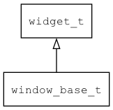
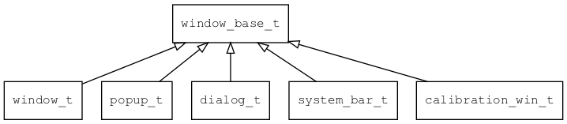

## window\_base\_t
### 概述


窗口。

本类把窗口相关的公共行为进行抽象，放到一起方便重用。目前已知的具体实现如下图：




> 本类是一个抽象类，不能进行实例化。请在应用程序中使用具体的类，如window\_t。
----------------------------------
### 函数
<p id="window_base_t_methods">

| 函数名称 | 说明 | 
| -------- | ------------ | 
| <a href="#window_base_t_window_base_cast">window\_base\_cast</a> | 转换为window_base对象(供脚本语言使用)。 |
| <a href="#window_base_t_window_base_create">window\_base\_create</a> | 创建window base对象。 |
| <a href="#window_base_t_window_base_get_prop">window\_base\_get\_prop</a> | 窗口get_prop函数的缺省实现。 |
| <a href="#window_base_t_window_base_on_destroy">window\_base\_on\_destroy</a> | 窗口on_destroy函数的缺省实现。 |
| <a href="#window_base_t_window_base_on_event">window\_base\_on\_event</a> | 窗口on_event函数的缺省实现。 |
| <a href="#window_base_t_window_base_on_paint_begin">window\_base\_on\_paint\_begin</a> | 窗口on_paint_begin函数的缺省实现。 |
| <a href="#window_base_t_window_base_on_paint_end">window\_base\_on\_paint\_end</a> | 窗口on_paint_end函数的缺省实现。 |
| <a href="#window_base_t_window_base_on_paint_self">window\_base\_on\_paint\_self</a> | 窗口on_paint_self函数的缺省实现。 |
| <a href="#window_base_t_window_base_set_prop">window\_base\_set\_prop</a> | 窗口set_prop函数的缺省实现。 |
### 属性
<p id="window_base_t_properties">

| 属性名称 | 类型 | 说明 | 
| -------- | ----- | ------------ | 
| <a href="#window_base_t_assets_manager">assets\_manager</a> | assets\_manager\_t* | 获取资源管理器对象。 |
| <a href="#window_base_t_closable">closable</a> | window\_closable\_t | 收到EVT_REQUEST_CLOSE_WINDOW是否自动关闭窗口。 |
| <a href="#window_base_t_close_anim_hint">close\_anim\_hint</a> | char* | 关闭窗口动画的名称。 |
| <a href="#window_base_t_disable_anim">disable\_anim</a> | bool\_t | 禁用窗口动画。 |
| <a href="#window_base_t_font_manager">font\_manager</a> | font\_manager\_t* | 获取字体管理器对象。 |
| <a href="#window_base_t_image_manager">image\_manager</a> | image\_manager\_t* | 获取图片管理器对象。 |
| <a href="#window_base_t_move_focus_down_key">move\_focus\_down\_key</a> | char* | 向下移动焦点的键值。 |
| <a href="#window_base_t_move_focus_left_key">move\_focus\_left\_key</a> | char* | 向左移动焦点的键值。 |
| <a href="#window_base_t_move_focus_next_key">move\_focus\_next\_key</a> | char* | 向后移动焦点的键值。 |
| <a href="#window_base_t_move_focus_prev_key">move\_focus\_prev\_key</a> | char* | 向前移动焦点的键值。 |
| <a href="#window_base_t_move_focus_right_key">move\_focus\_right\_key</a> | char* | 向右移动焦点的键值。 |
| <a href="#window_base_t_move_focus_up_key">move\_focus\_up\_key</a> | char* | 向上移动焦点的键值。 |
| <a href="#window_base_t_open_anim_hint">open\_anim\_hint</a> | char* | 打开窗口动画的名称。 |
| <a href="#window_base_t_stage">stage</a> | char* | 窗口当前处于的状态。 |
| <a href="#window_base_t_theme">theme</a> | char* | 主题资源的名称。 |
| <a href="#window_base_t_theme_obj">theme\_obj</a> | theme\_t* | 窗口的常量主题数据。 |
#### window\_base\_cast 函数
-----------------------

* 函数功能：

> <p id="window_base_t_window_base_cast">转换为window_base对象(供脚本语言使用)。

* 函数原型：

```
widget_t* window_base_cast (widget_t* widget);
```

* 参数说明：

| 参数 | 类型 | 说明 |
| -------- | ----- | --------- |
| 返回值 | widget\_t* | window\_base对象。 |
| widget | widget\_t* | window\_base对象。 |
#### window\_base\_create 函数
-----------------------

* 函数功能：

> <p id="window_base_t_window_base_create">创建window base对象。

* 函数原型：

```
widget_t* window_base_create (widget_t* parent, const widget_vtable_t* vt, xy_t x, xy_t y, wh_t w, wh_t h);
```

* 参数说明：

| 参数 | 类型 | 说明 |
| -------- | ----- | --------- |
| 返回值 | widget\_t* | 窗口对象。 |
| parent | widget\_t* | 父控件 |
| vt | const widget\_vtable\_t* | vtable对象。 |
| x | xy\_t | x坐标 |
| y | xy\_t | y坐标 |
| w | wh\_t | 宽度 |
| h | wh\_t | 高度 |
#### window\_base\_get\_prop 函数
-----------------------

* 函数功能：

> <p id="window_base_t_window_base_get_prop">窗口get_prop函数的缺省实现。

* 函数原型：

```
ret_t window_base_get_prop (widget_t* widget, const char* name, value_t* v);
```

* 参数说明：

| 参数 | 类型 | 说明 |
| -------- | ----- | --------- |
| 返回值 | ret\_t | 返回RET\_OK表示成功，否则表示失败。。 |
| widget | widget\_t* | window\_base对象。g |
| name | const char* | 属性名。 |
| v | value\_t* | value对象 |
#### window\_base\_on\_destroy 函数
-----------------------

* 函数功能：

> <p id="window_base_t_window_base_on_destroy">窗口on_destroy函数的缺省实现。

* 函数原型：

```
ret_t window_base_on_destroy (widget_t* widget);
```

* 参数说明：

| 参数 | 类型 | 说明 |
| -------- | ----- | --------- |
| 返回值 | ret\_t | 返回RET\_OK表示成功，否则表示失败。 |
| widget | widget\_t* | window\_base对象。 |
#### window\_base\_on\_event 函数
-----------------------

* 函数功能：

> <p id="window_base_t_window_base_on_event">窗口on_event函数的缺省实现。

* 函数原型：

```
ret_t window_base_on_event (widget_t* widget, event_t* e);
```

* 参数说明：

| 参数 | 类型 | 说明 |
| -------- | ----- | --------- |
| 返回值 | ret\_t | 返回RET\_OK表示成功，否则表示失败。 |
| widget | widget\_t* | window\_base对象。 |
| e | event\_t* | event对象。 |
#### window\_base\_on\_paint\_begin 函数
-----------------------

* 函数功能：

> <p id="window_base_t_window_base_on_paint_begin">窗口on_paint_begin函数的缺省实现。

* 函数原型：

```
ret_t window_base_on_paint_begin (widget_t* widget, canvas_t* c);
```

* 参数说明：

| 参数 | 类型 | 说明 |
| -------- | ----- | --------- |
| 返回值 | ret\_t | 返回RET\_OK表示成功，否则表示失败。 |
| widget | widget\_t* | window\_base对象。 |
| c | canvas\_t* | canvas对象。 |
#### window\_base\_on\_paint\_end 函数
-----------------------

* 函数功能：

> <p id="window_base_t_window_base_on_paint_end">窗口on_paint_end函数的缺省实现。

* 函数原型：

```
ret_t window_base_on_paint_end (widget_t* widget, canvas_t* c);
```

* 参数说明：

| 参数 | 类型 | 说明 |
| -------- | ----- | --------- |
| 返回值 | ret\_t | 返回RET\_OK表示成功，否则表示失败。1 |
| widget | widget\_t* | window\_base对象。 |
| c | canvas\_t* | canvas对象。 |
#### window\_base\_on\_paint\_self 函数
-----------------------

* 函数功能：

> <p id="window_base_t_window_base_on_paint_self">窗口on_paint_self函数的缺省实现。

* 函数原型：

```
ret_t window_base_on_paint_self (widget_t* widget, canvas_t* c);
```

* 参数说明：

| 参数 | 类型 | 说明 |
| -------- | ----- | --------- |
| 返回值 | ret\_t | 返回RET\_OK表示成功，否则表示失败。 |
| widget | widget\_t* | window\_base对象。 |
| c | canvas\_t* | canvas对象。 |
#### window\_base\_set\_prop 函数
-----------------------

* 函数功能：

> <p id="window_base_t_window_base_set_prop">窗口set_prop函数的缺省实现。

* 函数原型：

```
ret_t window_base_set_prop (widget_t* widget, const char* name, const value_t* v);
```

* 参数说明：

| 参数 | 类型 | 说明 |
| -------- | ----- | --------- |
| 返回值 | ret\_t | 返回RET\_OK表示成功，否则表示失败。 |
| widget | widget\_t* | window\_base对象。 |
| name | const char* | 属性名。 |
| v | const value\_t* | value对象 |
#### assets\_manager 属性
-----------------------
> <p id="window_base_t_assets_manager">获取资源管理器对象。

>
把资源管理器对象与窗口关联起来，是为了解决UI设计器与被设计的窗口需要从不同的位置加载资源资源的问题。

* 类型：assets\_manager\_t*

| 特性 | 是否支持 |
| -------- | ----- |
| 可直接读取 | 否 |
| 可直接修改 | 否 |
| 可通过widget\_get\_prop读取 | 是 |
#### closable 属性
-----------------------
> <p id="window_base_t_closable">收到EVT_REQUEST_CLOSE_WINDOW是否自动关闭窗口。

如果关闭窗口时，需要用户确认:

* 1.将closable设置为WINDOW\_CLOSABLE\_CONFIRM

* 2.处理窗口的EVT\_REQUEST\_CLOSE\_WINDOW事件

> closable在XML中取值为：yes/no/confirm，缺省为yes。

* 类型：window\_closable\_t

| 特性 | 是否支持 |
| -------- | ----- |
| 可直接读取 | 是 |
| 可直接修改 | 否 |
| 可持久化   | 是 |
| 可脚本化   | 是 |
| 可在IDE中设置 | 是 |
| 可在XML中设置 | 是 |
| 可通过widget\_get\_prop读取 | 是 |
| 可通过widget\_set\_prop修改 | 是 |
#### close\_anim\_hint 属性
-----------------------
> <p id="window_base_t_close_anim_hint">关闭窗口动画的名称。
请参考[窗口动画](https://github.com/zlgopen/awtk/blob/master/docs/window_animator.md)

* 类型：char*

| 特性 | 是否支持 |
| -------- | ----- |
| 可直接读取 | 是 |
| 可直接修改 | 否 |
| 可持久化   | 是 |
| 可脚本化   | 是 |
| 可在IDE中设置 | 是 |
| 可在XML中设置 | 是 |
| 可通过widget\_get\_prop读取 | 是 |
| 可通过widget\_set\_prop修改 | 是 |
#### disable\_anim 属性
-----------------------
> <p id="window_base_t_disable_anim">禁用窗口动画。

* 类型：bool\_t

| 特性 | 是否支持 |
| -------- | ----- |
| 可直接读取 | 是 |
| 可直接修改 | 否 |
| 可持久化   | 是 |
| 可脚本化   | 是 |
| 可在IDE中设置 | 是 |
| 可在XML中设置 | 是 |
| 可通过widget\_get\_prop读取 | 是 |
| 可通过widget\_set\_prop修改 | 是 |
#### font\_manager 属性
-----------------------
> <p id="window_base_t_font_manager">获取字体管理器对象。

>
把字体管理器对象与窗口关联起来，是为了解决UI设计器与被设计的窗口需要从不同的位置加载字体资源的问题。

* 类型：font\_manager\_t*

| 特性 | 是否支持 |
| -------- | ----- |
| 可直接读取 | 否 |
| 可直接修改 | 否 |
| 可通过widget\_get\_prop读取 | 是 |
#### image\_manager 属性
-----------------------
> <p id="window_base_t_image_manager">获取图片管理器对象。

>
把图片管理器对象与窗口关联起来，是为了解决UI设计器与被设计的窗口需要从不同的位置加载图片资源的问题。

* 类型：image\_manager\_t*

| 特性 | 是否支持 |
| -------- | ----- |
| 可直接读取 | 否 |
| 可直接修改 | 否 |
| 可通过widget\_get\_prop读取 | 是 |
#### move\_focus\_down\_key 属性
-----------------------
> <p id="window_base_t_move_focus_down_key">向下移动焦点的键值。

请参考[控件焦点](https://github.com/zlgopen/awtk/blob/master/docs/widget_focus.md)

* 类型：char*

| 特性 | 是否支持 |
| -------- | ----- |
| 可直接读取 | 是 |
| 可直接修改 | 否 |
| 可持久化   | 是 |
| 可脚本化   | 是 |
| 可在IDE中设置 | 是 |
| 可在XML中设置 | 是 |
| 可通过widget\_get\_prop读取 | 是 |
| 可通过widget\_set\_prop修改 | 是 |
#### move\_focus\_left\_key 属性
-----------------------
> <p id="window_base_t_move_focus_left_key">向左移动焦点的键值。

请参考[控件焦点](https://github.com/zlgopen/awtk/blob/master/docs/widget_focus.md)

* 类型：char*

| 特性 | 是否支持 |
| -------- | ----- |
| 可直接读取 | 是 |
| 可直接修改 | 否 |
| 可持久化   | 是 |
| 可脚本化   | 是 |
| 可在IDE中设置 | 是 |
| 可在XML中设置 | 是 |
| 可通过widget\_get\_prop读取 | 是 |
| 可通过widget\_set\_prop修改 | 是 |
#### move\_focus\_next\_key 属性
-----------------------
> <p id="window_base_t_move_focus_next_key">向后移动焦点的键值。

请参考[控件焦点](https://github.com/zlgopen/awtk/blob/master/docs/widget_focus.md)

* 类型：char*

| 特性 | 是否支持 |
| -------- | ----- |
| 可直接读取 | 是 |
| 可直接修改 | 否 |
| 可持久化   | 是 |
| 可脚本化   | 是 |
| 可在IDE中设置 | 是 |
| 可在XML中设置 | 是 |
| 可通过widget\_get\_prop读取 | 是 |
| 可通过widget\_set\_prop修改 | 是 |
#### move\_focus\_prev\_key 属性
-----------------------
> <p id="window_base_t_move_focus_prev_key">向前移动焦点的键值。

请参考[控件焦点](https://github.com/zlgopen/awtk/blob/master/docs/widget_focus.md)

* 类型：char*

| 特性 | 是否支持 |
| -------- | ----- |
| 可直接读取 | 是 |
| 可直接修改 | 否 |
| 可持久化   | 是 |
| 可脚本化   | 是 |
| 可在IDE中设置 | 是 |
| 可在XML中设置 | 是 |
| 可通过widget\_get\_prop读取 | 是 |
| 可通过widget\_set\_prop修改 | 是 |
#### move\_focus\_right\_key 属性
-----------------------
> <p id="window_base_t_move_focus_right_key">向右移动焦点的键值。

请参考[控件焦点](https://github.com/zlgopen/awtk/blob/master/docs/widget_focus.md)

* 类型：char*

| 特性 | 是否支持 |
| -------- | ----- |
| 可直接读取 | 是 |
| 可直接修改 | 否 |
| 可持久化   | 是 |
| 可脚本化   | 是 |
| 可在IDE中设置 | 是 |
| 可在XML中设置 | 是 |
| 可通过widget\_get\_prop读取 | 是 |
| 可通过widget\_set\_prop修改 | 是 |
#### move\_focus\_up\_key 属性
-----------------------
> <p id="window_base_t_move_focus_up_key">向上移动焦点的键值。

请参考[控件焦点](https://github.com/zlgopen/awtk/blob/master/docs/widget_focus.md)

* 类型：char*

| 特性 | 是否支持 |
| -------- | ----- |
| 可直接读取 | 是 |
| 可直接修改 | 否 |
| 可持久化   | 是 |
| 可脚本化   | 是 |
| 可在IDE中设置 | 是 |
| 可在XML中设置 | 是 |
| 可通过widget\_get\_prop读取 | 是 |
| 可通过widget\_set\_prop修改 | 是 |
#### open\_anim\_hint 属性
-----------------------
> <p id="window_base_t_open_anim_hint">打开窗口动画的名称。
请参考[窗口动画](https://github.com/zlgopen/awtk/blob/master/docs/window_animator.md)

* 类型：char*

| 特性 | 是否支持 |
| -------- | ----- |
| 可直接读取 | 是 |
| 可直接修改 | 否 |
| 可持久化   | 是 |
| 可脚本化   | 是 |
| 可在IDE中设置 | 是 |
| 可在XML中设置 | 是 |
| 可通过widget\_get\_prop读取 | 是 |
| 可通过widget\_set\_prop修改 | 是 |
#### stage 属性
-----------------------
> <p id="window_base_t_stage">窗口当前处于的状态。

* 类型：char*

| 特性 | 是否支持 |
| -------- | ----- |
| 可直接读取 | 是 |
| 可直接修改 | 否 |
| 可通过widget\_get\_prop读取 | 是 |
#### theme 属性
-----------------------
> <p id="window_base_t_theme">主题资源的名称。
每个窗口都可以有独立的主题文件，如果没指定，则使用系统缺省的主题文件。
主题是一个XML文件，放在assets/raw/styles目录下。
请参考[主题](https://github.com/zlgopen/awtk/blob/master/docs/theme.md)

* 类型：char*

| 特性 | 是否支持 |
| -------- | ----- |
| 可直接读取 | 是 |
| 可直接修改 | 否 |
| 可持久化   | 是 |
| 可脚本化   | 是 |
| 可在IDE中设置 | 是 |
| 可在XML中设置 | 是 |
| 可通过widget\_get\_prop读取 | 是 |
| 可通过widget\_set\_prop修改 | 是 |
#### theme\_obj 属性
-----------------------
> <p id="window_base_t_theme_obj">窗口的常量主题数据。

>
把主题管理器对象与窗口关联起来，是为了解决UI设计器与被设计的窗口需要从不同的位置加载主题资源的问题。

* 类型：theme\_t*

| 特性 | 是否支持 |
| -------- | ----- |
| 可直接读取 | 否 |
| 可直接修改 | 否 |
| 可通过widget\_get\_prop读取 | 是 |
