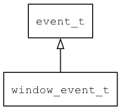

## window\_event\_t
### 概述


窗口事件，由窗口管理器触发。
----------------------------------
### 函数
<p id="window_event_t_methods">

| 函数名称 | 说明 | 
| -------- | ------------ | 
| <a href="#window_event_t_pointer_event_rotate">pointer\_event\_rotate</a> | 根据屏幕旋转方向修正pointer_event中的坐标。 |
| <a href="#window_event_t_window_event_cast">window\_event\_cast</a> | 把event对象转window_event_t对象。主要给脚本语言使用。 |
| <a href="#window_event_t_window_event_init">window\_event\_init</a> | 初始化事件。 |
### 属性
<p id="window_event_t_properties">

| 属性名称 | 类型 | 说明 | 
| -------- | ----- | ------------ | 
| <a href="#window_event_t_window">window</a> | widget\_t* | canvas。 |
#### pointer\_event\_rotate 函数
-----------------------

* 函数功能：

> <p id="window_event_t_pointer_event_rotate">根据屏幕旋转方向修正pointer_event中的坐标。

* 函数原型：

```
ret_t pointer_event_rotate (pointer_event_t* evt, system_info_t* info);
```

* 参数说明：

| 参数 | 类型 | 说明 |
| -------- | ----- | --------- |
| 返回值 | ret\_t | 返回RET\_OK表示成功，否则表示失败。 |
| evt | pointer\_event\_t* | 指针事件对象。 |
| info | system\_info\_t* | 系统信息。 |
#### window\_event\_cast 函数
-----------------------

* 函数功能：

> <p id="window_event_t_window_event_cast">把event对象转window_event_t对象。主要给脚本语言使用。

* 函数原型：

```
window_event_t* window_event_cast (event_t* event);
```

* 参数说明：

| 参数 | 类型 | 说明 |
| -------- | ----- | --------- |
| 返回值 | window\_event\_t* | 对象。 |
| event | event\_t* | event对象。 |
#### window\_event\_init 函数
-----------------------

* 函数功能：

> <p id="window_event_t_window_event_init">初始化事件。

* 函数原型：

```
event_t* window_event_init (window_event_t* event, void* target, uint32_t type, widget_t* widget);
```

* 参数说明：

| 参数 | 类型 | 说明 |
| -------- | ----- | --------- |
| 返回值 | event\_t* | event对象。 |
| event | window\_event\_t* | event对象。 |
| target | void* | 事件目标。 |
| type | uint32\_t | 事件类型。 |
| widget | widget\_t* | window对象。 |
#### window 属性
-----------------------
> <p id="window_event_t_window">canvas。

* 类型：widget\_t*

| 特性 | 是否支持 |
| -------- | ----- |
| 可直接读取 | 是 |
| 可直接修改 | 否 |
| 可脚本化   | 是 |
