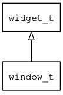

## window\_t
### 概述


窗口。

缺省的应用程序窗口，占用除system\_bar\_t之外的整个区域，请不要修改它的位置和大小(除非你清楚后果)。

window\_t是[window\_base\_t](window_base_t.md)的子类控件，window\_base\_t的函数均适用于window\_t控件。

在xml中使用"window"标签创建窗口。无需指定坐标和大小，可以指定主题和动画名称。如：

```xml
<window theme="basic" anim_hint="htranslate">
...
</window>
```

>
更多用法请参考：[window.xml](https://github.com/zlgopen/awtk/blob/master/demos/assets/default/raw/ui/)

在c代码中使用函数window\_create创建窗口。如：

```c
widget_t* window = window_create(NULL, 0, 0, 0, 0);
```

> 无需指定父控件、坐标和大小，使用0即可。

> 完整示例请参考：[window
demo](https://github.com/zlgopen/awtk-c-demos/blob/master/demos/)

可用通过style来设置窗口的风格，如背景颜色或图片等。如：

```xml
<style name="bricks">
<normal bg_image="bricks"  bg_image_draw_type="repeat"/>
</style>
```

> 更多用法请参考：[theme
default](https://github.com/zlgopen/awtk/blob/master/demos/assets/default/raw/styles/default.xml#L0)
----------------------------------
### 函数
<p id="window_t_methods">

| 函数名称 | 说明 | 
| -------- | ------------ | 
| <a href="#window_t_window_cast">window\_cast</a> | 转换为window对象(供脚本语言使用)。 |
| <a href="#window_t_window_close">window\_close</a> | 关闭窗口。 |
| <a href="#window_t_window_close_force">window\_close\_force</a> | 立即无条件关闭窗口(无动画)。 |
| <a href="#window_t_window_create">window\_create</a> | 创建window对象 |
| <a href="#window_t_window_create_default">window\_create\_default</a> | 以缺省的方式创建window对象。 |
| <a href="#window_t_window_open">window\_open</a> | 从资源文件中加载并创建window_base对象。本函数在ui_loader/ui_builder_default里实现。 |
| <a href="#window_t_window_open_and_close">window\_open\_and\_close</a> | 从资源文件中加载并创建window对象。本函数在ui_loader/ui_builder_default里实现。 |
| <a href="#window_t_window_set_fullscreen">window\_set\_fullscreen</a> | 设置为全屏窗口。 |
### 属性
<p id="window_t_properties">

| 属性名称 | 类型 | 说明 | 
| -------- | ----- | ------------ | 
| <a href="#window_t_fullscreen">fullscreen</a> | bool\_t | 是否全屏。 |
#### window\_cast 函数
-----------------------

* 函数功能：

> <p id="window_t_window_cast">转换为window对象(供脚本语言使用)。

* 函数原型：

```
widget_t* window_cast (widget_t* widget);
```

* 参数说明：

| 参数 | 类型 | 说明 |
| -------- | ----- | --------- |
| 返回值 | widget\_t* | window对象。 |
| widget | widget\_t* | window对象。 |
#### window\_close 函数
-----------------------

* 函数功能：

> <p id="window_t_window_close">关闭窗口。

* 函数原型：

```
ret_t window_close (widget_t* widget);
```

* 参数说明：

| 参数 | 类型 | 说明 |
| -------- | ----- | --------- |
| 返回值 | ret\_t | 返回RET\_OK表示成功，否则表示失败。 |
| widget | widget\_t* | window对象。 |
#### window\_close\_force 函数
-----------------------

* 函数功能：

> <p id="window_t_window_close_force">立即无条件关闭窗口(无动画)。

* 函数原型：

```
ret_t window_close_force (widget_t* widget);
```

* 参数说明：

| 参数 | 类型 | 说明 |
| -------- | ----- | --------- |
| 返回值 | ret\_t | 返回RET\_OK表示成功，否则表示失败。 |
| widget | widget\_t* | window对象。 |
#### window\_create 函数
-----------------------

* 函数功能：

> <p id="window_t_window_create">创建window对象

* 函数原型：

```
widget_t* window_create (widget_t* parent, xy_t x, xy_t y, wh_t w, wh_t h);
```

* 参数说明：

| 参数 | 类型 | 说明 |
| -------- | ----- | --------- |
| 返回值 | widget\_t* | 对象。 |
| parent | widget\_t* | 父控件 |
| x | xy\_t | x坐标 |
| y | xy\_t | y坐标 |
| w | wh\_t | 宽度 |
| h | wh\_t | 高度 |
#### window\_create\_default 函数
-----------------------

* 函数功能：

> <p id="window_t_window_create_default">以缺省的方式创建window对象。

* 函数原型：

```
widget_t* window_create_default ();
```

* 参数说明：

| 参数 | 类型 | 说明 |
| -------- | ----- | --------- |
| 返回值 | widget\_t* | 对象。 |
#### window\_open 函数
-----------------------

* 函数功能：

> <p id="window_t_window_open">从资源文件中加载并创建window_base对象。本函数在ui_loader/ui_builder_default里实现。

* 函数原型：

```
widget_t* window_open (const char* name);
```

* 参数说明：

| 参数 | 类型 | 说明 |
| -------- | ----- | --------- |
| 返回值 | widget\_t* | 对象。 |
| name | const char* | window的名称。 |
#### window\_open\_and\_close 函数
-----------------------

* 函数功能：

> <p id="window_t_window_open_and_close">从资源文件中加载并创建window对象。本函数在ui_loader/ui_builder_default里实现。

* 函数原型：

```
widget_t* window_open_and_close (const char* name, widget_t* to_close);
```

* 参数说明：

| 参数 | 类型 | 说明 |
| -------- | ----- | --------- |
| 返回值 | widget\_t* | 对象。 |
| name | const char* | window的名称。 |
| to\_close | widget\_t* | 关闭该窗口。 |
#### window\_set\_fullscreen 函数
-----------------------

* 函数功能：

> <p id="window_t_window_set_fullscreen">设置为全屏窗口。

>这里全屏是指与LCD相同大小，而非让SDL窗口全屏。

* 函数原型：

```
ret_t window_set_fullscreen (widget_t* widget, bool_t fullscreen);
```

* 参数说明：

| 参数 | 类型 | 说明 |
| -------- | ----- | --------- |
| 返回值 | ret\_t | 返回RET\_OK表示成功，否则表示失败。 |
| widget | widget\_t* | window对象。 |
| fullscreen | bool\_t | 是否全屏。 |
#### fullscreen 属性
-----------------------
> <p id="window_t_fullscreen">是否全屏。

>这里全屏是指与LCD相同大小，而非让SDL窗口全屏。

* 类型：bool\_t

| 特性 | 是否支持 |
| -------- | ----- |
| 可直接读取 | 是 |
| 可直接修改 | 否 |
| 可持久化   | 是 |
| 可脚本化   | 是 |
| 可在IDE中设置 | 是 |
| 可在XML中设置 | 是 |
| 可通过widget\_get\_prop读取 | 是 |
| 可通过widget\_set\_prop修改 | 是 |
